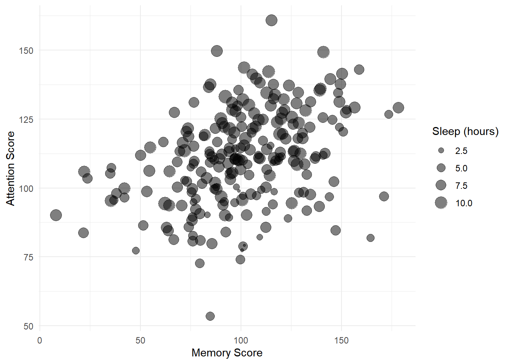

# Multiple regression: evaluating and comparing models {#multiple3}

*January 2022*

### In brief

> In this session we discuss model selection in the context of ANOVA and the use
> of Bayes Factors to choose between theoretically interesting models.


## Using ANOVA and Bayes Factors to compare models

-   [**Slides for the session**](slides/PSYC753_Chris2.pptx)
-   [**Using Rmd files**](slides/PSYC753_Chris2_Rmd.pptx)

\

### Overview

In the previous session, we saw that we can construct a linear model to predict an outcome variable (e.g., *final exam score* from *entrance exam score*). We also investigated how we can _improve_ a model by adding several continuous predictors to it.

\
How do we know if one model is _better_ or should be _preferred_ over another model? We touched on a common sense approach in the last session - we ideally want models that explain the variance in an outcome variable but each predictor in the model should make a sizable and relatively independent contribution to the model.

\

Today we will cover a more formal approach to model comparison using:

  - **ANOVA (Analysis of Variance)** and

  - **Bayes Factors**
  
\

It's important that you are comfortable with the material from the first [Building Models 1 session](building-models-1.html) before proceeding today.


## Comparing models using ANOVA

We can use ANOVA to determine whether the addition of variables into a model leads to a statistically significant improvement in the variance it explains _overall_. We may want to do this, for example, when building on existing theories or models, or looking at the effects of variables after controlling for others.

\
We'll start by comparing a model with _one_ predictor vs. a model with _three_ predictors.

\
Using the `ExamData` from the previous session, we'll run:

- a linear model with `finalex` as the outcome variable, and `entrex` as the predictor.

- a linear model with `finalex` as the outcome variable, and `entrex`,`age`, and `project` as the predictors.


```r
ExamData <- read_csv('https://bit.ly/37GkvJg')              
model1   <- lm(finalex ~ entrex, data = ExamData)           
model2   <- lm(finalex ~ entrex + age + project, data = ExamData) 
```

\
**Explanation of the code**: first the data is loaded into `ExamData`. The results of the simple regression are stored in `model1`. Those of the multiple regression are stored in `model2`.

\
Use `summary()` to display the results of each regression:

**Model 1:**


```r
summary(model1)
> 
> Call:
> lm(formula = finalex ~ entrex, data = ExamData)
> 
> Residuals:
>     Min      1Q  Median      3Q     Max 
> -54.494 -21.185   3.733  18.124  30.969 
> 
> Coefficients:
>             Estimate Std. Error t value Pr(>|t|)    
> (Intercept) -46.3045    25.4773  -1.817   0.0788 .  
> entrex        3.1545     0.5324   5.925 1.52e-06 ***
> ---
> Signif. codes:  0 '***' 0.001 '**' 0.01 '*' 0.05 '.' 0.1 ' ' 1
> 
> Residual standard error: 22.7 on 31 degrees of freedom
> Multiple R-squared:  0.531,	Adjusted R-squared:  0.5159 
> F-statistic:  35.1 on 1 and 31 DF,  p-value: 1.52e-06
```

\
**Model 2:**

```r
summary(model2)
> 
> Call:
> lm(formula = finalex ~ entrex + age + project, data = ExamData)
> 
> Residuals:
>     Min      1Q  Median      3Q     Max 
> -42.563 -16.519   4.901  16.991  36.424 
> 
> Coefficients:
>              Estimate Std. Error t value Pr(>|t|)    
> (Intercept) -117.9159    46.4211  -2.540   0.0167 *  
> entrex         3.0889     0.5734   5.387 8.66e-06 ***
> age            1.4231     1.3756   1.035   0.3094    
> project        0.6280     0.4609   1.363   0.1835    
> ---
> Signif. codes:  0 '***' 0.001 '**' 0.01 '*' 0.05 '.' 0.1 ' ' 1
> 
> Residual standard error: 22.03 on 29 degrees of freedom
> Multiple R-squared:  0.5869,	Adjusted R-squared:  0.5442 
> F-statistic: 13.73 on 3 and 29 DF,  p-value: 9.353e-06
```

\
(If you are not sure what it means by "e-06" in the output above then see the FAQs [here](#e-meaning))

:::{.exercise}

Make note of the variance explained by each model ($R^2$), i.e., `Multiple R-squared`: (report as a percentage, to 2 decimal places)

- Model 1: $R^2$ = <input class='webex-solveme nospaces' size='5' data-answer='["53.10"]'/> %

- Model 2: $R^2$ = <input class='webex-solveme nospaces' size='5' data-answer='["58.69"]'/> %

Which model explains a greater proportion of variance in `finalex`? <select class='webex-select'><option value='blank'></option><option value=''>entrex alone</option><option value='answer'>entrex, age, project</option></select>

- Calculate the difference in $R^2$ between the models. `model2` improves the prediction of `finalex` by  <input class='webex-solveme nospaces' size='4' data-answer='["5.59"]'/> %

:::

\
To compare the variance explained by each model, use `anova()`:


```r
anova(model1, model2)
```

<div class="kable-table">

| Res.Df|      RSS| Df| Sum of Sq|        F|    Pr(>F)|
|------:|--------:|--:|---------:|--------:|---------:|
|     31| 15980.58| NA|        NA|       NA|        NA|
|     29| 14077.62|  2|  1902.957| 1.960052| 0.1590683|

</div>

\
**Explanation of the output:** 

- **`anova()`** compares the variance that `model1` and `model2` explain with an _F_-statistic. 

- **`Pr(>F)`** gives the _p_-value for this statistic. If the _p_-value is less than .05, then we can reject the null hypothesis that there is no difference in the variance explained by each model, and we can say that the variance that `model2` explains in `finalex` is significantly greater than that of `model1`.

- We can report the _F_-statistic in APA style as _F_(2, 29) = 1.96, _p_ = .16. We can say that the additional 5.59% variance that `model2` explains relative to `model1` does not represent a statistically significant increase in $R^2$, and so `model2` should **not** be preferred over `model1`.


\

:::{.tip}
Comparing models in steps as we've done is sometimes called **hierarchical regression** or **sequential regression**. This type of regression is usually used for logical or theoretical reasons, when we want to know the contribution of a predictor (or a set of predictors) **over and above** an existing one. 
:::


:::{.exercise}

**Now, you try using `anova` to compare models.**

The variable `attendance` in `ExamData` scores individuals according to whether their class attendance was low (0) or high (1). A researcher suspects that `attendance` may explain additional variance in `finalex` over and above `entrex`.

As an exercise, compare the following two models using the `anova()` approach above: 

1. a model with `entrex` as a sole predictor of `finalex` (i.e., `model1`), and 

2. a model where `finalex` is predicted by `entrex` and `attendance` (call this `model3`). 

Is there sufficient evidence that a model with `entrex` _and_ `attendance` explains more variance than a model with `entrex` alone?


<div class='webex-solution'><button>Try yourself first, then click to see the code</button>


```r
# model1 was created earlier
summary(model1)

# specify model3
model3 <- lm(finalex ~ entrex + attendance, data = ExamData)

# show model3
summary(model3)

#compare model1 and model3
anova(model1, model3)
> 
> Call:
> lm(formula = finalex ~ entrex, data = ExamData)
> 
> Residuals:
>     Min      1Q  Median      3Q     Max 
> -54.494 -21.185   3.733  18.124  30.969 
> 
> Coefficients:
>             Estimate Std. Error t value Pr(>|t|)    
> (Intercept) -46.3045    25.4773  -1.817   0.0788 .  
> entrex        3.1545     0.5324   5.925 1.52e-06 ***
> ---
> Signif. codes:  0 '***' 0.001 '**' 0.01 '*' 0.05 '.' 0.1 ' ' 1
> 
> Residual standard error: 22.7 on 31 degrees of freedom
> Multiple R-squared:  0.531,	Adjusted R-squared:  0.5159 
> F-statistic:  35.1 on 1 and 31 DF,  p-value: 1.52e-06
> 
> 
> Call:
> lm(formula = finalex ~ entrex + attendance, data = ExamData)
> 
> Residuals:
>     Min      1Q  Median      3Q     Max 
> -42.750 -11.750   1.801   9.689  30.347 
> 
> Coefficients:
>             Estimate Std. Error t value Pr(>|t|)    
> (Intercept) -63.3108    20.2768  -3.122  0.00395 ** 
> entrex        3.2741     0.4173   7.846 9.35e-09 ***
> attendance   28.8202     6.3398   4.546 8.37e-05 ***
> ---
> Signif. codes:  0 '***' 0.001 '**' 0.01 '*' 0.05 '.' 0.1 ' ' 1
> 
> Residual standard error: 17.76 on 30 degrees of freedom
> Multiple R-squared:  0.7223,	Adjusted R-squared:  0.7038 
> F-statistic: 39.02 on 2 and 30 DF,  p-value: 4.499e-09
```

<div class="kable-table">

| Res.Df|       RSS| Df| Sum of Sq|        F|   Pr(>F)|
|------:|---------:|--:|---------:|--------:|--------:|
|     31| 15980.580| NA|        NA|       NA|       NA|
|     30|  9462.434|  1|  6518.146| 20.66533| 8.37e-05|

</div>

</div>


- The variance explained by a model with `entrex` alone is $R^2$ = <input class='webex-solveme nospaces' size='5' data-answer='["53.10"]'/> %

- The $R^2$ for the model that also included `attendance` was $R^2$ = <input class='webex-solveme nospaces' size='5' data-answer='["72.23"]'/> %  

- The increase in $R^2$ was <input class='webex-solveme nospaces' size='5' data-answer='["19.13"]'/>% 

- The ANOVA comparing models can be reported as: _F_(<input class='webex-solveme nospaces' size='1' data-answer='["1"]'/>, <input class='webex-solveme nospaces' size='2' data-answer='["30"]'/>) = <input class='webex-solveme nospaces' size='5' data-answer='["20.67"]'/>, _p_ < .001. 

- The increase in $R^2$ was <select class='webex-select'><option value='blank'></option><option value='answer'>statistically significant</option><option value=''>not significant</option></select>.

- As indicated by the estimates of the coefficients for `entrex` and `attendance`, both  <select class='webex-select'><option value='blank'></option><option value=''>negatively</option><option value='answer'>positively</option></select> predict `finalex`. 

- A higher `entrex` score and greater `attendance` is associated with a <select class='webex-select'><option value='blank'></option><option value='answer'>higher</option><option value=''>lower</option></select> `finalex` score.


</div>


:::


## Comparing models using Bayes Factors

An alternative approach to using ANOVA to compare models is to use **Bayes Factors**. 

\
A **Bayes Factor** is the **probability of obtaining the data under one model compared to another** (Rouder & Morey, 2012).  

\
For example, a Bayes Factor equal to 2 would tell us that the data are _twice_ as likely under one model than another. A Bayes Factor equal to 0.5 would tell us that the data are _half_ as likely under one model than another. 

\
Unlike classical tests of statistical significance (with _p_-values), Bayes Factors also allow us to _quantify_ evidence for the null hypothesis. Very handy!

\
To compute a Bayes Factor for a specific linear model, we use `lmBF` in the `BayesFactor` package (where `lm` stands for _linear model_ and `BF` stands for _Bayes Factor_).

\
First, we need to load the `BayesFactor` package: 


```r
library('BayesFactor')
```

We can use the `lmBF` function in the same way we use  `lm`. The function will return a **Bayes Factor** for the model we specify.

\
Let's determine the Bayes Factor for `model1`


```r
model1.BF <- lmBF(finalex ~ entrex, data = as.data.frame(ExamData) )  
```

**Explanation of the code**: The model is specified in exactly the same way as with `lm`. Due to a limitation of the package, however, we must convert `ExamData` from a tibble to a data frame using `as.data.frame`. Otherwise, the command works in the same way. The results are stored in `model1.BF`.

\
To look at what's stored in `model1.BF`:


```r
model1.BF
> Bayes factor analysis
> --------------
> [1] entrex : 8310.846 ±0.01%
> 
> Against denominator:
>   Intercept only 
> ---
> Bayes factor type: BFlinearModel, JZS
```

**Explanation of the output**: 

- The Bayes Factor provided for the model with `entrex` is equal to **8310.85**. 

- The `Against denominator: Intercept only` means that the model with `entrex` is being compared with a model that contains an **intercept only**. In an intercept-only model, the coefficient for `entrex` is equal to zero; that is, the regression line is a flat line (equal to the _mean_ of `entrex`). 

- The value of our Bayes Factor indicates that the model with `entrex` in is much more likely than a model that contains only an intercept (8310.85 times more likely, to be precise). We can therefore be confident that a model with `entrex` is preferable to the intercept only model (just as with our classical analysis). Happy days!

\
Now let's do the same for `model2`:


```r
# specify the model
model2.BF <- lmBF(finalex ~ entrex + age + project, data = as.data.frame(ExamData) )

# show the Bayes Factor
model2.BF
> Bayes factor analysis
> --------------
> [1] entrex + age + project : 2427.676 ±0%
> 
> Against denominator:
>   Intercept only 
> ---
> Bayes factor type: BFlinearModel, JZS
```

\

**Explanation:** The Bayes Factor is equal to **2427.68**. Again, this indicates that the model with `entrex` and `age` is much more likely than a model with only the intercept in (this is not that surprising given the result for `model1.BF` above). 

But, what we want to know is whether `model2` (containing `entrex` and `age`) is **more** likely than `model1` (containing only `entrex`). We can determine this by _dividing_ the Bayes Factor for `model2` by the Bayes Factor for `model1`:


```r
model2.BF / model1.BF
> Bayes factor analysis
> --------------
> [1] entrex + age + project : 0.2921093 ±0.01%
> 
> Against denominator:
>   finalex ~ entrex 
> ---
> Bayes factor type: BFlinearModel, JZS
```

**Explanation:** The Bayes Factor for this comparison is 0.29. This means that `model2` is **_less than a third as likely_** than `model1`. So, `model2` is much _less_ likely than `model1`. Not good news for `model2`!


:::{.tip}

**Interpreting the Bayes Factor**

- A Bayes Factor **equal to 1** tells us that probability of each model is the same.

- A Bayes Factor **greater than 1** means that `model2` is more likely than `model1`.

- A Bayes Factor **less than 1** means that `model1` is more likely than `model2`. 

**Thus, our Bayes Factor of 0.29 indicates that `model1` is more likely than `model2`.**

:::


:::{.tip}

**Reporting Bayes Factors**

\

**Notation**

We usually write the Bayes Factor in reports as $BF_{10}$ where: 

- the subscript **1** in $BF_{10}$ denotes the less-constrained model (the alternative hypothesis). This is the model with **more predictors** (our `model2`).

- the subscript **0** in $BF_{10}$ denotes the more constrained or simpler model (i.e., the null hypothesis). This is the model with **fewer predictors** (our `model1`).

(You can just write BF10 if you prefer.)


\

**The Size of the Bayes Factor**

- If the Bayes Factor is **greater than 3** (i.e., $BF_{10}$ > 3), we say that there is **substantial evidence for `model2`** (the less constrained model).

- If the Bayes Factor is **less than 0.33** (i.e., $BF_{10}$ < 0.33), we usually say that there is **substantial evidence for `model1`** (the more constrained model).

- We say that intermediate values for the Bayes Factor (between 0.33 and 3) don't offer strong evidence for either model.

:::

Thus, because our Bayes Factor of 0.29 is less than 1, this indicates greater evidence for `model1` than `model2`. Furthermore, because the Bayes Factor is less than 0.33, we have _substantial_ evidence for `model1` over `model2`.

\
It's becoming increasingly common to report the Bayes Factor alongside the results of a classical analysis. Thus, we could report our results as follows: "There was insufficient evidence that the addition of age and project to the model containing entrance exam resulted in an increase in $R^2$, _F_(2, 29) = 1.96, _p_ = .16; BF10 = 0.29."


:::{.exercise}

**Now you try using Bayes Factors to compare models**

To supplement the comparison of `model3` and `model1` that you did with `anova`, now compute the Bayes Factor for `model3` vs. `model1`.

\
You'll need the following steps:

- Model 1: Obtain the Bayes Factor for a model with `entrex` as a sole predictor of `finalex` (we did this already above; it's stored in `model1.BF`) 

- Model 2: Obtain the Bayes Factor for a model where `finalex` is predicted by `entrex` _and_ `attendance` and store this in `model3.BF`. 

- Compare the Bayes Factors in `model3.BF` and `model1.BF`.
\


<div class='webex-solution'><button>Try yourself first, then click here for the code</button>


```r
# 1. show the BF for model1 vs. intercept only
model1.BF  

# 2. Obtain the BF for model3 vs. intercept only, then show it
model3.BF <- lmBF(finalex ~ entrex + attendance, data = as.data.frame(ExamData) )

model3.BF

# 3. Compare the BFs for model3 vs model1
model3.BF / model1.BF
> Bayes factor analysis
> --------------
> [1] entrex : 8310.846 ±0.01%
> 
> Against denominator:
>   Intercept only 
> ---
> Bayes factor type: BFlinearModel, JZS
> 
> Bayes factor analysis
> --------------
> [1] entrex + attendance : 2351114 ±0%
> 
> Against denominator:
>   Intercept only 
> ---
> Bayes factor type: BFlinearModel, JZS
> 
> Bayes factor analysis
> --------------
> [1] entrex + attendance : 282.897 ±0.01%
> 
> Against denominator:
>   finalex ~ entrex 
> ---
> Bayes factor type: BFlinearModel, JZS
```


</div>


\
**Answer the following questions from the output:**

How much more likely is a model with`entrex` than an intercept only model? 

- <input class='webex-solveme nospaces' size='7' data-answer='["8310.85"]'/> times more likely.

How much more likely is a model with `entrex` and `attendance` than an intercept only model? 

- <input class='webex-solveme nospaces' size='7' data-answer='["2351114"]'/> times more likely.

How much more likely is a model with `entrex` and `attendance` as predictors than a model with `entrex` alone? 

- <input class='webex-solveme nospaces' size='6' data-answer='["282.90"]'/> times more likely.

There is <select class='webex-select'><option value='blank'></option><option value=''>insufficient</option><option value='answer'>strong</option></select> evidence that a model with `entrex` and `attendance` should be preferred over a model with `entrex` alone, given the data.

A comparison of the Bayes Factors for the two models therefore <select class='webex-select'><option value='blank'></option><option value=''>does not converge</option><option value='answer'>converges</option></select> with the results of the comparison using ANOVA, and the model in which Final Exam is predicted by <select class='webex-select'><option value='blank'></option><option value=''>Entrance Exam only</option><option value='answer'>Entrance Exam and Attendance</option></select> should be preferred.

:::


## Exercise

Now you will practise using ANOVA and Bayes Factors to compare models with a new dataset.


\
**Scenario:** A researcher would like to construct a model to predict scores in a memory task from several different variables. The data from 234 individuals are stored in the `memory_data` dataset, which are located at https://bit.ly/37pOTrC. 

:::{.exercise}

Use `read_csv` to load in the data at the link above to the variable `memory_data` and preview it with `head()`.


<div class='webex-solution'><button>Try this yourself first. Click to show code</button>


```r
memory_data <- read_csv('https://bit.ly/37pOTrC')
memory_data %>% head()
```

<div class="kable-table">

| attention| sex| blueberries|      iq|    age|  sleep| memory_score|
|---------:|---:|-----------:|-------:|------:|------:|------------:|
|    95.790|   1|         308|  99.932| 44.935|  9.945|       128.42|
|    66.748|   1|         270| 136.502| 29.450|  8.037|       127.43|
|   102.399|   1|         442| 109.591| 31.862| 11.011|       117.99|
|    36.863|   1|         219| 110.494| 27.894|  5.284|        95.51|
|    91.708|   0|         450| 118.925| 36.746|  9.303|       122.11|
|   146.196|   1|         255|  85.601| 23.902|  7.047|       102.22|

</div>


</div>


:::{.tip}

**About the data:**

- **attention**: sustained attention score (higher = better attention)

- **sex**: 0 = female, 1 = male

- **blueberries**: average number of blueberries consumed per year

- **iq**: the individual's IQ

- **age**: age of person in years

- **sleep**: average hours of sleep per night

- **memory_score**: memory test score

:::

The researcher wants to test whether `attention` and `sleep` predict `memory_score`, but after controlling for `iq` and `age` (she suspects memory varies with `iq` and `age` to being with). 

\
She therefore wants to use a hierarchical regression approach to determine whether `attention` and `sleep` explain additional variance in `memory_score` _over and above_ `iq` and `age`.

\
1. First, fit a linear model to determine the extent to which `memory_score` is predicted by `iq` and `age`. Store the results in `memory1`.


<div class='webex-solution'><button>Try first, then click to see the code</button>


```r
# specify the baseline model
memory1 <- lm(memory_score ~ iq + age, data = memory_data)

# see the model results
summary(memory1)
> 
> Call:
> lm(formula = memory_score ~ iq + age, data = memory_data)
> 
> Residuals:
>     Min      1Q  Median      3Q     Max 
> -44.154 -11.754   0.732  11.608  40.790 
> 
> Coefficients:
>             Estimate Std. Error t value Pr(>|t|)    
> (Intercept)  71.1669     9.0796   7.838 1.67e-13 ***
> iq            0.1073     0.0699   1.534    0.126    
> age           0.8220     0.1461   5.627 5.27e-08 ***
> ---
> Signif. codes:  0 '***' 0.001 '**' 0.01 '*' 0.05 '.' 0.1 ' ' 1
> 
> Residual standard error: 16.1 on 231 degrees of freedom
> Multiple R-squared:  0.1303,	Adjusted R-squared:  0.1228 
> F-statistic: 17.31 on 2 and 231 DF,  p-value: 9.875e-08
```

</div>


\
2. Next, add `attention` and `sleep` to the model, storing your results in `memory2`.


<div class='webex-solution'><button>Try first, then click to see the code</button>


```r
# specify the next model
memory2 <- lm(memory_score ~ iq + age + attention + sleep, data = memory_data)

# show the results
summary(memory2)
> 
> Call:
> lm(formula = memory_score ~ iq + age + attention + sleep, data = memory_data)
> 
> Residuals:
>     Min      1Q  Median      3Q     Max 
> -28.935  -8.555   1.713   8.450  31.384 
> 
> Coefficients:
>             Estimate Std. Error t value Pr(>|t|)    
> (Intercept)  9.60112    8.57889   1.119 0.264246    
> iq           0.18673    0.05451   3.426 0.000726 ***
> age          0.86579    0.11308   7.656 5.32e-13 ***
> attention    0.22894    0.02757   8.302 8.88e-15 ***
> sleep        3.68609    0.39328   9.373  < 2e-16 ***
> ---
> Signif. codes:  0 '***' 0.001 '**' 0.01 '*' 0.05 '.' 0.1 ' ' 1
> 
> Residual standard error: 12.46 on 229 degrees of freedom
> Multiple R-squared:  0.4839,	Adjusted R-squared:  0.4749 
> F-statistic: 53.68 on 4 and 229 DF,  p-value: < 2.2e-16
```

</div>


\
3. Now, compare the `memory1` and `memory2` models using `anova()`


<div class='webex-solution'><button>Try first, then click to see the code</button>


```r
anova(memory1, memory2)
```

<div class="kable-table">

| Res.Df|      RSS| Df| Sum of Sq|        F| Pr(>F)|
|------:|--------:|--:|---------:|--------:|------:|
|    231| 59912.24| NA|        NA|       NA|     NA|
|    229| 35553.54|  2|   24358.7| 78.44706|      0|

</div>

</div>


\
\
**Answer the following questions:**

- A model with `iq` and `age` as predictors explains <input class='webex-solveme nospaces' size='5' data-answer='["13.03"]'/> % of the variance in `memory_scores`

- A model with `iq`, `age`, `attention` and `sleep` as predictors explains <input class='webex-solveme nospaces' size='5' data-answer='["48.39"]'/> % of the variance in `memory_scores`

- Calculate the additional variance explained by the second model: Change in $R^2$ = <input class='webex-solveme nospaces' size='5' data-answer='["35.36"]'/> %

- The ANOVA comparing models can be reported as: _F_(<input class='webex-solveme nospaces' size='1' data-answer='["2"]'/>, <input class='webex-solveme nospaces' size='3' data-answer='["229"]'/>) = <input class='webex-solveme nospaces' size='5' data-answer='["78.45"]'/>, _p_ < .001. 

- Is there a statistically significant improvement in the prediction of `memory_scores` as a result of adding `attention` and `sleep` to the model? <select class='webex-select'><option value='blank'></option><option value=''>no</option><option value='answer'>yes</option></select>

\
\
**Now use Bayes Factors to determine how much more likely the `memory2` model is than the `memory1` model .**

\

<div class='webex-solution'><button>Try first, click here for a reminder of the steps</button>


- Determine the Bayes Factor for `memory1`

- Determine the Bayes Factor for `memory2`

- Compare the Bayes Factors for `memory2` and `memory1`


</div>


\

<div class='webex-solution'><button>Try first, click here to see the code</button>


```r
# Store the Bayes Factor for the first model in memory1.BF
memory1.BF <- lmBF(memory_score ~ iq + age, data = as.data.frame(memory_data) )

# Store the Bayes Factor for the second model in memory2.BF
memory2.BF <- lmBF(memory_score ~ iq + age + attention + sleep, data = as.data.frame(memory_data) )

# Compute the Bayes Factors for memory2.BF vs memory1.BF
memory2.BF / memory1.BF
> Bayes factor analysis
> --------------
> [1] iq + age + attention + sleep : 4.168455e+23 ±0%
> 
> Against denominator:
>   memory_score ~ iq + age 
> ---
> Bayes factor type: BFlinearModel, JZS
```

</div>


\

**Answer the following questions:**

- The Bayes Factor comparing `memory2` and `memory1` to (2 decimal places) is <input class='webex-solveme nospaces' size='4' data-answer='["4.17"]'/> e+ <input class='webex-solveme nospaces' size='2' data-answer='["23"]'/>.

- Does the Bayes Factor support the conclusions from the ANOVA? <select class='webex-select'><option value='blank'></option><option value=''>no</option><option value='answer'>yes</option></select>


<div class='webex-solution'><button>Click for answer</button>

Yes! The Bayes Factor is equal to $4.17 \times 10^{23}$, and this therefore strongly supports the inclusion of `attention` and `sleep` in the model already containing `iq` and `age`.

</div>


\

\
**Extra exercises, if there's time**

**1.**

The researcher wishes to predict the `memory_score` for a new individual with `iq` = 105, `age` = 27, `attention` = 90, `sleep` = 8. Determine the prediction. 

\
Hint: in a previous session, you have previously used the `predict()` function to do this.

\

- The predicted `memory_score` is <input class='webex-solveme nospaces' size='6' data-answer='["102.68"]'/>


<div class='webex-solution'><button>Try first, then click to show the code for the answer</button>


```r
# create tibble for the new data
new_data <- tibble(iq = 105, age = 27, attention = 90, sleep = 8)

# use predict to derive prediction from new data
predict(memory2, new_data)
>        1 
> 102.6768
```

</div>


\
\

**2.**
Create a scatterplot of `attention` against `memory_score`, with the size of each point indicating the hours of `sleep`


<div class='webex-solution'><button>Try yourself first, then click for the code</button>


```r
memory_data %>% 
  ggplot(aes(x = attention, y = memory_score, size = sleep)) +
  geom_point(alpha = 0.5) +   # alpha=0.5 makes points 50% transparent
  xlab('Memory Score') +
  ylab('Attention Score') +
  labs(size="Sleep (hours)") 
```

<div class="figure" style="text-align: center">

<p class="caption">(\#fig:unnamed-chunk-19)TRUE</p>
</div>

</div>


\
\
**3.**

The researcher is interested to know whether annual consumption of blueberries has any bearing on `memory_scores`, and so wants to add `blueberries` to the model in `memory2`.

\
Determine the Bayes Factor comparing `memory2` with a model that additionally contains `blueberries`. 

- The Bayes Factor for the model comparison is <input class='webex-solveme nospaces' size='4' data-answer='["0.17",".17"]'/> (to 2 decimal places)

- The Bayes Factor indicates that the model with `blueberries` is <select class='webex-select'><option value='blank'></option><option value=''>more likely</option><option value='answer'>less likely</option></select> than the model without it.

- Should the researcher add `blueberries` to the model? <select class='webex-select'><option value='blank'></option><option value='answer'>no</option><option value=''>yes</option><option value=''>if it tastes good</option></select>


<div class='webex-solution'><button>Try yourself first, then click for the code</button>


```r
# add blueberries to memory2; store in memory3.BF
memory3.BF <- lmBF(memory_score ~ iq + age + attention + sleep + blueberries, data = as.data.frame(memory_data) )

# calculate the BF for memory3 vs memory2
memory3.BF / memory2.BF
> Bayes factor analysis
> --------------
> [1] iq + age + attention + sleep + blueberries : 0.1663574 ±0%
> 
> Against denominator:
>   memory_score ~ iq + age + attention + sleep 
> ---
> Bayes factor type: BFlinearModel, JZS
```

</div>


:::


## Summary of key points

- We can compare a model with one that has more predictors by using `anova(model1, model2)`. 

- We can compare models using Bayes Factors with `lmBF` in the `BayesFactor` package.

- A **Bayes Factor** is probability of one model relative to another, _given the data_.

- To compare Bayes Factors of models:

  - First obtain the Bayes Factors for `model1` and `model2`. 
  
  - Then use `model2 / model1` to get the Bayes Factor, indicating how much more likely `model2` is.
  
- Bayes Factors less than 1 indicate evidence for `model1`
    
- Bayes Factors greater than 1 indicate evidence for `model2`
    
- We can report Bayes Factors as $BF_{10}$ = 2.23 (or BF10 = 2.23)


\

Next week's session will build on what was done in this session, so make sure you understand what was covered and ask if there's anything you're unsure of.
