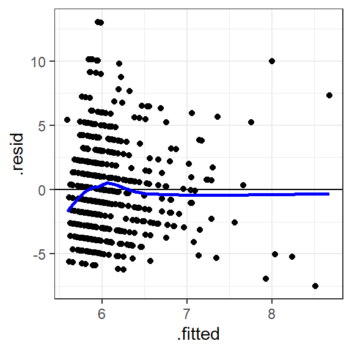

# Simple Regression{#simple1}

*Chris Berry*
\
*2022*


<style>
div.exercise { background-color:#e6f0ff; border-radius: 5px; padding: 20px;}
</style>

<style>
div.tip { background-color:#D5F5E3; border-radius: 5px; padding: 20px;}
</style>


## Overview


* **Slides** from the lecture part of the session: [Download](slides/PSYC753_L1_SimpleRegression.pptx)

\

:::{.tip}

- In **simple regression**, we create a _linear (straight line) model_ of the relationship between *one outcome variable and one predictor variable*

  - The **outcome variable** is what we want to predict or explain (e.g., _anxiety scores_)
  
  - The **predictor variable** is what we use to predict the outcome variable (e.g., _average hours of screen time per week in hours_)
  
  - Both the outcome and predictor variable are _continuous_ variables

- **Regression** is actually a more general technique that underpins a wide variety of analyses. **Simple regression** is the most basic form of regression. 


:::

\


The simple regression equation has the form, **Predicted outcome = a + b(Predictor)**. This is the same as the equation for a straight line (Y = a + bX) that many of you will have been taught in school.

- a is the **intercept**, it is the _height_ of the line

- b is the **slope** (or **coefficient for the predictor variable**). It determines the _steepness_ of the line, or, more formally, the amount of increase in the outcome variable for a one unit change in the predictor variable.

\

The goal of simple regression is to obtain the values of the intercept (a) and slope (b) so that the line 'fits' or 'goes through' our data as closely as possible. The specific method of 'fitting' the line to the data is called _the method of least squares_ (described in the lecture). Fortunately, R can work out the intercept and slope automatically for us (with `lm()`).

\


## Worked Example

**Is screen time linked to mental health?**

Teychenne and Hinkley (2016) used regression to investigate the association between **anxiety** and daily hours of **screen time** (e.g., TV, computer, device use) in 528 mothers with young children.

\

Read in the data from their study to R and store in `mentalh`:


```r
# ensure tidyverse is loaded first
library(tidyverse)

# read the data using read_csv()
mentalh <- read_csv('https://raw.githubusercontent.com/chrisjberry/Teaching/master/1_mental_health_data.csv')
```

There are numerous variables in `mentalh` (use `mentalh %>% glimpse()` to take a look). We will focus only on two here:

* `anxiety_score`: a score representing the number of anxiety symptoms experienced in the past week, and
* `screen_time`: hours per day of screen time use on average.

(Note: the data are publicly available, but I've changed some of the variable names for clarity.)


\

First, create a scatterplot of the two variables. Put the predictor variable on the x-axis, and the outcome variable on the y-axis. 


```r
# The code below takes mentalh and pipes it to ggplot() 
# aes() is used to tell ggplot() to put 
# screen_time on the x-axis, and anxiety_score on the y-axis
# The settings in geom_smooth() tell ggplot() to add the regression line.

mentalh %>% 
  ggplot(aes(x = screen_time, y = anxiety_score)) + 
  geom_point() + 
  geom_smooth(method = 'lm', se = FALSE)
```

<div class="figure" style="text-align: center">

<p class="caption">(\#fig:unnamed-chunk-3)Scatterplot of anxiety score according to screen time (hours per day) </p>
</div>


:::{.exercise}

**Describe the relationship between screen time and anxiety in the scatterplot plot** (pick one):

<div class='webex-radiogroup' id='radio_TYYHPXPMTG'><label><input type="radio" autocomplete="off" name="radio_TYYHPXPMTG" value=""></input> <span>Individuals with lower levels of screen time tend to have higher anxiety scores</span></label><label><input type="radio" autocomplete="off" name="radio_TYYHPXPMTG" value=""></input> <span>No association between screen time and anxiety scores is apparent</span></label><label><input type="radio" autocomplete="off" name="radio_TYYHPXPMTG" value="answer"></input> <span>Individuals with higher levels of screen time tend to have higher anxiety scores</span></label></div>


:::

\

Use `lm()` to run the simple regression and store the results in `simple1`: 


```r
# conduct a simple regression of anxiety as a function of screen time
# store the results in simple1
simple1 <- lm(anxiety_score ~ screen_time, data = mentalh)
```
**Explanation:** To specify the regression equation, we use `outcome_variable ~ predictor_variable`.The `~` symbol is a tilde. We use it to specify certain formulas in R. When you see `~`, you can read it as "as a function of". So, `outcome variable ~ predictor variable` means "outcome variable as a function of the predictor variable". In our case, "`anxiety_score` as a function of `screen_time`".

\

The intercept (a) and slope (b) are automatically calculated and stored in `simple1`:


```r
# look at the results 
simple1
```

```
## 
## Call:
## lm(formula = anxiety_score ~ screen_time, data = mentalh)
## 
## Coefficients:
## (Intercept)  screen_time  
##      5.5923       0.1318
```

:::{.exercise}
\

**The value of the intercept a is <select class='webex-select'><option value='blank'></option><option value='answer'>5.20</option><option value=''>0.25</option></select>**

**The value of the slope b for the screen_time predictor is <select class='webex-select'><option value='blank'></option><option value=''>5.20</option><option value='answer'>0.25</option></select>**

**The regression equation (of the form Predicted Outcome = a + b(Predictor)) can therefore be written as what?**

<div class='webex-radiogroup' id='radio_NEGGIXITBD'><label><input type="radio" autocomplete="off" name="radio_NEGGIXITBD" value=""></input> <span>predicted screen time = 5.59 + 0.13(anxiety score)</span></label><label><input type="radio" autocomplete="off" name="radio_NEGGIXITBD" value="answer"></input> <span>predicted anxiety score = 5.59 + 0.13(screen_time)</span></label><label><input type="radio" autocomplete="off" name="radio_NEGGIXITBD" value=""></input> <span>predicted anxiety score = 0.13 + 5.59(screen_time)</span></label></div>


:::

## Predicting

The regression equation can be used for **prediction**. 

Suppose someone asked us what the `anxiety_score` would be for a new person whose `screen_time` score is 10 hours per week.

By reading off from the regression line on the scatterplot from earlier, the `anxiety_score` looks to around 7:

<div class="figure" style="text-align: center">

<p class="caption">(\#fig:unnamed-chunk-6)Predicted anxiety score for a person with 10 hours screen time</p>
</div>

Using the regression equation, we can substitute 10 for `screen_time`, then calculate predicted `anxiety_score` more precisely. The `augment()` function in the `broom` package can be used to work out the prediction for new data automatically:


```r
# load the broom package
library(broom)

# store new scores as a new tibble
new_scores <- tibble(screen_time = 10)

# give new_scores to augment()
augment(simple1, newdata = new_scores)
```

<div class="kable-table">

| screen_time| .fitted|
|-----------:|-------:|
|          10| 6.91012|

</div>
The predicted `anxiety_score` is **6.91**

\

Predictions for multiple individuals can also be made at once. Here we obtain the predictions for two people with `screen_time` scores of 10 and 15.


```r
# store the scores we want predictions for in new_scores
new_scores <- tibble(screen_time = c(10, 15))

# use augment() to derive the predicted anxiety_scores
augment(simple1, newdata = new_scores)
```

<div class="kable-table">

| screen_time|  .fitted|
|-----------:|--------:|
|          10| 6.910120|
|          15| 7.569031|

</div>
The predicted `anxiety_scores` are **6.91** and **7.57**.

\
\

## Residuals
:::{.tip}
The **residual** for a given datapoint is its vertical distance from the regression line. It is the **error** in prediction of the outcome variable for that datapoint. 

**Residual = Observed - Predicted**
:::

\

To view the residuals, again use the `augment()` function in the `broom` package, this time without specifying new data. The residual for each individual is given in the column `.resid`


```r
# look at the residuals for simple1 (in .resid)
# use head() to only see first 6 rows
augment(simple1) %>% head()
```

<div class="kable-table">

| anxiety_score| screen_time|  .fitted|    .resid|      .hat|   .sigma|   .cooksd| .std.resid|
|-------------:|-----------:|--------:|---------:|---------:|--------:|---------:|----------:|
|             7|    2.571429| 5.931167|  1.068833| 0.0022003| 3.514985| 0.0001024|   0.304677|
|            10|    1.428571| 5.780559|  4.219441| 0.0029659| 3.510454| 0.0021534|   1.203238|
|            13|    4.214286| 6.147666|  6.852334| 0.0019133| 3.502526| 0.0036559|   1.953016|
|            13|    7.285714| 6.552426|  6.447574| 0.0039508| 3.503969| 0.0067111|   1.839532|
|             3|   18.571430| 8.039682| -5.039682| 0.0402420| 3.508118| 0.0449817|  -1.464784|
|             2|    1.500000| 5.789972| -3.789972| 0.0029045| 3.511390| 0.0017011|  -1.080735|

</div>

:::{.exercise}

What was the residual for a person with `anxiety_score` equal to 13, and `screen_time` score equal to 7.29 <select class='webex-select'><option value='blank'></option><option value=''>6.55</option><option value=''>6.85</option><option value='answer'>6.45</option></select>?

\

**For this person, was the `anxiety score` predicted by the model <select class='webex-select'><option value='blank'></option><option value=''>overpredicted (too high)</option><option value=''>fit exactly</option><option value='answer'>underpredicted (too low)</option></select>

:::

\

An assumption underlying regression is that the residuals are a bit like random noise. When we plot the _residual_ against the _predicted values_, there should be no associations evident in the plot. We can use this plot for checking this assumption of regression.


```r
# create a spread-versus-level plot
# using information in augment()
# use geom_hline() to draw a horizontal line at y=0
augment(simple1) %>% 
  ggplot(aes(x = .fitted, y = .resid)) +
  geom_hline(yintercept = 0) +
  geom_point()
```

<div class="figure" style="text-align: center">

<p class="caption">(\#fig:unnamed-chunk-10)Spread-versus-level plot: Predicted anxiety score vs. the residual</p>
</div>


**Explanation**: If there's no trend in the residuals, we'd expect the points to be a random cloud above and below the horizontal line (at y = 0). There should be no patterns, and the points should be pretty symmetrically distributed around a single point in the middle of the plot. Here, however, it's evident that the residuals tend to have lower values as the predicted values (`.fitted`) increase. In other words, there's some tendency for the model to overestimate `anxiety_score` as `screen_time` becomes more extreme. This type of plot is often seen in real datasets like this one.


## Evaluating the model

### R^2^

:::{.tip}
**R^2^** is a statistic that describes how well our model explains the outcome variable. It ranges between 0 and 1 and can be interpreted as the **proportion of variance in the outcome variable that is explained by the predictor variable**. 
:::

\

To obtain R^2^ for the model:


```r
# use glance() to get R-squared
glance(simple1)
```

<div class="kable-table">

| r.squared| adj.r.squared|    sigma| statistic|   p.value| df|    logLik|      AIC|     BIC| deviance| df.residual| nobs|
|---------:|-------------:|--------:|---------:|---------:|--:|---------:|--------:|-------:|--------:|-----------:|----:|
| 0.0148346|     0.0129617| 3.511952|  7.920493| 0.0050709|  1| -1411.456| 2828.913| 2841.72| 6487.581|         526|  528|

</div>

The column `r.squared` contains our value of R-squared, and is equal to 0.0148. To interpret as a percentage, multiply the proportion by 100. This means that `screen_time` explains 1.48% of the variance in `anxiety_score`. In psychological research, this is a relatively small amount of variance that is being explained. It may still be meaningful in some contexts though (e.g., where it may be better to have a model with some predictive power rather than none at all). 

R^2^ is actually the value of the correlation between the outcome and predictor variable, multiplied by itself:


```r
# load corrr package
library(corrr)

# calculate the correlation coefficient between screen_time and anxiety_score
mentalh %>% 
  select(screen_time, anxiety_score) %>% 
  correlate()
```

<div class="kable-table">

|term          | screen_time| anxiety_score|
|:-------------|-----------:|-------------:|
|screen_time   |          NA|     0.1217973|
|anxiety_score |   0.1217973|            NA|

</div>
The correlation between `screen_time` and `anxiety_score` is 0.1217973. 

0.1217973 \* 0.1217973 = **0.0148**, which is equal to our value of R^2^ obtained previously.

\

### Bayes Factor

To further evaluate the model, we can obtain a Bayes Factor. 

\

:::{.tip}
The **Bayes Factor** tells us how much more likely the model is than a model of `anxiety_score` that comprises the mean only. We call this baseline model the **intercept-only** model. It is a model in which the regression line is a flat line (has a slope equal to zero).
:::

\

To compute the Bayes Factor, we use `lmBF()` in the `BayesFactor` package:


```r
# load BayesFactor package
library(BayesFactor)

# Compute Bayes Factor
lmBF(anxiety_score ~ screen_time, data = mentalh) 
```

```
## Warning: data coerced from tibble to data frame
```

```
## Bayes factor analysis
## --------------
## [1] screen_time : 4.465124 ±0%
## 
## Against denominator:
##   Intercept only 
## ---
## Bayes factor type: BFlinearModel, JZS
```
The Bayes Factor is 4.47. We'd report this as BF = 4.47. This BF means that a model consisting of `screen_time` alone as a predictor of `anxiety_score` is over four times more likely than an intercept-only model in which `screen_time` does not predict `anxiety_score`. In other words, there's sufficient evidence to say that `screen_time` predicts `anxiety_score`. 

\

:::{.tip}
**Reporting the simple regression:**

A simple regression was conducted to model the number of anxiety symptoms reported in the past week (anxiety score) from average hours of screen time usage per day (screen time). Screen time was found to have a positive association with anxiety scores, whereby individuals who reported greater levels of screen time also tended to have greater anxiety scores. The regression equation was "Predicted anxiety score = 5.59 + 0.13(screen time)", indicating that every hour of screen time use was associated with an increase in 0.13 in the anxiety score. Screen time explained 1.30% of the variance in anxiety score (adjusted R^2^ value). The Bayes Factor, comparing the model against an intercept-only model, was 4.47, indicating that the model was statistically significant, being over four times more likely than an intercept-only model.

:::


## Exercise

:::{.exercise}

Is screen time predicted by age?

In addition to screen time, Teychenne and Hinkley (2016) also asked participants their age in years, stored in `age` in the `mentalh` dataset. Let's explore the relation between these variables using simple regression. 

\

**Adapt the code in this worksheet to do the following:**

**1. Produce a scatterplot of `age` vs. `screen_time`**


<div class='webex-solution'><button>Hint</button>

Pipe `mentalh` to `ggplot()` and use `geom_point()` and `geom_smooth()`

</div>
 


<div class='webex-solution'><button>Solution</button>


```r
mentalh %>% 
  ggplot(aes(x = age, y = screen_time)) + 
  geom_point() + 
  geom_smooth(method = 'lm', se = FALSE)
```

</div>
 

\

_Describe the relationship between screen time and anxiety_ (pick one):

<div class='webex-radiogroup' id='radio_PDLBXYDWZR'><label><input type="radio" autocomplete="off" name="radio_PDLBXYDWZR" value=""></input> <span>Older individuals tend to have higher sccreen time scores</span></label><label><input type="radio" autocomplete="off" name="radio_PDLBXYDWZR" value=""></input> <span>Older individuals tend to have lower screen time scores</span></label><label><input type="radio" autocomplete="off" name="radio_PDLBXYDWZR" value="answer"></input> <span>No association between age and screen time appears to be present</span></label></div>


\

**2. Conduct a simple regression, with `screen_time` as the outcome variable, and `age` as the predictor variable**


<div class='webex-solution'><button>Hint</button>

Use `lm()` to specify the simple regression

</div>
 


<div class='webex-solution'><button>Solution</button>


```r
simple2 <- lm(screen_time ~ age, data = mentalh)
simple2
```

</div>
 

What is the value of the intercept a (to two decimal places)? <input class='webex-solveme nospaces' size='4' data-answer='["7.48"]'/>

What is the value of the slope b (to two decimal places)? <input class='webex-solveme nospaces' size='5' data-answer='["-0.10"]'/>

\

What is the regression equation?

<div class='webex-radiogroup' id='radio_OEKXYQXCSL'><label><input type="radio" autocomplete="off" name="radio_OEKXYQXCSL" value="answer"></input> <span>Predicted screen time = 7.48 - 0.10(age)</span></label><label><input type="radio" autocomplete="off" name="radio_OEKXYQXCSL" value=""></input> <span>Predicted screen time = 0.10 - 7.48(age)</span></label><label><input type="radio" autocomplete="off" name="radio_OEKXYQXCSL" value=""></input> <span>Predicted screen time = 7.48 + 0.10(age)</span></label></div>


\

**3. Obtain R-squared**

<div class='webex-solution'><button>Hint</button>

Make sure you have stored the regression results (e.g., in `simple2`), then use `glance()` with that variable

</div>


<div class='webex-solution'><button>Solution</button>


```r
glance(simple2)
```

</div>


What proportion of variance in the anxiety score is explained by self reported levels of vigorous physical activity? (Report the adjusted R-squared value, to two decimal places) <input class='webex-solveme nospaces' size='4' data-answer='["0.02"]'/>

Report the value of adjusted R-squared as a percentage, to two decimal places: The adjusted R^2^ value is equal to <input class='webex-solveme nospaces' size='4' data-answer='["1.68"]'/>%


\

**4. Obtain the Bayes Factor for the model**

<div class='webex-solution'><button>Hint</button>

Use `lmBF()` to specify the model

</div>


<div class='webex-solution'><button>Solution</button>


```r
simple2_BF <- lmBF(screen_time ~ age, data = mentalh)
```

</div>


How many times more likely is the model with  `age` as a predictor of `screen_time`, compared to an intercept-only model? (to two decimal places) <input class='webex-solveme nospaces' size='5' data-answer='["12.19"]'/>

\

**5. Produce a plot of the fitted (predicted values) against the residuals. Is there any trend evident in the residuals?**


<div class='webex-solution'><button>Hint</button>

Use `augment()` with `ggplot()` and `geom_point()`

</div>


<div class='webex-solution'><button>Solution</button>


```r
augment(simple2) %>% 
  ggplot(aes(x = .fitted, y = .resid)) + 
  geom_point() + 
  geom_hline(yintercept = 0)
```
  

</div>


*What type of trend is evident between the predicted values and the residuals?*


<div class='webex-solution'><button>Further interpretation</button>

The spread of the points above the line appear seem to be greater than those of points below the horizontal line, indicating that the model tends to underestimate some of the screen time scores. This could be because the screen time scores are positively skewed (e.g., try `mentalh %>% ggplot(aes(screen_time)) + geom_density()`), and therefore taking the log transform of the scores prior to analysis may improve this plot (though may not necessarily change the outcome of the analysis).

</div>


**6. On balance, does age seem to be a good predictor of a person's daily screen time use?**


:::

\

## Further Exercises

These exercises are not essential, and are for those feeling confident with everything so far.

:::{.exercise}
Further Exercise 1 

The variable `physical_activity` in the `mentalh` dataset is a measure of moderate to vigorous physical activity of the participants in the study, based on participant's self reported weekly activity.

To what extent is participants' `anxiety_score` explained by their `physical_activity`? 

Investigate this question by producing the following:

* Scatterplot
* Correlation
* Simple regression model
* Adjusted R-squared value
* Bayes Factor

On balance, does the `anxiety_score` seem to be predicted well by `physical_activity`? 


<div class='webex-solution'><button>Solution: code</button>


```r
# scatterplot
mentalh %>% 
  ggplot(aes(x = physical_activity, y = anxiety_score)) +
  geom_point() + 
  geom_smooth(method = 'lm', se = F) +
  xlab("Physical activity") +
  ylab("Anxiety score") +
  theme_classic()


# correlation
mentalh %>% select(anxiety_score, physical_activity) %>% correlate()

# simple regression model
model_activity <- lm(anxiety_score ~ physical_activity, data = mentalh)

# look at intercept and slope
model_activity

# look at plot of fitted values and residuals
augment(model_activity) %>% 
  ggplot(aes(x=.fitted, y=.resid)) +
  geom_point() +
  geom_hline(yintercept = 0)

# look at R-squared
glance(model_activity)

# calculate Bayes Factor
lmBF(anxiety_score ~ physical_activity, data = mentalh)
```

</div>


<div class='webex-solution'><button>Solution: interpretation</button>

No, there's no evidence that the anxiety scores are predicted by self reported measures of moderate-to-vigorous levels of physical activity. The two measures showed virtually no correlation, r = -0.01. The regression equation was Predicted Anxiety Score = 6.23 - 0.0001*physical activity, and the model explained no appreciable amount of variance in anxiety score, adjusted R^2^ = -0.0017. The Bayes Factor was equal to 0.10. Given that this value of the Bayes Factor is less than 0.33, this indicates strong evidence for the intercept-only model, compared to the simple regression model where physical activity is the sole predictor of anxiety scores. In other words, if we only had these two variables, the best predictor of anxiety scores would be the mean value of the anxiety scores.

\

Interestingly, although there appears to be no association between anxiety and physical activity in this sample of mothers, other populations do show reductions in anxiety with greater levels of vigorous physical activity (e.g., adolescents, see Hrafnkelsdottir et al., 2018).

</div>


:::

\


\


## Summary

:::{.tip}

- Use **simple regression** to model the relationship between an outcome and predictor variable, where both are continuous variables.

- Once obtained, the regression equation allows us to:

  - precisely **describe the association** between the outcome and predictor variables (whether positive or negative).

  - derive **predictions** for the outcome variable, given new values of the predictor variable.

  - **evaluate** the model by comparing it with other models of varying complexity (i.e., models with fewer or more predictors)

:::

\


## References

Hrafnkelsdottir S.M., Brychta R.J., Rognvaldsdottir V., Gestsdottir S., Chen K.Y., Johannsson E., et al. (2018) Less screen time and more frequent vigorous physical activity is associated with lower risk of reporting negative mental health symptoms among Icelandic adolescents. _PLoS ONE_ _13_(4): e0196286. https://doi.org/10.1371/journal.pone.0196286

Teychenne M, Hinkley T (2016) Associations between screen-based sedentary behaviour and anxiety symptoms in mothers with young children. _PLoS ONE_, _11_(5): e0155696. https://doi.org/10.1371/journal.pone.0155696


\


