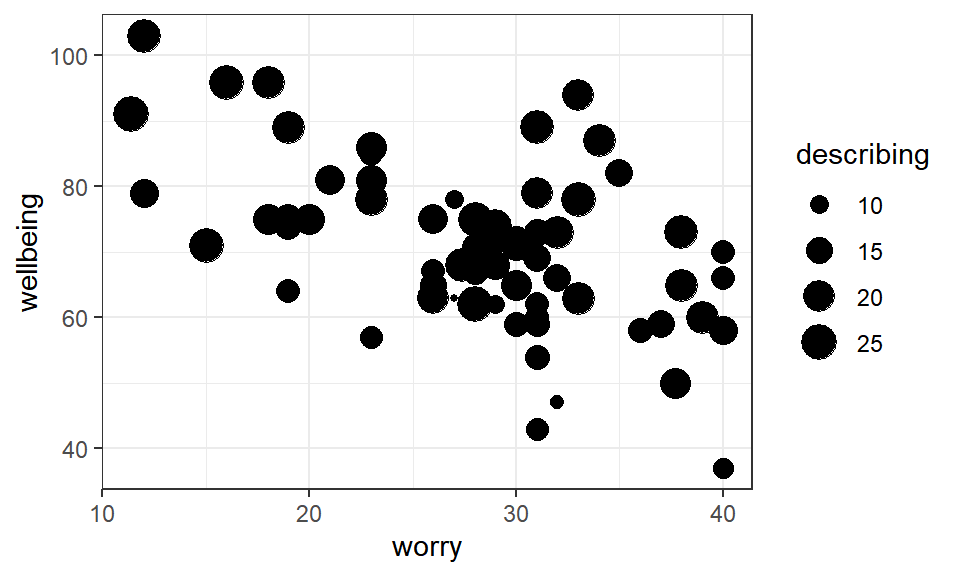

# Multiple regression: multiple continuous predictors {#multiple1}

*January 2022*

### In brief

> Models need to be _appropriately complex_. That is, we want to make models
> that represent our theories for the underlying causes of our data. Often this
> means adding many variables to a regression model. But we won't
> always be sure which variables to add. Adding multiple variables also brings
> challenges. Where predictors are highly correlated (termed **multicollinearity**)
> then model results can be confusing. 


## Multiple regression with several continuous predictors

-   [Slides for the session](slides/PSYC753_Chris1.pptx)


### Overview

So far, you have used regression to predict an outcome variable from a predictor variable. For example, can we predict _academic performance_ from _hours of study_?

You've also used it to determine whether the relation between two variables differs according to a categorical variable. Does the relation between academic performance and hours of study, for example, differ for _men_ and _women_?

\
We often want to determine the extent to which an outcome variable is predicted by **several continuous predictors**.

For example, in addition to hours of study, a person's _IQ_ or _academic interest_ might also predict their academic performance. We may want to add these predictors to a model because it may serve to _improve_ the prediction of academic performance. 

\
Today, we will: 

- learn how to conduct a multiple regression with several continuous predictor variables

- evaluate the regression model with statistics ($R^2$, _F_-statistic, _t_-values)

- use Venn diagrams to help conceptualise the contribution of predictors to a model


:::{.tip}

**Simple vs. multiple regression**

- **Simple regression** is a linear model of the relationship between *one outcome variable and one predictor variable*. For example, can we predict `exam performance` on the basis of `IQ` scores? 

- **Multiple regression** is a linear model of the relationship between *one outcome variable and more than one predictor variable*. For example, can we predict `exam performance`based on `IQ` scores _and_ `attendance` at lectures?

:::


## Analysing the model

Suppose we want to construct a model to predict final university exam scores. This is the task faced by some admissions tutors!  We'll start off with a simple regression model, then work up to multiple regression.  


Load the `ExamData` dataset from https://bit.ly/37GkvJg. This contains exam scores for students taking a university course. (Make sure `tidyverse` is loaded first!)

:::{.tip}

**Learning tip**

Try typing out the code today if you usually cut and paste it to R!

:::


```r
ExamData <- read_csv('https://bit.ly/37GkvJg')

ExamData %>% head()
```

<div class="kable-table">

| finalex| entrex|  age| project|  iq| proposal| attendance|
|-------:|------:|----:|-------:|---:|--------:|----------:|
|      38|     44| 21.9|      50| 110|       44|          0|
|      49|     40| 22.6|      75| 120|       70|          0|
|      61|     43| 21.8|      54| 119|       54|          0|
|      65|     42| 22.5|      60| 125|       53|          0|
|      69|     44| 21.9|      82| 121|       73|          0|
|      73|     46| 21.8|      65| 140|       62|          0|

</div>


:::{.tip}


These are the variables in `ExamData`:

- `finalex`: final examination marks
- `entrex`:  entrance examination marks
- `age`: age in years
- `project`: dissertation project marks
- `iq`: IQ score
- `proposal`: dissertation proposal grade
- `attendance`: 1 = high attendance; 0 = low attendance

:::


First, let's ask whether `finalex` is predicted by `entrex`. Plot these variables:


```r
ExamData %>% 
  ggplot(aes(x = entrex, y = finalex)) + 
  geom_point() +
  geom_smooth(se=F, method=lm)
```

<div class="figure" style="text-align: center">

<p class="caption">(\#fig:unnamed-chunk-3)TRUE</p>
</div>


There looks to be a positive association - students with higher entrance exam scores tend to have higher final exam scores. A good start!

To conduct the simple regression with `finalex` as the outcome variable, and `entrex` as the predictor variable, use `lm`: 


```r
m1 <- lm(finalex ~ entrex, data = ExamData) 
```
**Explanation**: `finalex ~ entrex` can be read as "`finalex` is predicted by `entrex`". The model is stored in `m1`. 


View the intercept of the regression line and the coefficient for `entrex`:


```r
m1
> 
> Call:
> lm(formula = finalex ~ entrex, data = ExamData)
> 
> Coefficients:
> (Intercept)       entrex  
>     -46.305        3.155
```

We can therefore write the regression equation:

  $Predicted\ final\ exam\ score  = -46.305 + 3.155(entrance\ exam)$


\
\
Use `summary(m1)` to display statistical analysis of the model: 


```r
summary(m1)
> 
> Call:
> lm(formula = finalex ~ entrex, data = ExamData)
> 
> Residuals:
>     Min      1Q  Median      3Q     Max 
> -54.494 -21.185   3.733  18.124  30.969 
> 
> Coefficients:
>             Estimate Std. Error t value Pr(>|t|)    
> (Intercept) -46.3045    25.4773  -1.817   0.0788 .  
> entrex        3.1545     0.5324   5.925 1.52e-06 ***
> ---
> Signif. codes:  0 '***' 0.001 '**' 0.01 '*' 0.05 '.' 0.1 ' ' 1
> 
> Residual standard error: 22.7 on 31 degrees of freedom
> Multiple R-squared:  0.531,	Adjusted R-squared:  0.5159 
> F-statistic:  35.1 on 1 and 31 DF,  p-value: 1.52e-06
```


**Explanation of the output**:

\
**`Residuals:`** provides an indication of the discrepancy between the values of `finalex` predicted by the model (i.e., the regression equation) and the actual values of `finalex`. If the model does a good job in predicting `finalex`,  the residuals should be relatively small. 

  - The difference between `Min` and `Max` gives us some idea of the range of error in the prediction of `finalex` scores. The difference in `3Q` and `1Q` is the interquartile range. The `median` of the residuals is 3.73.

\
**`Coefficients:`** contains tests of statistical significance for each of the coefficients. The values in the column headed `Pr(>|t|)` are the _p_-values associated with the _t_-values for the coefficients for each predictor. The _t_-values test a null hypothesis that the coefficients are equal to zero. A _p_-value less than .05 indicates that a predictor is statistically significant.

  - The row for the `(intercept)` reports a _t_-test for whether the value of the intercept differs from zero. We're not usually interested in this test (so don't report it). 

  - The row for `entrex` tests whether the value of its coefficient (3.15) differs from zero. A coefficient of zero would be expected if the predictor explained no variance in the outcome variable. The coefficient for `entrex` (3.15) is clearly greater than zero. We can report this by saying that `extrex` is a statistically significant predictor of `finalex`, _b_ = 3.15, _t_(31) = 5.92, _p_ < .001.

\
**`Multiple R-squared:`** This is $R^2$ - the **proportion of variance in `finalex` explained by `entrex`**.  Here, $R^2$ = 0.531. So approximately half of the variance in `finalex` is explained by `entrex`. It's usually referred to simply as "R-squared" or $R^2$.

  - $R^2$ is often reported as a percentage. To get this, simply multiply the value by 100. i.e., 0.531 x 100 = 53.10%.  

\
**`Adjusted R-squared:`** is an estimate of $R^2$, but adjusted for the population. Despite the usefulness of this statistic, most studies still tend to report only the (unadjusted) $R^2$ value. If reporting the `Adjusted R-squared` value, be sure to label it clearly as such. Here, Adjusted R-squared = 0.52.

\
**`F-statistic:`** This compares the variance in `finalex` explained by the model with the variance that it does not explain (i.e., explained variance divided by unexplained variance). Higher values of _F_ indicate that the model explains greater variance in an outcome variable. If the _p_-value associated with the _F_-statistic is less than .05, we can say that the model significantly predicts the outcome variable. 

Hence, we can say that a model consisting of `entrex` alone is a significant predictor of `finalex`, _F_(1, 31) = 35.10, _p_ < .001. Higher `entrex` scores tend to be associated with higher `finalex` scores. If our model did not explain any variance in `finalex`, we wouldn't expect this to be statistically significant.

  - In simple regression, the null hypothesis being tested on the _F_-statistic is that the slope of the regression line in the population is equal to zero. This is actually equivalent to the _t_-test on the `entrex` coefficient. So in simple regression, report the _F_-statistic for the overall regression or the _t_-test on the coefficient (not both). This equivalence between _F_ and _t_ does not hold true for multiple regression, as we shall see later.


:::{.exercise}

**Now you have a go**

Run another simple regression:

- set `finalex` as the outcome variable and `project` as the predictor variable

- store the output in a variable with a different name (`m2`)

- then display the output of `m2` using `summary()`.


<div class='webex-solution'><button>Try yourself first before clicking to show the code</button>


```r
m2 <- lm(finalex ~ project, data= ExamData) 

summary(m2)
> 
> Call:
> lm(formula = finalex ~ project, data = ExamData)
> 
> Residuals:
>     Min      1Q  Median      3Q     Max 
> -64.015 -21.686  -0.573  21.758  70.427 
> 
> Coefficients:
>             Estimate Std. Error t value Pr(>|t|)  
> (Intercept)   4.6968    40.1677   0.117   0.9077  
> project       1.4442     0.5861   2.464   0.0195 *
> ---
> Signif. codes:  0 '***' 0.001 '**' 0.01 '*' 0.05 '.' 0.1 ' ' 1
> 
> Residual standard error: 30.32 on 31 degrees of freedom
> Multiple R-squared:  0.1638,	Adjusted R-squared:  0.1368 
> F-statistic: 6.072 on 1 and 31 DF,  p-value: 0.01948
```

</div>


\
Answer the following: (report statistics to 2 decimal places)

- What is the value of the coefficient for `project`? <input class='webex-solveme nospaces' size='4' data-answer='["1.44"]'/>

- What proportion of the variance in `finalex` is explained by `project`?: $R^2$ = <input class='webex-solveme nospaces' size='4' data-answer='["0.16",".16"]'/> (or <input class='webex-solveme nospaces' size='5' data-answer='["16.38"]'/> %).

- Write down the regression equation (on a bit of paper).


<div class='webex-solution'><button>Show me</button>


  - $Predicted\ final\ exam\ score  = 4.70 + 1.44(project)$


</div>


- Is `project` alone a statistically significant predictor of `finalex`, as indicated by the _F_-statistic? <select class='webex-select'><option value='blank'></option><option value=''>no</option><option value='answer'>yes</option></select>

- Report the _F_-ratio in APA style, that is, in the form 

  **_F_(df1, df2) = _F_-statistic, _p_ = _p_-value**: 


<div class='webex-solution'><button>Show me</button>


_F_(1, 31) = 6.07, _p_ = .02


</div>


- Individuals with <select class='webex-select'><option value='blank'></option><option value=''>lower</option><option value='answer'>higher</option></select> project scores tended to have higher final exam scores.

:::


## Conceptualising the variance explained by predictors

Venn diagrams are useful for understanding the variance that predictors explain in the outcome variable. They are especially useful for understanding what's going on in multiple regression.


Suppose the rectangle below represents all of the _variance_ in `finalex` to be explained.


The area of the circle below represents the variance in `finalex` explained by `entrex` in the first simple regression we did. If this diagram were drawn to scale (it's not), the area of the circle would be equal to the value of $R^2$ (i.e., 53.1% of the rectangle).


The part of the rectangle not inside the circle represents the variance in `finalex` that is _not_ explained by the model (i.e., the unexplained or _residual_ variance). 


To _improve_ the model, we can explore whether adding in other predictors to the model explains additional variance, thereby increasing the total $R^2$ of the model.


You might think that we can simply add in variables (circles, above) to the model as we wish, until all the residual variance has been explained. This seems fine to do until we learn that if we were to add as many predictors to the model as there are rows in our data (33 individuals in our `ExamData`), then we'd perfectly predict the outcome variable, and have an $R^2$ of 100%! This would be true even if the predictors consisted of random values. Our model would clearly be meaningless though. We ideally want to explain the outcome variable with relatively few predictors.


## Adding predictor variables to the model

An issue that can arise when adding variables to a model is that predictors are usually correlated to some extent. This can make interpretation of multiple regressions tricky. For example, a predictor that is statistically significant in a simple regression may become non-significant in a multiple regression. Let's see a demonstration of this!

We'll now add `project` to the model with `entrex`. First, check the correlation between predictors:


```r
ExamData %>% 
  select(entrex,project) %>% 
  cor()
>            entrex   project
> entrex  1.0000000 0.2908253
> project 0.2908253 1.0000000
```


:::{.exercise}

The correlation between `entrex` and `project` is _r_ = <input class='webex-solveme nospaces' size='4' data-answer='["0.29",".29"]'/>

Our predictor variables are weakly correlated. We should keep this in mind going forward.

:::


Now run a _multiple regression_ to predict `finalex` from both `entrex` and `project`. Again, use `lm` but use the `+` symbol to add predictors to the model:


```r
m3 <- lm(finalex ~ entrex + project, data = ExamData)

summary(m3)
> 
> Call:
> lm(formula = finalex ~ entrex + project, data = ExamData)
> 
> Residuals:
>     Min      1Q  Median      3Q     Max 
> -41.880 -16.617   4.636  15.562  35.273 
> 
> Coefficients:
>             Estimate Std. Error t value Pr(>|t|)    
> (Intercept) -84.8289    33.6846  -2.518   0.0174 *  
> entrex        2.8894     0.5406   5.344 8.81e-06 ***
> project       0.7515     0.4457   1.686   0.1021    
> ---
> Signif. codes:  0 '***' 0.001 '**' 0.01 '*' 0.05 '.' 0.1 ' ' 1
> 
> Residual standard error: 22.06 on 30 degrees of freedom
> Multiple R-squared:  0.5716,	Adjusted R-squared:  0.5431 
> F-statistic: 20.02 on 2 and 30 DF,  p-value: 3e-06
```


:::{.exercise}
In this model with `entrex` and `project`as predictors:

What is the value of $R^2$ (as a percentage): <input class='webex-solveme nospaces' size='5' data-answer='["57.16"]'/> %

By how much has $R^2$ _increased_ in this model, relative to the model with `entrex` alone (where $R^2$ was 53.10%)? (as a percentage) (you will need to calculate this) <input class='webex-solveme nospaces' size='4' data-answer='["4.06"]'/> %

Is the overall regression model predicting `finalex` on the basis of `entrex` and `project` statistically significant? <select class='webex-select'><option value='blank'></option><option value='answer'>yes</option><option value=''>no</option></select>

- Is `entrex` a statistically significant predictor of `finalex`?  <select class='webex-select'><option value='blank'></option><option value='answer'>yes</option><option value=''>no</option></select>

- We can report this in the following way: the _t_-test on the coefficient for `entrex` is statistically significant, *b* = 2.89, *t*(30) = 5.34, *p* < .001.

- Is `project` a statistically significant predictor of `finalex` in this model?  <select class='webex-select'><option value='blank'></option><option value=''>yes</option><option value='answer'>no</option></select>

- What is the value of the coefficient for `project`? _b_ = <input class='webex-solveme nospaces' data-tol='0.01' size='4' data-answer='["0.75",".75"]'/>

- Report the _t_-statistic in APA style: 


<div class='webex-solution'><button>Show me</button>


Project mark was not a statistically significant predictor of final examination in this model, *b* = 0.75, *t*(30) = 1.69, *p* = .10


</div>


:::


Looking across the analyses we've performed, we can see that `project` is a (weak) but statistically significant predictor of `finalex` in a simple regression. However, when it is included in a model that also includes `entrex` it is not a significant predictor! What's going on?

- The model containing only `project` explains 16.38% of the variability in `finalex`.

- The model containing only `entrex` explains 53.10% of the variability in `finalex`.

- However, a model containing _both_ `project` and `entrex` only explains 57.16% of the variability in `finalex`, not 16.38 + 53.10 = 69.48%, as we might expect. 

This is because the predictors are _correlated_ (_r_ = .29) and so the variance they explain in `finalex` is _shared_.

\
We could represent this on a Venn diagram as follows:


The correlation is represented as an overlap in the circles. Their total area (57.16%) is therefore _less_ than the area they'd explain if there were no overlap (69.48%) (i.e., if there was no correlation).

**This demonstrates an important point**: The *t*-tests on the coefficients in a multiple regression assess the **unique** contribution of each predictor in the model. That is, they test the variance a predictor explains in an outcome variable, **after** the variance explained by the other predictors has been taken into account. This is why `project` is not statistically significant in the multiple regression model  -- it only explains a small amount of variance once `entrex` has been taken into account. 

:::{.tip}

It is possible to think of the _F_-statistic and _t_-value in multiple regression in terms of the Venn diagram:

- The **_F_-statistic** compares the explained variance with the unexplained variance. The explained variance is represented by the **_outline_** of the two circles in the Venn diagram above. The unexplained variance is the remaining blue area of the rectangle.

- The **_t_-value** compares the unique variance a predictor explains with the remaining unexplained variance. For example, for `project` in the Venn diagram above, this would be the area in the orange **_crescent_**, relative to the remaining blue area in the rectangle.

:::


## Multicollinearity

If the correlation between predictors is very high (greater than _r_ = 0.9), this is known as **multicollinearity**. On a Venn diagram, the circles representing the predictors would almost completely overlap. Multicollinearity can be a problem in multiple regression. Predictors may explain a large amount of variance in the outcome variable, but their 'unique' contribution in a multiple regression may be small. A situation can arise where _neither_ predictor may be statistically significant even though the overall regression is significant!


An example of multicollinearity in the `ExamData` dataset can be seen with the variables `project` and `proposal`. 

:::{.exercise}

Obtain the correlation between `project` and `proposal`:


<div class='webex-solution'><button>Show me</button>


```r
ExamData %>% 
  select(project, proposal) %>% 
  cor()
>            project  proposal
> project  1.0000000 0.9371487
> proposal 0.9371487 1.0000000
```

</div>


The correlation between `project` and `proposal` is _r_ = <input class='webex-solveme nospaces' size='4' data-answer='["0.94",".94"]'/>.

To see the effects of multicollinearity, conduct a regression with `finalex` as the outcome variable and `project` and `proposal` as the predictor variables.


<div class='webex-solution'><button>Show me</button>


```r
multi1 <- lm(finalex ~ project + proposal, data = ExamData)

summary(multi1)
> 
> Call:
> lm(formula = finalex ~ project + proposal, data = ExamData)
> 
> Residuals:
>     Min      1Q  Median      3Q     Max 
> -64.287 -22.590  -0.346  22.395  70.289 
> 
> Coefficients:
>             Estimate Std. Error t value Pr(>|t|)
> (Intercept)   4.8784    40.8601   0.119    0.906
> project       1.2751     1.7072   0.747    0.461
> proposal      0.1826     1.7263   0.106    0.916
> 
> Residual standard error: 30.81 on 30 degrees of freedom
> Multiple R-squared:  0.1641,	Adjusted R-squared:  0.1084 
> F-statistic: 2.945 on 2 and 30 DF,  p-value: 0.06797
```

</div>


- How much variance in `finalex` is explained by the model: $R^2$ = <input class='webex-solveme nospaces' data-tol='0.02' size='5' data-answer='["16.41"]'/> %.

- Is the overall regression statistically significant? <select class='webex-select'><option value='blank'></option><option value=''>yes</option><option value='answer'>no</option></select>

- Is the coefficient for `project` statistically significant? <select class='webex-select'><option value='blank'></option><option value=''>yes</option><option value='answer'>no</option></select>

- Is the coefficient for `proposal` statistically significant? <select class='webex-select'><option value='blank'></option><option value=''>yes</option><option value='answer'>no</option></select>
:::


:::{.exercise}

Now run two simple regressions to determine whether `project` and `proposal` explain variance in `finalex` and are statistically significant predictors when in models on their own. 


<div class='webex-solution'><button>Show me</button>


```r
multi2 <- lm(finalex ~ project, data = ExamData)
summary(multi2)

multi3 <- lm(finalex ~ proposal, data = ExamData)
summary(multi3)
> 
> Call:
> lm(formula = finalex ~ project, data = ExamData)
> 
> Residuals:
>     Min      1Q  Median      3Q     Max 
> -64.015 -21.686  -0.573  21.758  70.427 
> 
> Coefficients:
>             Estimate Std. Error t value Pr(>|t|)  
> (Intercept)   4.6968    40.1677   0.117   0.9077  
> project       1.4442     0.5861   2.464   0.0195 *
> ---
> Signif. codes:  0 '***' 0.001 '**' 0.01 '*' 0.05 '.' 0.1 ' ' 1
> 
> Residual standard error: 30.32 on 31 degrees of freedom
> Multiple R-squared:  0.1638,	Adjusted R-squared:  0.1368 
> F-statistic: 6.072 on 1 and 31 DF,  p-value: 0.01948
> 
> 
> Call:
> lm(formula = finalex ~ proposal, data = ExamData)
> 
> Residuals:
>     Min      1Q  Median      3Q     Max 
> -64.987 -22.987  -1.378  24.059  68.921 
> 
> Coefficients:
>             Estimate Std. Error t value Pr(>|t|)  
> (Intercept)   16.628     37.441   0.444   0.6601  
> proposal       1.391      0.598   2.326   0.0267 *
> ---
> Signif. codes:  0 '***' 0.001 '**' 0.01 '*' 0.05 '.' 0.1 ' ' 1
> 
> Residual standard error: 30.59 on 31 degrees of freedom
> Multiple R-squared:  0.1486,	Adjusted R-squared:  0.1211 
> F-statistic: 5.409 on 1 and 31 DF,  p-value: 0.02675
```

</div>


- In a simple regression with `finalex` as the outcome variable, and `project` as the predictor variable, $R^2$ = <input class='webex-solveme nospaces' data-tol='0.1' size='4' data-answer='["16.4"]'/> %.

- Is the overall regression statistically significant? <select class='webex-select'><option value='blank'></option><option value='answer'>yes</option><option value=''>no</option></select>

- In a simple regression with `finalex` as the outcome variable, and `proposal` as the predictor variable, $R^2$ = <input class='webex-solveme nospaces' data-tol='0.1' size='4' data-answer='["14.9"]'/> %.

- Is the overall regression statistically significant? <select class='webex-select'><option value='blank'></option><option value='answer'>yes</option><option value=''>no</option></select>
  
- Try to explain what's going on here in your own words. Click below or ask if you get stuck.


<div class='webex-solution'><button>Explain</button>

*Interpretation*

- Because `proposal` and `project` are highly correlated (_r_ = 0.94), this gives rise to the situation where the simple regressions indicate that they explain variance in `finalex`, but when both are included as predictors in a multiple regression, it appears as if neither are significant predictors of `finalex` !  

- If this were a real scenario, we'd consider dropping `project` or `proposal` from the model. Because the correlation is so high, having one predictor is as good as having the other (more or less).

- It seems intuitive that a person's final project mark would be highly correlated with their proposal mark.

- The take-home message here is to check for high correlations between your predictor variables before including them in a multiple regression. 

</div>


:::


## Final exercise

:::{.exercise}

As a final exercise, run a multiple regression to predict `finalex` from **three** predictors: `entrex`, `project`, and `iq`.


<div class='webex-solution'><button>Show me how</button>


```r
multi4 <- lm(finalex ~ entrex + project + iq, data = ExamData)

summary(multi4)
> 
> Call:
> lm(formula = finalex ~ entrex + project + iq, data = ExamData)
> 
> Residuals:
>     Min      1Q  Median      3Q     Max 
> -40.444 -16.174   5.509  14.312  33.338 
> 
> Coefficients:
>              Estimate Std. Error t value Pr(>|t|)    
> (Intercept) -130.3803    54.7288  -2.382 0.023981 *  
> entrex         2.6180     0.5978   4.379 0.000142 ***
> project        0.6874     0.4490   1.531 0.136620    
> iq             0.4862     0.4610   1.055 0.300214    
> ---
> Signif. codes:  0 '***' 0.001 '**' 0.01 '*' 0.05 '.' 0.1 ' ' 1
> 
> Residual standard error: 22.02 on 29 degrees of freedom
> Multiple R-squared:  0.5875,	Adjusted R-squared:  0.5448 
> F-statistic: 13.77 on 3 and 29 DF,  p-value: 9.168e-06
```

</div>


Which variables are statistically significant predictors of `finalex`?

- `entrex` <select class='webex-select'><option value='blank'></option><option value='answer'>yes</option><option value=''>no</option></select>

- `project` <select class='webex-select'><option value='blank'></option><option value=''>yes</option><option value='answer'>no</option></select>

- `iq` <select class='webex-select'><option value='blank'></option><option value=''>yes</option><option value='answer'>no</option></select>

On the basis of all the models conducted so far (with `entrex`, `project`, and `iq`), which model would you choose to best predict `finalex`?


<div class='webex-solution'><button>Tell me which model seems best</button>


The model containing `entrex` alone, as this seems to provide the simplest and most effective model of the `finalex`.

A general goal of regression is to identify the fewest predictor variables necessary to predict an outcome variable, where each predictor variable predicts a substantial and independent segment of the variability in the outcome variable.


</div>


:::


## Summary of key points

- Predictors can be added to a model in `lm` using the `+` symbol

- e.g., `lm(finalex ~ entrex + project + iq)`

- Predictor variables are often correlated to some extent. This can affect the interpretation of individual predictor variables. Venn diagrams help to understand the results. 

- The **_F_-statistic** tells us whether the model _as a whole_ significantly predicts the outcome variable.

- The **_t_-values** tell us whether individual predictors in the model are statistically significant.

- In multiple regression, it's important to understand that the statistical significance of individual predictors only holds **after taking into account the other predictors in the model**.

- **Multicollinearity** exists when predictors are very highly correlated (_r_ above 0.9) and should be avoided.


