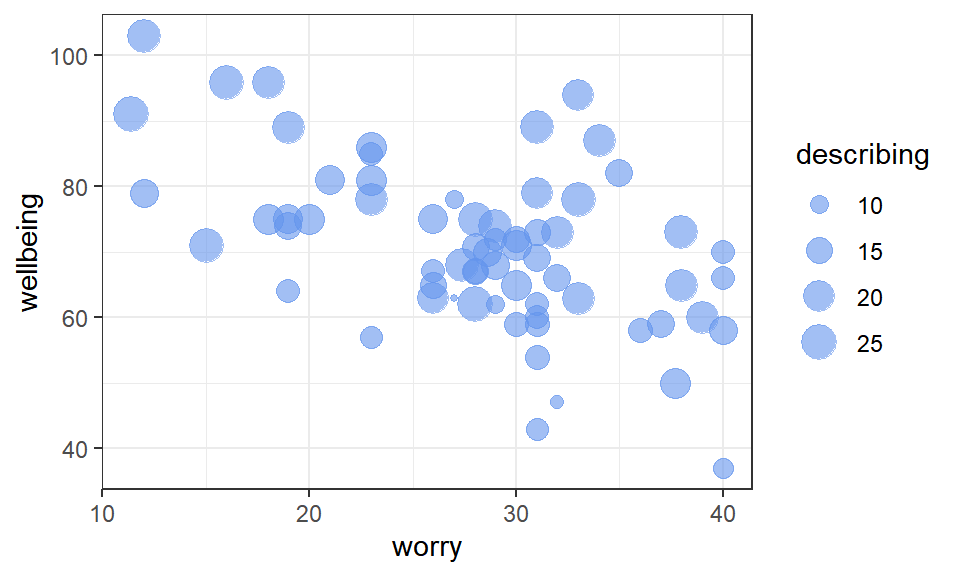
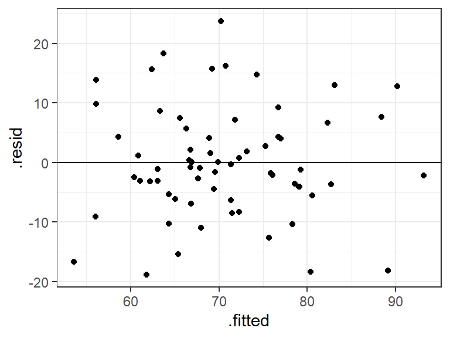
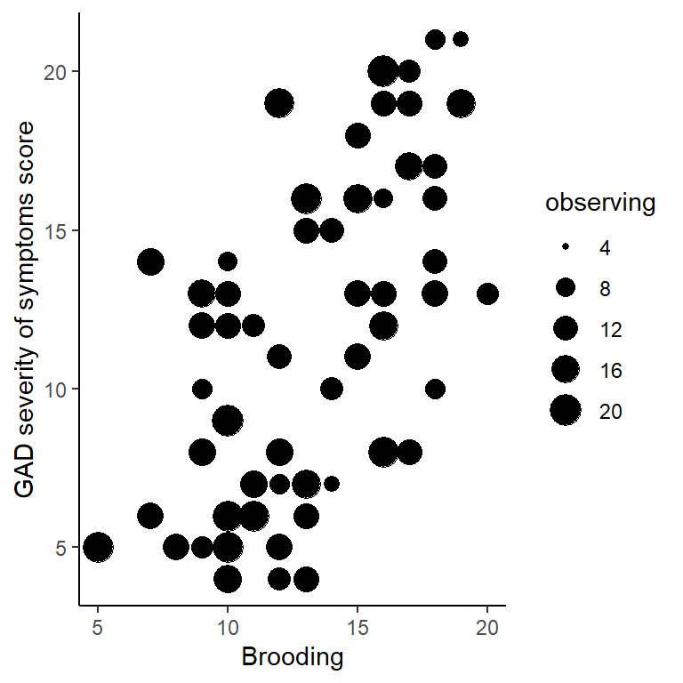

# Multiple regression: multiple continuous predictors {#multiple1}

*Chris Berry*
\
*2022*


<style>
div.exercise { background-color:#e6f0ff; border-radius: 5px; padding: 20px;}
</style>

<style>
div.tip { background-color:#D5F5E3; border-radius: 5px; padding: 20px;}
</style>


## Overview

\

* **Slides** from the lecture part of the session: [Download](slides/PSYC753_L2_MultipleRegression1.pptx)

\


This worksheet assumes you have gone through the previous one on [simple regression](#simple1). 

\

When we want to determine the extent to which an outcome variable (e.g., psychological wellbeing) is predicted by **multiple continuous predictors** (e.g., both *worry* **and** *mindfulness* scores), we can use **multiple regression**. 

Adding multiple predictors to a model may serve to _improve_ the prediction of the outcome variable. It can also be a way to test specific theories or hypotheses.

\

:::{.tip}
**Simple vs. Multiple Regression**

- **Simple regression** is a linear model of the relationship between *one outcome variable and one predictor variable*. For example, can we predict *wellbeing* on the basis of *worry* scores? 

- **Multiple regression** is a linear model of the relationship between *one outcome variable and more than one predictor variable*. For example, can we predict *wellbeing* based on *worry*, *mindfulness*, and *emotional intelligence* scores? 

:::


## Worked example

Iani et al. (2019) looked at factors associated with psychological wellbeing and distress in 66 individuals with generalised anxiety disorder. For educational purposes, we'll focus on a subset of their data, namely whether **wellbeing** is predicted by **worry** and **describing** scores in a multiple regression. _Describing_ is the mindfulness skill of being able to describe one's inner experiences and feelings with words. 

\

Read the data to R. The data are stored at:

https://raw.githubusercontent.com/chrisjberry/Teaching/master/2_wellbeing_data.csv


```r
# First ensure tidyverse is loaded, i.e., 'library(tidyverse)'

# read in the data using read_csv(), store in wellbeing_data
wellbeing_data <- read_csv('https://raw.githubusercontent.com/chrisjberry/Teaching/master/2_wellbeing_data.csv')
```

```r
# preview the data with glimpse()
wellbeing_data %>% glimpse() 
```

We'll use these three variables in the dataset:

* `wellbeing`: Higher scores indicate higher wellbeing.
* `worry`: Higher scores indicate higher levels of worry.
* `describing`: Higher scores indicate higher self-reported ability to describe one's inner experiences.

(_Note._ The data are publicly available, but I've changed the variable names for clarity. As in Iani et al. (2019), missing values were replaced with the mean of the relevant variable.)


\

Visualise the data with a scatterplot. Place the outcome variable `wellbeing` on the y-axis, the predictor `worry` on the x-axis, and let the _size_ of each point represent the second predictor, the `describing` score:


```r
# Scatterplot of all three variables
# Use alpha to alter transparency of points
# to make overlap easier to see

wellbeing_data %>% 
  ggplot(aes(x = worry, y = wellbeing, size = describing)) +
  geom_point(alpha = 0.6, colour = "cornflowerblue")
```

<div class="figure" style="text-align: center">

<p class="caption">(\#fig:unnamed-chunk-4)Scatterplot of wellbeing scores vs. worry and describing</p>
</div>

:::{.exercise}

From inspection of the scatterplot:

* Greater `worry` scores tend to be associated with <select class='webex-select'><option value='blank'></option><option value='answer'>lower</option><option value=''>constant</option><option value=''>higher</option></select> `wellbeing` scores.


<div class='webex-solution'><button>Explain</button>

A negative trend between `worry` and `wellbeing` is evident in the scatterplot

</div>


\

* Greater `describing` scores tend to be associated with <select class='webex-select'><option value='blank'></option><option value=''>lower</option><option value=''>constant</option><option value='answer'>higher</option></select> `wellbeing` scores.


<div class='webex-solution'><button>Explain</button>

The size of the `describing` points tend to be larger when `wellbeing` scores are higher.

</div>


\

The above trends are also apparent in the Pearson correlations between variables:


```r
# select the relevant columns from wellbeing_data and 
# use correlate() to obtain the correlations

wellbeing_data %>% 
  select(wellbeing, worry, describing) %>% 
  correlate(method = "pearson")
```
<table>
 <thead>
  <tr>
   <th style="text-align:left;background-color: lightblue !important;"> term </th>
   <th style="text-align:right;background-color: lightblue !important;"> wellbeing </th>
   <th style="text-align:right;background-color: lightblue !important;"> worry </th>
   <th style="text-align:right;background-color: lightblue !important;"> describing </th>
  </tr>
 </thead>
<tbody>
  <tr>
   <td style="text-align:left;background-color: lightblue !important;"> wellbeing </td>
   <td style="text-align:right;background-color: lightblue !important;"> NA </td>
   <td style="text-align:right;background-color: lightblue !important;"> -0.5419352 </td>
   <td style="text-align:right;background-color: lightblue !important;"> 0.5356548 </td>
  </tr>
  <tr>
   <td style="text-align:left;background-color: lightblue !important;"> worry </td>
   <td style="text-align:right;background-color: lightblue !important;"> -0.5419352 </td>
   <td style="text-align:right;background-color: lightblue !important;"> NA </td>
   <td style="text-align:right;background-color: lightblue !important;"> -0.2477970 </td>
  </tr>
  <tr>
   <td style="text-align:left;background-color: lightblue !important;"> describing </td>
   <td style="text-align:right;background-color: lightblue !important;"> 0.5356548 </td>
   <td style="text-align:right;background-color: lightblue !important;"> -0.2477970 </td>
   <td style="text-align:right;background-color: lightblue !important;"> NA </td>
  </tr>
</tbody>
</table>

* The correlation between `wellbeing` and `worry` (to 2 decimal places) is _r_ = <input class='webex-solveme nospaces' size='5' data-answer='["-0.54","-.54"]'/>
* The correlation between `wellbeing` and `describing`  (to 2 decimal places) is _r_ = <input class='webex-solveme nospaces' size='4' data-answer='[".54","0.54"]'/>
* The correlation between the two predictors (`worry` and `describing`)  (to 2 decimal places) is _r_ = <input class='webex-solveme nospaces' size='5' data-answer='["-.25","-0.25"]'/>

:::

\

\


:::{.tip}

**Multiple regression using `lm()`**

To include more than one predictor in a regression model, use the `+` symbol when specifying the model with `lm()`:

`lm(outcome ~ predictor_1 + predictor_2 + predictor_3.... , data = mydata)`

This runs a model of the form:

$Predicted \ outcome = a + b_1(Predictor \ 1) + b_2(Predictor \ 2) + b_3(Predictor \ 3) ...$ 

Note that we don't need to specify the intercept **a** in `lm()` since it is included automatically by R (as is the case with simple regression).

:::

\


```r
# conduct a multiple regression, store it in multiple1
multiple1 <- lm(wellbeing ~ worry + describing, data = wellbeing_data) 

# look at the coefficients
multiple1
```

```
## 
## Call:
## lm(formula = wellbeing ~ worry + describing, data = wellbeing_data)
## 
## Coefficients:
## (Intercept)        worry   describing  
##     70.7306      -0.7708       1.2484
```


* `(Intercept)` is the value of the intercept **a** in the regression equation. Type to two decimal places:<input class='webex-solveme nospaces' size='5' data-answer='["70.73"]'/>
* `worry` is the value of the coefficient $b_1$ for the `worry` predictor. <input class='webex-solveme nospaces' size='5' data-answer='["-0.77"]'/>
* `describing` is the value of the coefficient $b_2$ for the `describing` predictor. <input class='webex-solveme nospaces' size='4' data-answer='["1.25"]'/>

\

The regression equation is therefore written as:

\

  $Predicted\ wellbeing  = 70.73 - 0.77(worry) + 1.25(describing)$


\


### Residual plot

We can obtain a plot of the predicted values vs. the residuals in the same way as for simple regression by using `augment()` in the `broom` package.


```r
augment(multiple1) %>% 
  ggplot(aes(x = .fitted, y = .resid)) +
  geom_hline(yintercept = 0) +
  geom_point()
```

<div class="figure" style="text-align: center">

<p class="caption">(\#fig:unnamed-chunk-8)Scatterplot of the predicted values vs. residuals</p>
</div>

The points seem randomly and evenly distributed around the horizontal, in line with assumptions of homoscedasticity (equal variance of residuals at each predicted value), and independence of residuals. 

\


### Evaluating the model: Bayes Factor

\

:::{.tip}
The Bayes Factor tells us how many more times likely the multiple regression model is, relative to the intercept-only model.
:::

\

Use `lmBF()` to obtain the Bayes Factor for the multiple regression model:


```r
# store the BF for the model in multiple1_BF
multiple1_BF <- lmBF(wellbeing ~ worry + describing, data = data.frame(wellbeing_data))

# show the BF
multiple1_BF
```

```
## Bayes factor analysis
## --------------
## [1] worry + describing : 4190994 ±0%
## 
## Against denominator:
##   Intercept only 
## ---
## Bayes factor type: BFlinearModel, JZS
```

The Bayes Factor for the model is <input class='webex-solveme nospaces' size='4,190,994' data-answer='["4190994"]'/>. This tells us that the model with `worry` and `describing` is over four million times more likely than an `Intercept only` model (one with no predictors). Thus, there's strong evidence that the multiple regression model explains `wellbeing`.

\

### Evaluating the model: R^2^

\

:::{.tip}
R^2^ tells us how much variance in the outcome variable is explained by the multiple regression model.
:::

\

Use `glance()` in the `broom` package to obtain the R^2^ for the model:


```r
glance(multiple1)
```

<div class="kable-table">

<table>
 <thead>
  <tr>
   <th style="text-align:right;"> r.squared </th>
   <th style="text-align:right;"> adj.r.squared </th>
   <th style="text-align:right;"> sigma </th>
   <th style="text-align:right;"> statistic </th>
   <th style="text-align:right;"> p.value </th>
   <th style="text-align:right;"> df </th>
   <th style="text-align:right;"> logLik </th>
   <th style="text-align:right;"> AIC </th>
   <th style="text-align:right;"> BIC </th>
   <th style="text-align:right;"> deviance </th>
   <th style="text-align:right;"> df.residual </th>
   <th style="text-align:right;"> nobs </th>
  </tr>
 </thead>
<tbody>
  <tr>
   <td style="text-align:right;"> 0.4653263 </td>
   <td style="text-align:right;"> 0.4483526 </td>
   <td style="text-align:right;"> 9.393314 </td>
   <td style="text-align:right;"> 27.41444 </td>
   <td style="text-align:right;"> 0 </td>
   <td style="text-align:right;"> 2 </td>
   <td style="text-align:right;"> -239.9547 </td>
   <td style="text-align:right;"> 487.9093 </td>
   <td style="text-align:right;"> 496.6679 </td>
   <td style="text-align:right;"> 5558.763 </td>
   <td style="text-align:right;"> 63 </td>
   <td style="text-align:right;"> 66 </td>
  </tr>
</tbody>
</table>

</div>

* `r.squared` is **R^2^**, the proportion of variance in `wellbeing` explained by the model. Thus, the model explains 0.4653, or 46.53% of the variance in `wellbeing`.
* `adj.r.squared` is the **Adjusted R^2^** value, which is R^2^ adjusted for the sample size and the number of predictors in the model. It is an estimate of R^2^ for the population (not merely the scores we have in the sample), and is always less than R^2^. You'll see researchers reporting either R^2^ or the adjusted R^2^ in the literature. If you're not sure which one to use, report the adjusted R^2^, and say so (e.g., "adjusted R^2^ = 44.83%"). 

The adjusted R^2^ value is 0.4483, so in a report we could say that a model with `worry` and `describing` explains **44.83%** of the variance in `wellbeing`.

\


## Understanding the contribution of individual predictors

:::{.tip}
Because predictor variables are often correlated to a degree, some of the variance they explain in the outcome will be **shared**. A predictor's contribution to a model must therefore only be interpreted _after_ the other predictors in the model have been taken into account. This is explained in more detail below.
:::

### R^2^ in simple vs. multiple regression


In a simple regression of `wellbeing ~ worry`, the variance in `wellbeing` explained by `worry` is **R^2^ = 29.37%**:


```r
s1 <- lm(wellbeing ~ worry, data = wellbeing_data)
glance(s1)
```

<div class="kable-table">

<table>
 <thead>
  <tr>
   <th style="text-align:right;"> r.squared </th>
   <th style="text-align:right;"> adj.r.squared </th>
   <th style="text-align:right;"> sigma </th>
   <th style="text-align:right;"> statistic </th>
   <th style="text-align:right;"> p.value </th>
   <th style="text-align:right;"> df </th>
   <th style="text-align:right;"> logLik </th>
   <th style="text-align:right;"> AIC </th>
   <th style="text-align:right;"> BIC </th>
   <th style="text-align:right;"> deviance </th>
   <th style="text-align:right;"> df.residual </th>
   <th style="text-align:right;"> nobs </th>
  </tr>
 </thead>
<tbody>
  <tr>
   <td style="text-align:right;"> 0.2936938 </td>
   <td style="text-align:right;"> 0.2826578 </td>
   <td style="text-align:right;"> 10.71152 </td>
   <td style="text-align:right;"> 26.61226 </td>
   <td style="text-align:right;"> 2.6e-06 </td>
   <td style="text-align:right;"> 1 </td>
   <td style="text-align:right;"> -249.1416 </td>
   <td style="text-align:right;"> 504.2832 </td>
   <td style="text-align:right;"> 510.8522 </td>
   <td style="text-align:right;"> 7343.15 </td>
   <td style="text-align:right;"> 64 </td>
   <td style="text-align:right;"> 66 </td>
  </tr>
</tbody>
</table>

</div>
\

In a simple regression of `wellbeing ~ describing`, the variance in `wellbeing` explained by `describing` is **R^2^ = 28.69%**


```r
s2 <- lm(wellbeing ~ describing, data = wellbeing_data)
glance(s2)
```

<div class="kable-table">

<table>
 <thead>
  <tr>
   <th style="text-align:right;"> r.squared </th>
   <th style="text-align:right;"> adj.r.squared </th>
   <th style="text-align:right;"> sigma </th>
   <th style="text-align:right;"> statistic </th>
   <th style="text-align:right;"> p.value </th>
   <th style="text-align:right;"> df </th>
   <th style="text-align:right;"> logLik </th>
   <th style="text-align:right;"> AIC </th>
   <th style="text-align:right;"> BIC </th>
   <th style="text-align:right;"> deviance </th>
   <th style="text-align:right;"> df.residual </th>
   <th style="text-align:right;"> nobs </th>
  </tr>
 </thead>
<tbody>
  <tr>
   <td style="text-align:right;"> 0.286926 </td>
   <td style="text-align:right;"> 0.2757842 </td>
   <td style="text-align:right;"> 10.76272 </td>
   <td style="text-align:right;"> 25.75226 </td>
   <td style="text-align:right;"> 3.6e-06 </td>
   <td style="text-align:right;"> 1 </td>
   <td style="text-align:right;"> -249.4563 </td>
   <td style="text-align:right;"> 504.9126 </td>
   <td style="text-align:right;"> 511.4816 </td>
   <td style="text-align:right;"> 7413.512 </td>
   <td style="text-align:right;"> 64 </td>
   <td style="text-align:right;"> 66 </td>
  </tr>
</tbody>
</table>

</div>

\


So, by looking at the (non-adjusted) R^2^ values of our simple and multiple regressions so far, an interesting pattern is evident:

- In the simple regression of `wellbeing ~ worry`, R^2^ = **29.37%**

- In the simple regression of `wellbeing ~ describing`, R^2^ = **28.69%**

- Yet, in a multiple regression of `wellbeing ~ worry + describing`, R^2^ = **46.56%**, which is **_less_** than the sum of R^2^ from the simple regressions (29.37 + 28.69 = 58.06%). 

The reason why the R^2^ values from the simple regressions don't add up to the same value as the R^2^ for the multiple regression is because `worry` and `describing` are *correlated* (_r_ = -0.25, as you obtained earlier). This means that some of the variance that they explain in `wellbeing` is *shared*. 


\

### Venn Diagrams

:::{.tip}
Venn diagrams are useful for understanding the variance that predictors explain in the outcome variable. They are especially useful for understanding R^2^ in multiple regression. Here, I use them to explain why the R^2^ values from simple regressions don't necessarily add up to R^2^ when the same predictors are in a multiple regression.
:::

\

Suppose the rectangle below represents all of the _variance_ in `wellbeing` to be explained.


{width=70%}


The area of the circle below represents the variance in `wellbeing` explained by `worry` in the first simple regression. If this diagram were drawn to scale (it's not!), the area of the circle would be equal to the value of $R^2$ (i.e., 29.37%).


{width=70%}


The part of the rectangle not inside the circle represents the variance in `wellbeing` that is _not_ explained by the model (i.e., the unexplained or _residual_ variance). 

We'll now add `describing` to the model with `worry`. We could represent this on a Venn diagram as follows:

{width=60%}

The correlation is represented as an *overlap* in the circles. Their total area (R^2^ for the multiple regression model = 46.56%) is _less_ than the area they'd explain if there were no overlap (58.06%). 

**This highlights an important point**: Predictors are often correlated to some degree, so in multiple regression it only really makes sense to talk about the contribution a predictor makes _in the context of the other predictors in the model_. That is, a given predictor explains variance in the outcome variable only _after the other predictors in the model have been taken into account_. 

Given that the **unique** contributions of `worry` and `describing` are lower in a multiple regression model, we must ask whether there's evidence that each predictor makes a unique contribution, over an above the other predictor. For example, is there sufficient evidence for a unique contribution of `worry`, once `describing` has been taken into account? If not, we probably wouldn't include it in the model. 

\

### Using Bayes factors to assess the unique contribution of predictors

:::{.tip}
We can compare Bayes Factors to determine whether a given predictor in a multiple regression model makes a unique contribution to the prediction of the outcome variable.
:::

\

First, obtain the Bayes Factor for the model in which `predictor_1` has been left out of the full model. Then obtain the Bayes Factor for model in which `predictor_2` has been left out of the model. Repeat this for as many predictors you have in the model. 

In our example, this involves obtaining the BFs of the model of `wellbeing ~ describing`, and the BF of the model of `wellbeing ~ worry`:


```r
# BF for wellbeing ~ describing
describing_BF <- lmBF(wellbeing ~ describing, data = data.frame(wellbeing_data))

# BF for wellbeing ~ worry
worry_BF <- lmBF(wellbeing ~ worry, data = data.frame(wellbeing_data))
```

We also need the BF for the full model:


```r
# BF for wellbeing ~ worry + describing
# (this is the same as multiple1_BF above, but 
#  with a different name, which will help us see what's going on later)
worry_describing_BF <- lmBF(wellbeing ~ worry + describing, data = data.frame(wellbeing_data))
```

\

:::{.tip}

**Comparing models**

We can use the following general formula to determine whether there's evidence for a more complex version of a model, relative to a simpler model:

`BF_more_complex_model / BF_simpler_model`

That is, we divide the BF for the more complex model by the BF for the simpler one. This then tells us _how many more times more likely the more complex model is, relative to the simpler one._

For example, if `BF_more_complex_model = 10` and `BF_simpler_model = 2`, then the more complex model is five times more likely than the simpler one (because 10 / 2 = 5). There'd be substantial evidence to prefer the more complex model.

:::

\

In our case, we can compare Bayes Factor of the full model (`worry_describing_BF`) with that of our simpler models (`describing_BF`) and (`worry_BF`) in order to determine whether each predictor makes a unique contribution to the full model or not.

\

To determine if there's evidence for the unique contribution of `worry` to the model:

```r
# compare BFs for the full model and one in which worry is left out
worry_describing_BF / describing_BF
```

```
## Bayes factor analysis
## --------------
## [1] worry + describing : 981.4912 ±0%
## 
## Against denominator:
##   wellbeing ~ describing 
## ---
## Bayes factor type: BFlinearModel, JZS
```

The BF for the comparison is **981.49**, indicating that there's substantial evidence that the addition of `worry` to a model containing `describing` improves the model. In other words, there's evidence for a unique contribution of `worry` to the prediction of `wellbeing`.

\

To determine if there's evidence for the unique contribution of `describing` to the model:


```r
# compare the BFs for the full model and one in which describing is left out
worry_describing_BF / worry_BF
```

```
## Bayes factor analysis
## --------------
## [1] worry + describing : 738.4095 ±0%
## 
## Against denominator:
##   wellbeing ~ worry 
## ---
## Bayes factor type: BFlinearModel, JZS
```

The BF comparing the full model with one containing `worry` alone is **738.41**. This indicates that the model with both `worry` and `describing` is over seven hundred times more likely than the model with `worry` alone. The BF is greater than 3, so this indicates substantial evidence for the unique contribution of `describing` to the prediction of `wellbeing`.


Thus, in a multiple regression model, there's substantial evidence that both `worry` and `describing` predict `wellbeing` overall (BF = 4,190,994). There's also substantial evidence that `worry` (BF = 981.49) and `describing` (BF = 738.41) make unique contributions to this model. The model with both predictors included therefore seems justified.


\


## Multicollinearity


:::{.tip}
If the correlation between predictors is very high (greater than _r_ = 0.8 or less than -0.8), this is known as **multicollinearity**. 
:::

\

Multicollinearity can be a problem in multiple regression. Predictors may explain a large amount of variance in the outcome variable, but their 'unique' contribution in a multiple regression may be small. In an extreme scenario, _neither_ predictor makes a unique contribution, even though the overall regression explains a large amount of variance in the outcome variable! On a Venn diagram, the circles representing the predictors would almost completely overlap:


{width=75%}


Multicollinearity should be avoided. Therefore, check for extreme correlations between your predictor variables before including them in a multiple regression.

The correlation between the predictor variables in the model of `wellbeing ~ worry + describing` was <input class='webex-solveme nospaces' size='-.25' data-answer='["-0.25"]'/>, and multicollinearity was therefore <select class='webex-select'><option value='blank'></option><option value=''>of concern</option><option value='answer'>of no concern</option><option value=''>not possible to determine</option></select>.

\

:::{.tip}
**How many predictor variables should be included in a model?**

If adding predictors to the regression improves the prediction of the outcome variable, you may think that we can simply keep adding in variables to the model, until all the residual variance has been explained. This seems fine until we learn that if we were to add as many predictors to the model as there are rows in our data (e.g., 66 participants in`wellbeing_data`), then we'd perfectly predict the outcome variable, and have a (non-adjusted) $R^2$ of 100%! This would be true even if the predictors consisted of random values. Our model would clearly be meaningless though. 

We ideally want to explain the outcome variable with relatively few predictors, or for our selection of predictors to be guided by specific hypotheses or theory.
:::


\

## Exercise

:::{.exercise}

Main Exercise

The `wellbeing_data` also contain these columns:

* `gad` : Severity of symptoms of GAD (Generalised Anxiety Disorder). Higher scores indicate greater severity of symptoms.
* `brooding` : Higher scores indicate higher levels of brooding (i.e., being preoccupied with depressing, morbid, or painful memories or thoughts).
* `observing` : Higher scores indicate greater tendency to notice things in one's environment (e.g., smells, sounds, visual elements). It's another measure of mindfulness.

\

**Use multiple regression to investigate the extent to which `brooding` and `observing` predict `gad`. Adapt the code in this worksheet to do the following things (and try not to look at the solution until you've attempted the question):**

\


**1. Visualise the relationship between `gad`, `brooding` and `observing` in a scatterplot.**


<div class='webex-solution'><button>Hint</button>

Pipe `wellbeing_data` to `ggplot()` and use `geom_point()`. Use the `size` option to specify the second predictor variable in `aes()`

</div>
 


<div class='webex-solution'><button>Solution</button>


```r
wellbeing_data %>% 
  ggplot(aes(x = brooding, y = gad, size = observing)) +
  geom_point() +
  xlab("Brooding") + 
  ylab("GAD severity of symptoms score") +
  theme_classic()
```

<div class="figure" style="text-align: center">

<p class="caption">(\#fig:unnamed-chunk-17)GAD vs. brooding and observing scores</p>
</div>

In the scatterplot, `observing` could have also been swapped around with `brooding`. Try both ways.

</div>


* Greater `brooding` scores tend to be associated with <select class='webex-select'><option value='blank'></option><option value=''>lower</option><option value=''>no appreciable change in</option><option value='answer'>higher</option></select> `gad` scores.
* Greater `observing` scores tend to be associated with <select class='webex-select'><option value='blank'></option><option value=''>lower</option><option value='answer'>no appreciable change in</option><option value=''>higher</option></select> `gad` scores.

\

**2. Obtain the correlations between `gad`, `brooding`, and `observing`**


<div class='webex-solution'><button>Hint</button>

Pipe the `wellbeing_data` to `select()` and use `correlate()`

</div>
 


<div class='webex-solution'><button>Solution</button>


```r
wellbeing_data %>% 
  select(gad, brooding, observing) %>% 
  correlate(method = "pearson")
```

</div>
 


**State the correlations to two decimal places:** 

* The correlation between the GAD score and brooding is _r_ = <input class='webex-solveme nospaces' size='4' data-answer='["0.60",".60"]'/>
* The correlation between the GAD score and observing is _r_ = <input class='webex-solveme nospaces' size='5' data-answer='["-0.12","-.12"]'/>
* The correlation between brooding and observing is _r_ = <input class='webex-solveme nospaces' size='5' data-answer='["-0.18","-.18"]'/>

\

**Is multicollinearity a concern between the two predictor variables?** <select class='webex-select'><option value='blank'></option><option value=''>yes</option><option value='answer'>no</option><option value=''>cannot determine</option></select>


<div class='webex-solution'><button>Explanation</button>

The correlation between the predictor variables is _r_ = -.18. Although they are weakly correlated, this does not exceed r = -.80, and therefore multicolinearity is not a concern.

</div>


\

**3. Conduct a multiple regression, with `gad` as the outcome variable, and `brooding` and `observing` as the predictor variables**


<div class='webex-solution'><button>Hint</button>

Use `lm()` to specify the simple regression. Store it in `multiple2`.

</div>
 


<div class='webex-solution'><button>Solution</button>


```r
multiple2 <- lm(gad ~ brooding + observing, data = wellbeing_data)
multiple2
```

</div>
 

What is the value of the intercept a (to two decimal places)? <input class='webex-solveme nospaces' size='4' data-answer='["0.07"]'/>

What is the value of the coefficient for `brooding` (to two decimal places)? <input class='webex-solveme nospaces' size='4' data-answer='["0.89"]'/>

What is the value of the coefficient for `observing` (to two decimal places)? <input class='webex-solveme nospaces' size='5' data-answer='["-0.02"]'/>

\

What is the regression equation?

<div class='webex-radiogroup' id='radio_XFGYIDWWJE'><label><input type="radio" autocomplete="off" name="radio_XFGYIDWWJE" value=""></input> <span>Predicted GAD score = 0.07 - 0.89(brooding) + 0.02(observing)</span></label><label><input type="radio" autocomplete="off" name="radio_XFGYIDWWJE" value=""></input> <span>Predicted GAD score = 0.07 + 0.02(brooding) - 0.89(observing)</span></label><label><input type="radio" autocomplete="off" name="radio_XFGYIDWWJE" value="answer"></input> <span>Predicted GAD score = 0.07 + 0.89(brooding) - 0.02(observing)</span></label></div>


\

**4. Obtain R^2^ for the model**

<div class='webex-solution'><button>Hint</button>

Make sure you have stored the regression results (e.g., in `mutliple2`), then use `glance()` with that variable.

</div>


<div class='webex-solution'><button>Solution</button>


```r
glance(multiple2)
```

</div>


What proportion of variance in the GAD score is explained by the model containing `brooding` and `observing`? (Report the adjusted R-squared value as a proportion, to two decimal places) <input class='webex-solveme nospaces' size='4' data-answer='["0.34",".34"]'/>

Report the value of adjusted R-squared as a percentage, to two decimal places: The adjusted R^2^ value is equal to <input class='webex-solveme nospaces' size='5' data-answer='["34.50"]'/>%


\

**5. Obtain the Bayes Factor for the model**

<div class='webex-solution'><button>Hint</button>

Use `lmBF()` to specify the multiple regression model

</div>


<div class='webex-solution'><button>Solution</button>


```r
multiple2_BF <- lmBF(gad ~ brooding + observing, data = data.frame(wellbeing_data))
```

</div>


How many times more likely is the model with  `brooding` and `observing` as a predictor of `gad`, compared to an intercept-only model? (to two decimal places) <input class='webex-solveme nospaces' size='8' data-answer='["26889.69"]'/>

\

**6. Plot the predicted values against the residuals.**


<div class='webex-solution'><button>Hint</button>

Use `augment()` with `ggplot()` and `geom_point()`

</div>


<div class='webex-solution'><button>Solution</button>


```r
augment(multiple2) %>% 
  ggplot(aes(x = .fitted, y = .resid)) + 
  geom_point() + 
  geom_hline(yintercept = 0)
```
  

</div>


**What type of trend is evident between the predicted values and the residuals <select class='webex-select'><option value='blank'></option><option value=''>positive trend</option><option value='answer'>there's no association</option><option value=''>negative association</option></select>**


<div class='webex-solution'><button>Further interpretation</button>

Although there's a slight negative association for lower predicted values, the assumptions of homoscedasticity and independence of residuals appear to be met. You could also try adding the code `+ geom_smooth(method = "lm", se = FALSE)` to your plot to see what the (linear) trend line would actually be.

</div>


\

**7. Using `lmBF()`, determine whether there's evidence for a unique contribution of `brooding` and `observing` to prediction of `gad`**


* The BF associated with the unique contribution of `observing` is <input class='webex-solveme nospaces' size='4' data-answer='["0.19"]'/>

* The BF associated with the unique contribution of `brooding` is <input class='webex-solveme nospaces' size='8' data-answer='["71841.28"]'/>


<div class='webex-solution'><button>Hint 1</button>

* Use `lmBF()` to obtain the BF for both simple regressions and the multiple regression.
* Then use the general formula `BF_more_complex_model / BF_simpler_model` to obtain the BF for the unique contribution of each predictor.

</div>


<div class='webex-solution'><button>Hint 2</button>

To get the BF for the two simple regressions:

`BF_brooding <- lmBF(gad ~ brooding, data = data.frame(wellbeing_data))`

`BF_observing <- lmBF(gad ~ observing, data = data.frame(wellbeing_data))`

\

The multiple regression BF (same as `multiple2_BF`):

`BF_brooding_observing <- lmBF(gad ~ brooding + observing, data = data.frame(wellbeing_data))`

\
Then the BFs for relevant models need to be compared, using: 

`BF_more_complex_model / BF_simpler_model`


</div>


<div class='webex-solution'><button>Solution</button>


```r
# BF for gad ~ brooding
BF_brooding <- lmBF(gad ~ brooding, data = data.frame(wellbeing_data))

# BF for gad ~ observing
BF_observing <- lmBF(gad ~ observing, data = data.frame(wellbeing_data))

# BF for full model
BF_brooding_observing <- lmBF(gad ~ brooding + observing, data = data.frame(wellbeing_data))


# BF for the unique contribution of observing
BF_brooding_observing / BF_brooding

# BF for the unique contribution of brooding
BF_brooding_observing / BF_observing
```


</div>


\

**8. On balance, is there evidence for a model containing both brooding and observing as predictors of GAD scores?**


<div class='webex-solution'><button>Hint</button>

Look at BF for the unique contributions. If the BF is greater than 3, this indicates substantial evidence for the inclusion of that predictor in the model. If the BF is less than 0.33, then there's substantial evidence against its inclusion (the simpler model is preferable). Intermediate BFs are inconclusive, and the predictor should therefore be left out.

</div>


<div class='webex-solution'><button>Solution</button>

Together, `brooding` and `observing` explain 34.50% of the variance in GAD scores (adjusted R^2^), and there was strong evidence for this model, compared to an intercept only model, BF = 26889.69. There was, however, no evidence for a unique contribution of `observing` to the model (BF = 0.19), but there was substantial evidence for a unique contribution of `brooding` to the model, BF = 741841.28, whereby greater GAD scores were associated with higher `brooding` scores. In the interest of parsimony (not making models more complex than they need to be), the results suggest that only `brooding` predicts GAD and `observing` should not be included in the model that also contains `brooding`. 


</div>


:::


\

\

## Further exercises

Not essential. For those confident with everything.

### `regressionBF()`

When determining the BF for the unique contribution of a predictor, as a shortcut, we could have used `regressionBF()`, rather than using `lmBF()` multiple times. `regressionBF()` automatically calculates the BFs for all permutations of a set of predictors in a model. 

For our first model of `wellbeing` on the basis of `worry` and `describing`:


```r
# obtain BFs for all permutations of the model predictors
all_BFs <- regressionBF(wellbeing ~ worry + describing, data = data.frame(wellbeing_data))

# look at the BFs
all_BFs
```

```
## Bayes factor analysis
## --------------
## [1] worry              : 5675.703 ±0%
## [2] describing         : 4270.027 ±0%
## [3] worry + describing : 4190994  ±0%
## 
## Against denominator:
##   Intercept only 
## ---
## Bayes factor type: BFlinearModel, JZS
```

* "[1]" is the BF for the model with `worry` as the sole predictor of `wellbeing`
* "[2]" is the BF for the model with `describing` as the sole predictor of `wellbeing`
* "[3]" is the BF for the model with `worry` and `describing` as predictors

\

Comparing the BF for [3] and [2] will tell us whether there's evidence that `worry` makes a unique contribution.

```r
# compare multiple regression with simple regression 2
all_BFs[3] / all_BFs[2]
```

```
## Bayes factor analysis
## --------------
## [1] worry + describing : 981.4912 ±0%
## 
## Against denominator:
##   wellbeing ~ describing 
## ---
## Bayes factor type: BFlinearModel, JZS
```

The BF for this comparison is **981.49**, which matches the BF for the unique contribution of `describing` calculated earlier.

\

Comparing the BF for [3] and [1] will therefore tell us whether there's evidence that `describing` makes a unique contribution to the model:


```r
# compare the BF for [3] and [1]
all_BFs[3] / all_BFs[1]
```

```
## Bayes factor analysis
## --------------
## [1] worry + describing : 738.4095 ±0%
## 
## Against denominator:
##   wellbeing ~ worry 
## ---
## Bayes factor type: BFlinearModel, JZS
```

The BF for this comparison is **738.41**, which matches the BF for the unique contribution of `describing` calculated earlier.

\

Thus, the BFs derived by this method are the same as when we used `lmBF()` in the main section of the worksheet.

\

:::{.exercise}

Further exercise 1

Use `regressionBF()` to obtain the BFs for the unique contribution of `brooding` and `observation` in the model in the Main Exercise (i.e., `gad ~ brooding + observation`), and check that they are the same as the ones produced when you used `lmBF()`

:::

\


### Predicting new data

As with simple regression, we can use `augment()` to predict what the outcome variable would be, given new data. For example, for a new individual with a `worry` score of 20 and `describing` score of 15:


```r
# specify the new data (for each predictor in the model)
new_scores <- tibble(worry = 20, 
                     describing = 15)

# use augment() in the broom package to obtain the prediction
library(broom)
augment(multiple1, newdata = new_scores)
```

<div class="kable-table">

<table>
 <thead>
  <tr>
   <th style="text-align:right;"> worry </th>
   <th style="text-align:right;"> describing </th>
   <th style="text-align:right;"> .fitted </th>
  </tr>
 </thead>
<tbody>
  <tr>
   <td style="text-align:right;"> 20 </td>
   <td style="text-align:right;"> 15 </td>
   <td style="text-align:right;"> 74.03992 </td>
  </tr>
</tbody>
</table>

</div>

`.fitted` contains the predicted `wellbeing` score, and is equal to 74.04. 

\

To derive predictions for several new participants, use `c(score1, score2...)` when specifying the `new_scores`. To add another individual with a `worry` score of 25 and `describing` score of 10


```r
# specify the new data (for both predictors)
new_scores <- tibble(worry = c(20, 25), 
                     describing = c(15, 10))

# use augment() in the broom package for the predictions
augment(multiple1, newdata = new_scores)
```

<div class="kable-table">

<table>
 <thead>
  <tr>
   <th style="text-align:right;"> worry </th>
   <th style="text-align:right;"> describing </th>
   <th style="text-align:right;"> .fitted </th>
  </tr>
 </thead>
<tbody>
  <tr>
   <td style="text-align:right;"> 20 </td>
   <td style="text-align:right;"> 15 </td>
   <td style="text-align:right;"> 74.03992 </td>
  </tr>
  <tr>
   <td style="text-align:right;"> 25 </td>
   <td style="text-align:right;"> 10 </td>
   <td style="text-align:right;"> 63.94410 </td>
  </tr>
</tbody>
</table>

</div>

Each row contains the details for a new person. The `.fitted` column contains the predicted `wellbeing` scores: **74.04** and **63.94**.

\

:::{.exercise}
Predicting data

For the model in the main exercise (i.e., `gad ~ brooding + observing`), what are the predicted values of `gad` for three new individuals with `brooding` scores of 10, 15, and 20, and `observing` scores of 3, 6 and 9, respectively. 

* Predicted GAD of participant 1 (to one decimal place) = <input class='webex-solveme nospaces' size='3' data-answer='["8.9"]'/>
* Predicted GAD of participant 2 (to one decimal place) = <input class='webex-solveme nospaces' size='4' data-answer='["13.2"]'/>
* Predicted GAD of participant 3 (to one decimal place) = <input class='webex-solveme nospaces' size='4' data-answer='["17.6"]'/>


<div class='webex-solution'><button>Solution</button>


```r
new_scores <- tibble(brooding = c(10, 15, 20),
                     observing = c(3, 6, 9))

multiple2 <- lm(gad ~ brooding + observing, data = wellbeing_data)

augment(multiple2, newdata = new_scores)
```

</div>


:::

\

:::{.exercise}

Further exercise

Not essential. Only for if you are _really_ confident with everything.

The variables `attention`, `clarity` and `repair` in the `wellbeing_data` are measures of emotional intelligence. To what extent do these three predictors uniquely explain `wellbeing` in a multiple regression?

* The BF for the unique contribution of `attention` = <input class='webex-solveme nospaces' size='5' data-answer='["81.01"]'/>
* The BF for the unique contribution of `clarity` = <input class='webex-solveme nospaces' size='4' data-answer='["3.84"]'/>
* The BF for the unique contribution of `repair` = <input class='webex-solveme nospaces' size='5' data-answer='["82.36"]'/>


<div class='webex-solution'><button>Hint</button>

Obtain the BF for the full model and the BFs for the models in which each of the predictors have been left out. Compare the BF for the full model with that of the model with the predictor left out in order to obtain the BF for the unique contribution of that predictor.

</div>


\


<div class='webex-solution'><button>Solution</button>


Check correlations:


```r
wellbeing_data %>% 
  select(wellbeing, attention, clarity, repair) %>% 
  correlate(method = "pearson")
```

\ 

Run multiple regression:


```r
multiple3 <- lm(wellbeing ~ attention + clarity + repair, data = wellbeing_data)
```

\

Adjusted R^2^ for the overall model:

```r
glance( multiple3 )
```

\


Using `lmBF()`:


```r
BF_attention_clarity_repair <-
  lmBF(wellbeing ~ attention + clarity + repair, data = data.frame(wellbeing_data))

BF_attention_clarity <-
  lmBF(wellbeing ~ attention + clarity, data = data.frame(wellbeing_data))

BF_attention_repair <-
  lmBF(wellbeing ~ attention + repair, data = data.frame(wellbeing_data))

BF_clarity_repair <-
  lmBF(wellbeing ~ clarity + repair, data = data.frame(wellbeing_data))

# unique contribution of attention
BF_attention_clarity_repair / BF_clarity_repair

# unique contribution of clarity
BF_attention_clarity_repair / BF_attention_repair

# unique contribution of repair
BF_attention_clarity_repair / BF_attention_clarity
```


\

Using `regressionBF()`:


```r
all_BFs <-
  regressionBF(wellbeing ~ attention + clarity + repair, data = data.frame(wellbeing_data))

# look at output
all_BFs

# unique contribution of attention
all_BFs[7] / all_BFs[6]

# unique contribution of clarity
all_BFs[7] / all_BFs[5]

# unique contribution of repair
all_BFs[7] / all_BFs[4]
```
\


</div>


:::

\

## Summary of key points

- Predictors can be added to a model in `lm` using the `+` symbol

  - e.g., `lm(wellbeing ~ worry + describing + predictor_3 + ....)`

- Predictor variables are often _correlated_ to some extent. This can affect the interpretation of individual predictor variables. Venn diagrams can help to understand the unique contributions of predictors 

- In multiple regression, it's important to understand that each predictor makes a contribution to explaining the outcome variable only **after taking into account the other predictors in the model**.

- The Bayes Factor for a multiple regression model tells us how much more likely it is, compared to an intercept-only model. 

- To know whether there's evidence for the unique contribution of a predictor, we have to compare Bayes Factors for the more complex model (which includes it), versus the simpler model (in which the predictor is left out). i.e., `BF_more_complex_model / BF_simpler_model`.

- **Multicollinearity** exists when predictors are highly correlated (_r_ above 0.8 or below -0.8) and should be avoided by dropping one of the predictors.

\

## References

Iani, L., Quinto, R. M., Lauriola, M., Crosta, M. L., & Pozzi, G. (2019). Psychological well-being and distress in patients with generalized anxiety disorder: The roles of positive and negative functioning. _PloS one_, _14_(11), e0225646. https://doi.org/10.1371/journal.pone.0225646


