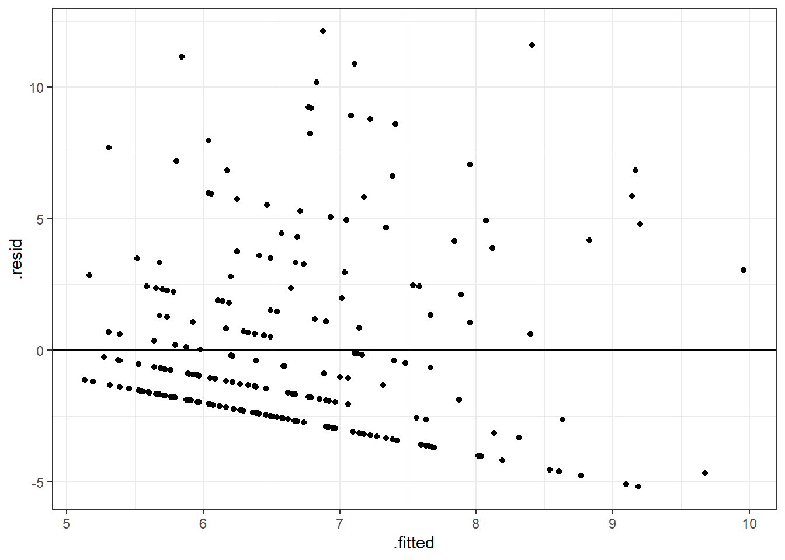

# Multiple regression: multiple continuous predictors {#multiple1}

*Chris Berry*
\
*2022*


<!--
commented text


<style>
div.exercise { background-color:#e6f0ff; border-radius: 5px; padding: 20px;}
</style>

<style>
div.tip { background-color:#D5F5E3; border-radius: 5px; padding: 20px;}
</style>


## Overview

\

* **Slides** from the lecture part of the session: [Download](slides/PSYC753_L2_MultipleRegression1.pptx)

\


This worksheet assumes you have gone through the previous one on [simple regression](#simple1). 

\

:::{.tip}

When we want to determine the extent to which an outcome variable (e.g., anxiety score) is predicted by **multiple continuous predictors** (e.g., screen time *and* physical activity), we can use **multiple regression**. 

Adding multiple predictors to a model may serve to _improve_ the prediction of the outcome variable. 

:::

\

:::{.tip}
**Simple vs. Multiple Regression**

- **Simple regression** is a linear model of the relationship between *one outcome variable and one predictor variable*. For example, can we predict **anxiety scores** on the basis of **screen time** scores? 

- **Multiple regression** is a linear model of the relationship between *one outcome variable and more than one predictor variable*. For example, can we predict **anxiety scores** based on **screen time** scores, **physical activity** scores, and **life satisfaction**? 

:::


## Worked example

In the previous session we used `screen_time` to predict `anxiety_score` in the data of Hrafnkelsdottir et al. (2018). In a separate simple regression (in the exercises), we used `physical_activity` to predict `anxiety_score`.

We'll now conduct a multiple regression by including both `screen_time` and `physical_activity` in the same model.

\

:::{.tip}

**Multiple regression with `lm()`**

To include additional predictors in a regression model, use the `+` symbol when specifying the model with `lm()`:

`lm(outcome ~ predictor_1 + predictor_2 + predictor_3.... , data = mydata)`

:::

\


```r
# load tidyverse (if not already loaded)
library(tidyverse)

# load the dataset (if not already loaded)
mentalh <- read_csv('data/mentalhealthdata.csv')

# conduct a multiple regression, store it in multiple1
multiple1 <- lm(anxiety_score ~ screen_time + physical_activity, data = mentalh) 

# look at the coefficients
multiple1
```

```
## 
## Call:
## lm(formula = anxiety_score ~ screen_time + physical_activity, 
##     data = mentalh)
## 
## Coefficients:
##       (Intercept)        screen_time  physical_activity  
##            8.3991             0.1627            -0.5699
```


* `(Intercept)` is the value of the intercept **a** in the regression equation
* `screen_time` is the value of the coefficient for the `screen_time` predictor
* `physical_activity` is the value of the coefficient for the `physical_activity` predictor

\

The regression equation is therefore written as:

  $Predicted\ anxiety\ score  = 8.40 + 0.16(screen\ time) - 0.57(physical\ activity)$

\

:::{.exercise}
By looking at the _sign_  (positive or negative) on the relevant coefficient, complete these statements: 

* Greater `screen_time` scores are associated with <select class='webex-select'><option value='blank'></option><option value=''>lower</option><option value='answer'>higher</option></select> levels of anxiety


<div class='webex-solution'><button>Explanation</button>

A positive sign on the coefficient indicates a positive association between the predictor variable and the outcome variable (i.e., as scores on one increase, scores on the other also increase).

</div>


* Greater levels of `physical_activity` are associated with <select class='webex-select'><option value='blank'></option><option value='answer'>lower</option><option value=''>higher</option></select> levels of anxiety.


<div class='webex-solution'><button>Explanation</button>

A negative sign on the coefficient indicates a negative association between the predictor variable and the outcome variable (i.e., as scores on one increase, scores on the other decrease).

</div>

:::


### Predicting new data

As with simple regression, we can use the multiple regression equation to predict what the outcome variable would be, given new data. For example, for a new individual with a `screen_time` score of 10 and `physical_activity` score of 5.5:


```r
# specify the new data (for all predictors in the model)
new_scores <- tibble(screen_time = 10, 
                     physical_activity = 5.5)

# use augment() in the broom package to obtain the prediction
library(broom)
augment(multiple1, newdata = new_scores)
```

<div class="kable-table">

| screen_time| physical_activity|  .fitted|
|-----------:|-----------------:|--------:|
|          10|               5.5| 6.892328|

</div>

`.fitted` is the predicted `anxiety_score` (6.9). `augment()` has worked it out the prediction automatically.

To derive predictions for several new participants, use `c(score1, score2...)` when specifying the `new_scores`:


```r
# specify the new data (for both predictors)
new_scores <- tibble(screen_time = c(10, 12), 
                     physical_activity = c(5.5, 2))

# use augment() in the broom package for the predictions
augment(multiple1, newdata = new_scores)
```

<div class="kable-table">

| screen_time| physical_activity|  .fitted|
|-----------:|-----------------:|--------:|
|          10|               5.5| 6.892328|
|          12|               2.0| 9.212314|

</div>

The second row contains the prediction for a new person with `screen_time` of **12** hours and `physical_activity` of **2**. Their predicted `anxiety_score` is **9.21**.

\


### Evaluating the model: Bayes Factor

Use `lmBF()` to obtain the Bayes Factor for the multiple regression model:


```r
# store the BF in multiple1_BF
multiple1_BF <- lmBF(anxiety_score ~ screen_time + physical_activity, data = mentalh)
```

```
## Warning: data coerced from tibble to data frame
```

```r
# show the BF
multiple1_BF
```

```
## Bayes factor analysis
## --------------
## [1] screen_time + physical_activity : 58.40328 ±0%
## 
## Against denominator:
##   Intercept only 
## ---
## Bayes factor type: BFlinearModel, JZS
```

The Bayes Factor for the model is **58.40**. This tells us that the model with `screen_time` and `physical_activity` is 58.40 times more likely than an `Intercept only` model. In other words, there's strong evidence that this model is explaining variance in `anxiety_score`, and should be preferred over an intercept-only one (i.e., one with no predictors).


### Residuals

We can obtain a plot of the predicted values vs. the residuals (a spread-versus level plot) in the same was as for simple regression, by using `augment()` in the `broom` package.


```r
# create a spread-versus-level plot
augment(multiple1) %>% 
  ggplot(aes(x = .fitted, y = .resid)) +
  geom_hline(yintercept = 0) +
  geom_point()
```

<div class="figure" style="text-align: center">

<p class="caption">(\#fig:unnamed-chunk-6)TRUE</p>
</div>

A negative trend in the plot is evident, such that the residuals become more negative as the predicted values of `anxiety_score` increase. This was also the case in the previous worksheet with `anxiety_score` versus `screen_time`. This suggests the model could be improved. 


\

### Evaluating the model: R^2^

Use `glance()` in the `broom` package to obtain the R^2^ for the model:


```r
glance(multiple1)
```

<div class="kable-table">

| r.squared| adj.r.squared|    sigma| statistic|   p.value| df|    logLik|      AIC|      BIC| deviance| df.residual| nobs|
|---------:|-------------:|--------:|---------:|---------:|--:|---------:|--------:|--------:|--------:|-----------:|----:|
|  0.064907|     0.0571469| 3.510864|  8.364191| 0.0003076|  2| -651.1421| 1310.284| 1324.273| 2970.606|         241|  244|

</div>

* `r.squared` is **R^2^**, the proportion of variance in values of `anxiety_score` explained by the model. Thus, `screen_time` and `physical_activity` explain 0.0649, or 6.49% of the variance in `anxiety_score`.

* `adj.r.squared` is the **Adjusted R^2^** value, which is R^2^, adjusted for the sample size and number of predictors in the model. It is an estimate of R^2^ for the population (not merely the scores we have in the sample), and is always less than R^2^. You'll see researchers using either R^2^ or the adjusted R^2^ in the literature. If you're not sure which one to use, report the adjusted R^2^, and say which one you are using (e.g., "adjusted R^2^ = 5.71%"). 

The adjusted R^2^ value is 0.0571, so a model with `screen_time` and `physical_activity` explains 5.71% of the variance in `anxiety_scores`.

\


## Contribution of individual predictors

By looking at the regular (non-adjusted) R^2^ values of our models so far, an interesting trend is evident:

- In a simple regression of `anxiety_score ~ screen_time`, R^2^ = 2.96%

- In a simple regression of `anxiety_score ~ physical_activity`, R^2^ = 5.33%

- Yet, in a multiple regression of `anxiety_score ~ screen_time + physical_activity`, R^2^ = 6.49%, which is _less_ than the sum of R^2^ from the simple regressions (i.e., 2.96 + 5.33 = 8.29%). Why don't the R^2^ values from the simple regressions add up to the same value as the multiple regression? The reason is because `screen_time` and `physical_activity` are **correlated**, and this means that some of the variance that they explain in `anxiety_score` is **shared**. 


```r
# obtain the correlation between the predictors
mentalh %>% 
  select(screen_time, physical_activity) %>% 
  correlate()
```

```
## 
## Correlation method: 'pearson'
## Missing treated using: 'pairwise.complete.obs'
```

<div class="kable-table">

|term              | screen_time| physical_activity|
|:-----------------|-----------:|-----------------:|
|screen_time       |          NA|        -0.2987714|
|physical_activity |  -0.2987714|                NA|

</div>
\


### Venn Diagrams

Venn diagrams are useful for understanding the variance that predictors explain in the outcome variable. They are especially useful for understanding what's going on with R^2^ in a multiple regression:


Suppose the rectangle below represents all of the _variance_ in `anxiety_score` to be explained.


{width=70%}


The area of the circle below represents the variance in `anxiety_score` explained by `screen_time` in the first simple regression we did in the last session. If this diagram were drawn to scale (it's not!), the area of the circle would be equal to the value of $R^2$ (i.e., 2.96% of the rectangle).


{width=70%}


The part of the rectangle not inside the circle represents the variance in `anxiety_score` that is _not_ explained by the model (i.e., the unexplained or _residual_ variance). 

We'll now add `physical_activity` to the model with `screen_time`. We could represent this on a Venn diagram as follows:

{width=70%}

The correlation is represented as an overlap in the circles. Their total area (6.49%) is _less_ than the area they'd explain if there were no overlap (8.29%) (if there was zero correlation).

**This demonstrates an important point**: Predictors are often correlated to some degree. In multiple regression, it only really makes sense to talk about the contribution a predictor makes _in the context of the other predictors in the model_. That is, a given predictor explains variance in the outcome variable only _after the other predictors in the model have been taken into account_, or _given the presence of the other predictors_. 

To take this further, if variables predictors are correlated in a mutliple regression, the model as a whole may explain the outcome variable well (indicated by the BF and R^2^), even though the *unique contribution* of a predictor is very low. 

Given that the **unique** contribution of `screen_time` and `physical_activity` is lower in a multiple regression model, this begs the question of whether it was worth adding in `physical_activity` to the model with `screen_time` in the first place. (Conversely, we can ask whether adding `screen_time` to a model containing `physical_activity` results in an improvement in prediction of `anxiety_score`.)

\

### Bayes Factors to assess the contribution of predictors

Is the addition of `physical_activity`to a model containing `screen_time` statistically significant? Does it result in an _improvement_ in prediction? We can use Bayes Factors to determine whether there's sufficient evidence for this or not.

First, obtain the Bayes Factors for the simple and multiple regression models using `lmBF()`:


```r
# BF for anxiety_score ~ screen_time
simple1_BF    <- lmBF(anxiety_score ~ screen_time, data = data.frame(mentalh))

# BF for anxiety_score ~ physical activity
simple2_BF    <- lmBF(anxiety_score ~ physical_activity, data = data.frame(mentalh))

# BF for anxiety_score ~ screen_time + physical_activity
multiple1_BF   <- lmBF(anxiety_score ~ screen_time + physical_activity, data = data.frame(mentalh))

# look at the BFs
simple1_BF
simple2_BF
multiple1_BF
```

```
## Bayes factor analysis
## --------------
## [1] screen_time : 4.420298 ±0%
## 
## Against denominator:
##   Intercept only 
## ---
## Bayes factor type: BFlinearModel, JZS
## 
## Bayes factor analysis
## --------------
## [1] physical_activity : 77.49101 ±0%
## 
## Against denominator:
##   Intercept only 
## ---
## Bayes factor type: BFlinearModel, JZS
## 
## Bayes factor analysis
## --------------
## [1] screen_time + physical_activity : 58.40328 ±0%
## 
## Against denominator:
##   Intercept only 
## ---
## Bayes factor type: BFlinearModel, JZS
```

* In a model with `screen_time` alone, BF = 4.42. 
* In a model with `physical_activity` alone, BF = 77.49.
* In a model with both predictors, BF = 58.40

\

:::{.tip}

**Comparing models**

We can use the following formula to determine whether there's evidence for a more complex version of a model, relative to a simpler one:

`BF_complex_model / BF_simpler_model`

That is, we divide the BF for the complex model, by the BF for the simpler one. This then tells us _how many more times more likely the more complex model is, relative to the simpler one._

For example, if `BF_complex_model = 10` and `BF_simpler_model = 2`, then the more complex model is five times more likely than the simpler one (because 10 / 2 = 5). There'd be strong evidence to prefer the more complex model. 

:::

\


For our models:


```r
# compare the BFs for the multiple regression model with one containing screen_time alone
multiple1_BF / simple1_BF
```

```
## Bayes factor analysis
## --------------
## [1] screen_time + physical_activity : 13.21252 ±0%
## 
## Against denominator:
##   anxiety_score ~ screen_time 
## ---
## Bayes factor type: BFlinearModel, JZS
```

The BF comparing the multiple regression model with the model containing `screen_time` alone is **13.21**. This indicates that the model with both `screen_time` and `physical_activity` is over 13 times more likely than the model with `screen_time` alone. The BF is greater than 3, so this indicates strong evidence for the inclusion of the `screen_time` variable.

\

Equally, we could ask if the addition of `screen_time` to a model containing `physical_activity` is statistically significant:

```r
# compare BFs for the multiple regression model and the model containing physical_activity alone
multiple1_BF / simple2_BF
```

```
## Bayes factor analysis
## --------------
## [1] screen_time + physical_activity : 0.7536782 ±0%
## 
## Against denominator:
##   anxiety_score ~ physical_activity 
## ---
## Bayes factor type: BFlinearModel, JZS
```

The BF for the comparison is less than one (BF = 0.75), indicating that the addition of `screen_time` to a model containing `physical_activity` is **not** statistically significant.

Putting this altogether, in a multiple regression model, the _unique contribution_ of `screen_time` is not statistically significant, but that of `physical_activity` is. In the interest of parsimony (not making things more complex than they need to be), it would make sense to drop `screen_time` from the model, which doesn't contribute much to the model, over an above `physical_activity`. `physical_activity` is doing a good job at explaining the variance in `anxiety_score` on its own.

\

### Bayes Factors shortcut: `regressionBF()`

As a shortcut, we could use `regressionBF()`, which automatically calculates the BFs for all permutations of a set of predictors in a model:


```r
# obtain BFs for all permutations of the model
all_BFs <- regressionBF(anxiety_score ~ screen_time + physical_activity, data = mentalh)
```

```
## Warning: data coerced from tibble to data frame
```

```r
# look at the BFs
all_BFs
```

```
## Bayes factor analysis
## --------------
## [1] screen_time                     : 4.420298 ±0%
## [2] physical_activity               : 77.49101 ±0%
## [3] screen_time + physical_activity : 58.40328 ±0%
## 
## Against denominator:
##   Intercept only 
## ---
## Bayes factor type: BFlinearModel, JZS
```

We can then compare the BFs for given models to obtain the same results as before:


```r
# compare multiple regression with simple regression 1 
# the BF should be the same as before
all_BFs[3] / all_BFs[1]

# compare multiple regression with simple regression 2
# the BF should be the same as before
all_BFs[3] / all_BFs[2]
```

```
## Bayes factor analysis
## --------------
## [1] screen_time + physical_activity : 13.21252 ±0%
## 
## Against denominator:
##   anxiety_score ~ screen_time 
## ---
## Bayes factor type: BFlinearModel, JZS
## 
## Bayes factor analysis
## --------------
## [1] screen_time + physical_activity : 0.7536782 ±0%
## 
## Against denominator:
##   anxiety_score ~ physical_activity 
## ---
## Bayes factor type: BFlinearModel, JZS
```


## Multicollinearity

If the correlation between predictors is very high (greater than _r_ = 0.8 or less than -0.8), this is known as **multicollinearity**. On a Venn diagram, the circles representing the predictors would almost completely overlap. Multicollinearity can be a problem in multiple regression. Predictors may explain a large amount of variance in the outcome variable, but their 'unique' contribution in a multiple regression may be small. In an exterme scenario, _neither_ predictor may be statistically significant even though the overall regression explains a large amount of variance in the outcome variable!

{width=50%}


An example of multicollinearity in the `mentalh` dataset can be seen with the variables `BMI` (Body Mass Index) and `weight_kg` (weight of the participant in kg). 

:::{.exercise}

Obtain the correlation between `BMI` and `weight_kg`:


<div class='webex-solution'><button>Solution</button>


```r
mentalh %>% 
  select(BMI, weight_kg) %>% 
  correlate()
```

```
## 
## Correlation method: 'pearson'
## Missing treated using: 'pairwise.complete.obs'
```

<div class="kable-table">

|term      |       BMI| weight_kg|
|:---------|---------:|---------:|
|BMI       |        NA| 0.8164486|
|weight_kg | 0.8164486|        NA|

</div>

</div>


The correlation between `BMI` and `weight_kg` (to two decimal places) is _r_ = <input class='webex-solveme nospaces' size='4' data-answer='["0.82"]'/>.
:::

Since BMI is calculated from a person's weight (in addition to height and sex), it is no surprise that the correlation with `weight_kg` is so high. Given that both variables say similar things, and are highly correlated (r > 0.8), we wouldn't include both as predictors in a model. We'd pick one instead.

\

The take-home message here is to check for extreme correlations between your predictor variables before including them in a multiple regression.

\

:::{.tip}
**How many predictor variables should be in the model?**

If adding predictors to the regression improves the prediction of the outcome variable, you may think that we can simply add in variables to the model as we wish, until all the residual variance has been explained. This seems fine to do until we learn that if we were to add as many predictors to the model as there are rows in our data (e.g., 244 participants in`mentalh`), then we'd perfectly predict the outcome variable, and have an $R^2$ of 100%! This would be true even if the predictors consisted of random values. Our model would clearly be meaningless though. We ideally want to explain the outcome variable with relatively few predictors.
:::


\

## Exercise

:::{.exercise}

Use multiple regression to investigate the extent to which `screen_time` and `physical_activity` predict `depression_score` in the `mentalh` dataset. `depression_score` is a measure of the symptoms of depression. Higher scores indicate a greater number of depressive symptoms.


\

**Adapt the code in this worksheet to do the following:**

**1. Obtain the correlations between `dep_score`, `screen_time`, and `physical_activity`**


<div class='webex-solution'><button>Hint</button>

Pipe `mentalh` to `select()` and use `correlate()`

</div>
 


<div class='webex-solution'><button>Solution</button>


```r
mentalh %>% 
  select(depression_score, screen_time, physical_activity) %>% 
  correlate()
```

</div>
 

\

**State the correlations to two decimal places:** 

* The correlation between the depression score and screen time is _r_ = <input class='webex-solveme nospaces' size='4' data-answer='["0.28",".28"]'/>
* The correlation between the depression score and physical activity is _r_ = <input class='webex-solveme nospaces' size='5' data-answer='["-0.22","-.22"]'/>
* The correlation between screen time and physical activity is _r_ = <input class='webex-solveme nospaces' size='5' data-answer='["-0.30","-.30"]'/>
\

**Is multicolinearity a concern between the two predictor variables?** <select class='webex-select'><option value='blank'></option><option value=''>yes</option><option value='answer'>no</option><option value=''>cannot determine</option></select>


<div class='webex-solution'><button>Explanation</button>

The correlation between the predictor variables is r = -.30. Although they are weakly correlated, this does not exceed r = -.80, and therefore multicolinearity is not a concern.

</div>


\

**2. Conduct a multiple regression, with `depression_score` as the outcome variable, and `screen_time` and `physical_activity` as the predictor variables**


<div class='webex-solution'><button>Hint</button>

Use `lm()` to specify the simple regression

</div>
 


<div class='webex-solution'><button>Solution</button>


```r
multiple2 <- lm(depression_score ~ screen_time + physical_activity, data = mentalh)
multiple2
```

</div>
 

What is the value of the intercept a (to two decimal places)? <input class='webex-solveme nospaces' size='5' data-answer='["17.71"]'/>

What is the value of the coefficient for `screen_time` (to two decimal places)? <input class='webex-solveme nospaces' size='4' data-answer='["0.83"]'/>

What is the value of the coefficient for `physical_activity` (to two decimal places)? <input class='webex-solveme nospaces' size='5' data-answer='["-1.05"]'/>

\

What is the regression equation?

<div class='webex-radiogroup' id='radio_QBMDVVHKZD'><label><input type="radio" autocomplete="off" name="radio_QBMDVVHKZD" value=""></input> <span>Predicted depression score = 17.71 + 1.05(screen time) - 0.83(physical activity)</span></label><label><input type="radio" autocomplete="off" name="radio_QBMDVVHKZD" value=""></input> <span>Predicted depression score = 17.71 + 0.83(screen time) + 1.05(physical activity)</span></label><label><input type="radio" autocomplete="off" name="radio_QBMDVVHKZD" value="answer"></input> <span>Predicted depression score = 17.71 + 0.83(screen time) - 1.05(physical activity)</span></label></div>


\

**3. Obtain R-squared**

<div class='webex-solution'><button>Hint</button>

Make sure you have stored the regression results (e.g., in `mutliple2`), then use `glance()` with that variable

</div>


<div class='webex-solution'><button>Solution</button>


```r
glance(multiple2)
```

</div>


What proportion of variance in the depression score is explained by screen time and physical activity? (Report the adjusted R-squared value, to two decimal places) <input class='webex-solveme nospaces' size='4' data-answer='["0.09"]'/>

Report the value of adjusted R-squared as a percentage, to two decimal places: The adjusted R^2^ value is equal to <input class='webex-solveme nospaces' size='4' data-answer='["9.00"]'/>%


\

**4. Obtain the Bayes Factor for the model**

<div class='webex-solution'><button>Hint</button>

Use `lmBF()` to specify the model

</div>


<div class='webex-solution'><button>Solution</button>


```r
multiple2_BF <- lmBF(depression_score ~ screen_time + physical_activity, data = mentalh)
```

</div>


How many times more likely is the model with  `screen_time` and `physical_activity` as a predictor of `depression_score`, compared to an intercept-only model? (to two decimal places) <input class='webex-solveme nospaces' size='7' data-answer='["3388.76"]'/>

\

**5. Produce a spread versus level plot of the data. Is there any trend evident in the residuals?**


<div class='webex-solution'><button>Hint</button>

Use `augment()` with `ggplot()` and `geom_point()`

</div>


<div class='webex-solution'><button>Solution</button>


```r
augment(multiple2) %>% 
  ggplot(aes(x = .fitted, y = .resid)) + 
  geom_point() + 
  geom_hline(yintercept = 0)
```
  

</div>


*What type of trend is evident between the predicted values and the residuals <select class='webex-select'><option value='blank'></option><option value=''>positive trend</option><option value=''>no association</option><option value='answer'>negative association</option></select>*


<div class='webex-solution'><button>Further interpretation</button>

The pattern shown in the spread-level plot is similar to the pattern in our previous regression models. Once again, this suggests our model can be improved. We'll investigate this more in future sessions. 

</div>


\

**6. Using `lmBF()`, determine whether the unique contribution of `screen_time` and `physical_activity` to prediction of `depression_score` is statistically significant**


<div class='webex-solution'><button>Hint</button>

* Use `lmBF()` to obtain the BF for both simple regressions and the multiple regression.
* Then use the formula `BF_complex_model / BF_simpler_model` to obtain the BF for the contribution of each predictor.

</div>


<div class='webex-solution'><button>Solution</button>


```r
# BF for depression_score ~ screen_time
BF_screen <- lmBF(depression_score ~ screen_time, data = data.frame(mentalh))

# BF for depression_score ~ physical_activity
BF_physical <- lmBF(depression_score ~ physical_activity, data = data.frame(mentalh))

# BF for depression_score ~ screen_time + physical_activity
BF_screen_physical <- lmBF(depression_score ~ screen_time + physical_activity, data = data.frame(mentalh))

# show the BFs
BF_screen
BF_physical
BF_screen_physical

# BF for the unique contribution of physical_activity
BF_screen_physical / BF_screen

# BF for the unique contribution of screen_time
BF_screen_physical / BF_physical
```

```
## Bayes factor analysis
## --------------
## [1] screen_time : 1661.733 ±0%
## 
## Against denominator:
##   Intercept only 
## ---
## Bayes factor type: BFlinearModel, JZS
## 
## Bayes factor analysis
## --------------
## [1] physical_activity : 36.68915 ±0.01%
## 
## Against denominator:
##   Intercept only 
## ---
## Bayes factor type: BFlinearModel, JZS
## 
## Bayes factor analysis
## --------------
## [1] screen_time + physical_activity : 3388.76 ±0%
## 
## Against denominator:
##   Intercept only 
## ---
## Bayes factor type: BFlinearModel, JZS
## 
## Bayes factor analysis
## --------------
## [1] screen_time + physical_activity : 2.039293 ±0%
## 
## Against denominator:
##   depression_score ~ screen_time 
## ---
## Bayes factor type: BFlinearModel, JZS
## 
## Bayes factor analysis
## --------------
## [1] screen_time + physical_activity : 92.36409 ±0.01%
## 
## Against denominator:
##   depression_score ~ physical_activity 
## ---
## Bayes factor type: BFlinearModel, JZS
```


</div>


* The BF associated with the unique contribution of `physical_activity` is <input class='webex-solveme nospaces' size='4' data-answer='["2.04"]'/>

* The BF associated with the unique contribution of `screen_time` is <input class='webex-solveme nospaces' size='5' data-answer='["92.37"]'/>

\

**7. On balance, is there evidence for a model containing both screen time and physical activity as predictors of depression scores?**


<div class='webex-solution'><button>Hint</button>

Look at BF for the unique contributions. If the BF is greater than 3, this indicates strong evidence for the inclusion of the predictor.

</div>


<div class='webex-solution'><button>Solution</button>

Together, screen time and physical activity explain 9.00% of the variance in depression scores (adjusted R^2^), and there was strong evidence for this model, compared to an intercept only model, BF = 3388.76. The unique contribution of screen time was statistically significant (BF = 92.37), but there was only weak evidence that physical activity made a contribution, over and above screen time, in this model, BF = 2.04.


</div>


:::


\


## Further exercises

:::{.exercise}

Produce density plots of the individual variables `depression_score`, `screen_time` and `physical_activity`. 

Produce a scatterplot to show all three variables on the same figure

What is the increase in R^2^ associated with the addition of `screen_time` and `physical_activity` into the model predicting `depression_score`

Move residuals and regressionBF sections here.


:::


\

## Summary of key points

- Predictors can be added to a model in `lm` using the `+` symbol

  - e.g., `lm(anxiety_score ~ screen_time + physical_activity + predictor_3 + ....)`

- Predictor variables are often _correlated_ to some extent. This can affect the interpretation of individual predictor variables. Venn diagrams help to understand the results. 

- In multiple regression, it's important to understand that each predictor makes a contribution to explaining the outcome variable only **after taking into account the other predictors in the model**.

- As with simple regression, the Bayes Factor for a multiple regression model tells us how much more likely the overall model is, compared to an intercept-only model. 

- To know whether individual predictors are statistically significant or not, we have to compare Bayes Factors for the more complex model which includes it, versus the model without it. i.e., `BF_complex_model / BF_simpler_model`. Use `lmBF()` to derive the BFs for each model separately, or use `regressionBF()` to obtain all the BFs for a set of models in one go.


- **Multicollinearity** exists when predictors are very highly correlated (_r_ above 0.8) and should be avoided.

\

## References

Hrafnkelsdottir S.M., Brychta R.J., Rognvaldsdottir V., Gestsdottir S., Chen K.Y., Johannsson E., et al. (2018) Less screen time and more frequent vigorous physical activity is associated with lower risk of reporting negative mental health symptoms among Icelandic adolescents. _PLoS ONE_ _13_(4): e0196286. https://doi.org/10.1371/journal.pone.0196286


commented text
--> 


