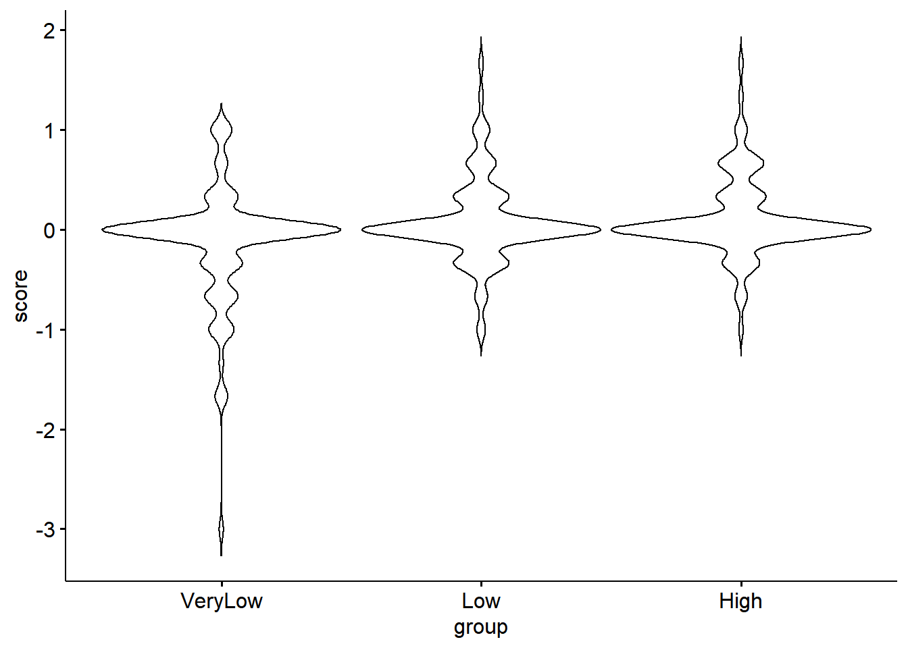
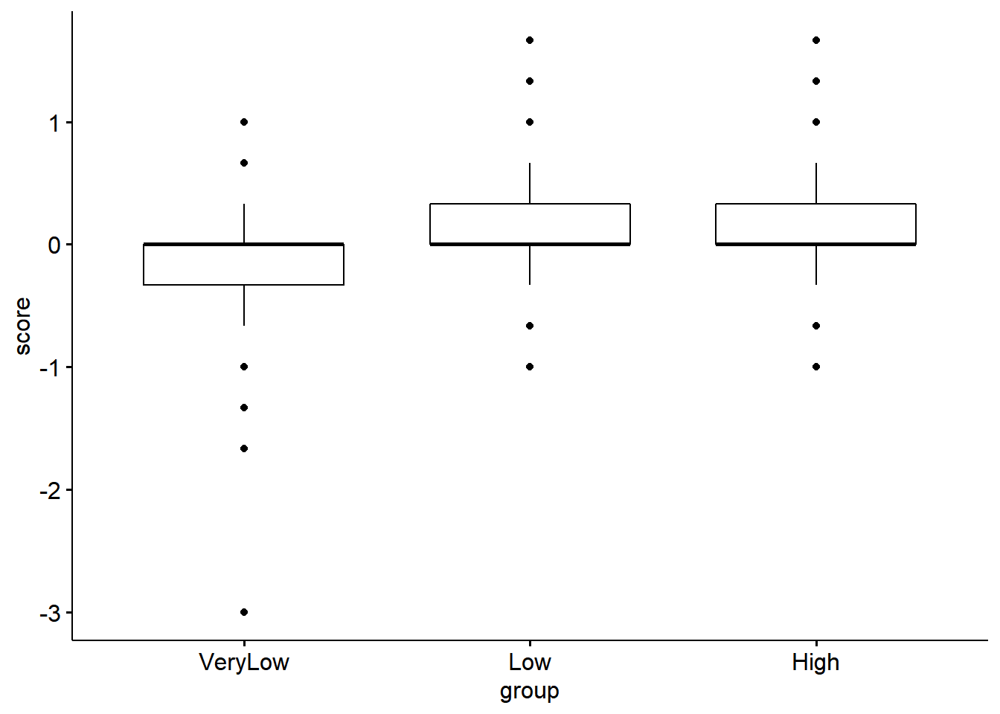

# ANOVA: One-way (and 2x2 Between-subjects)

*Chris Berry*
\
*2022*


<!--
commented text


<style>
div.exercise { background-color:#e6f0ff; border-radius: 5px; padding: 20px;}
</style>

<style>
div.tip { background-color:#D5F5E3; border-radius: 5px; padding: 20px;}
</style>


## Overview

\

* **Slides** from the lecture part of the session: [Download](slides/PSYC753_L2_MultipleRegression1.pptx)

\


So far we have used regression where both the outcome and predictor variables are continuous.

When the predictor variables in a regression are categorical, the analysis usually goes by a different name, ANOVA, which stands for Analysis Of Variance. 

**A one-way between subjects ANOVA** is used to compare the scores from different groups of individuals. For example, do the anxiety scores differ between three groups of individuals who each undergo a different type of therapy as treatment. 

:::{.tip}
  * **one-way** means that there is one independent variable, for example, _type of therapy_. In the language of ANOVA, independent variables are also called *factors*. A factor can be made up of different *levels* (e.g., type of therapy could have levels: CBT, EMDR, Control).
  * **between subjects** means that each level of the independent variable is administered to a different group of participants. For example, if type of therapy is manipulated between-subjects, one group would receive Cognitive Behavioural Therapy, one group receive EMDR, and another group who receive no treatment are the control group. 
:::

The ANOVA will tell us whether scores on our dependent variable (e.g., anxiety score) differ according to the levels of the independent variable (type of treatment).

Other types of ANOVA (e.g., two-way, within-subjects, factorial) will be considered in future sessions. 


## Worked Example

What is the effect of viewing picture of different aesthetic quality on mood? Meidenbauer et al. (2020) showed three groups of participants pictures of urban environments that were either very low in aesthetic appeal (n=103), low in aesthetic (n=103), or high (n=103). Participants' State Trait Anxiety Inventory (negative symptoms: upset, tense, worried ) was measured before and after viewing these images. The `affect` dataset contains the results of this study. The label for the aesthetic group is in the column labelled `group`. The change in mood score is in the column called `score`. 

What is the independent variable? aesthetic group

How many levels does it have? 3

What is the dependent variable? STAI

How many participants in each group?
affect %>% group_by(group) %>% count()
  
To run a one-way between subjects ANOVA in R use lmBF() or anovaBF()


```r
affect <- read_csv("data/affect.csv")
```

```
## Rows: 306 Columns: 20
```

```
## -- Column specification --------------------------------------------------------
## Delimiter: ","
## chr  (3): imageCon, natCon, group
## dbl (17): Sub, Avg_Pic_Rate, STAI1_pos, STAI1_neg, mood1_happy, mood1_sad, m...
```

```
## 
## i Use `spec()` to retrieve the full column specification for this data.
## i Specify the column types or set `show_col_types = FALSE` to quiet this message.
```

```r
affect<- 
  affect %>% 
  mutate(group = factor(group,levels=c("VeryLow","Low","High")))

ggviolin(data = affect, x= "group", y = "score")
```

<div class="figure" style="text-align: center">

<p class="caption">(\#fig:unnamed-chunk-2-1)TRUE</p>
</div>

```r
ggboxplot(data = affect, x= "group", y = "score")
```

<div class="figure" style="text-align: center">

<p class="caption">(\#fig:unnamed-chunk-2-2)TRUE</p>
</div>

```r
lmBF(score ~ group, data = data.frame(affect))
anovaBF(score ~ group, data = data.frame(affect))

# follow up ttests
#ttestBF()
```

```
## Bayes factor analysis
## --------------
## [1] group : 66.65842 ±0.04%
## 
## Against denominator:
##   Intercept only 
## ---
## Bayes factor type: BFlinearModel, JZS
## 
## Bayes factor analysis
## --------------
## [1] group : 66.65842 ±0.04%
## 
## Against denominator:
##   Intercept only 
## ---
## Bayes factor type: BFlinearModel, JZS
```

Comparisons

\

## References
Glass G.V., Peckham P.D., Sanders J.R. Consequences of failure to meet assumptions underlying the fixed effects analyses of variance and covariance. Rev. Educ. Res. 1972;42:237–288. doi: 10.3102/00346543042003237. 

Meidenbauer, K. L., Stenfors, C. U., Bratman, G. N., Gross, J. J., Schertz, K. E., Choe, K. W., & Berman, M. G. (2020). The affective benefits of nature exposure: What's nature got to do with it?. Journal of environmental psychology, 72, 101498. https://doi.org/10.1016/j.jenvp.2020.101498

Schmider E., Ziegler M., Danay E., Beyer L., Bühner M. Is it really robust? Methodology. 2010;6:147–151. doi: 10.1027/1614-2241/a000016


commented text
--> 
