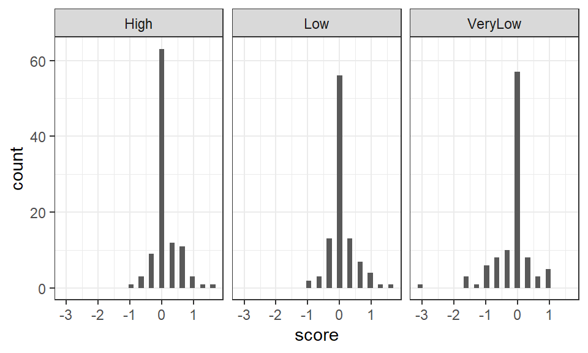
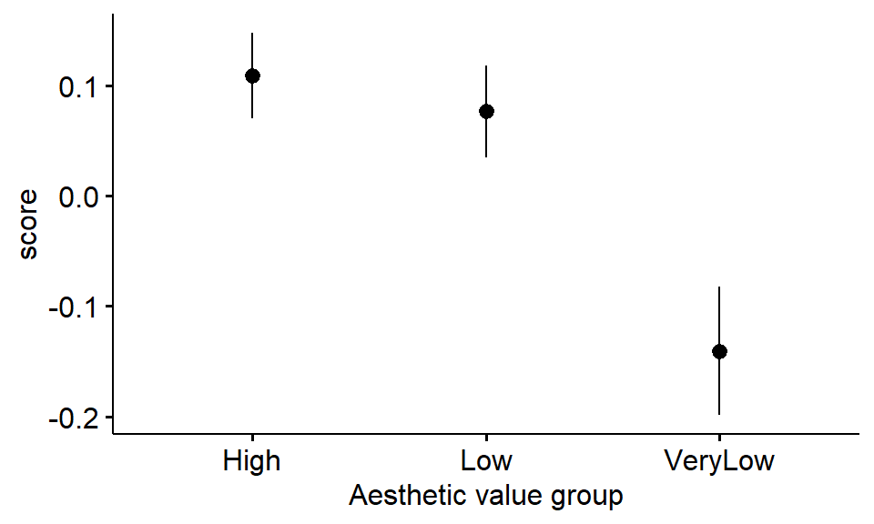
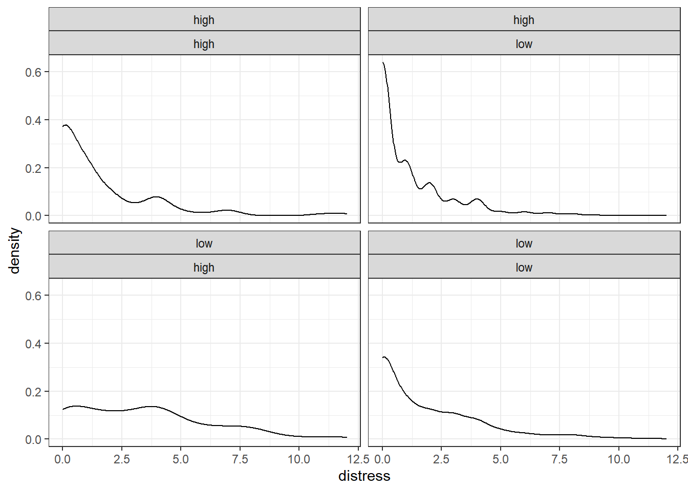

# ANOVA: between-subjects designs {#anova1}

*Chris Berry*
\
*2022*


<!--
commented text

<style>
div.exercise { background-color:#e6f0ff; border-radius: 5px; padding: 20px;}
</style>

<style>
div.tip { background-color:#D5F5E3; border-radius: 5px; padding: 20px;}
</style>


## Overview

\

* **Slides** from the lecture part of the session: [Download](slides/PSYC753_L3_ANOVA_1.pptx)

\


So far we have used regression where both the outcome and predictor are _continuous variables_.

When all the _predictor variables_ in a regression are categorical, the analysis is called **ANOVA**, which stands for Analysis Of VAriance. 

Here we consider two types of ANOVA for between-subjects designs: one-way ANOVA and two-way ANOVA. We will consider other types in future sessions (e.g., for within-subjects/repeated measures designs).


## One-way between subjects ANOVA

:::{.tip}
**A one-way between subjects ANOVA** is used to compare the scores from a dependent variable across different groups of individuals. For example, do **mood** scores differ between three groups of individuals, where each group undergoes a different type of therapy as treatment? 
:::

\

  * **one-way** means that there is one independent variable, for example, _type of therapy_. 
  * Independent variables are also called **factors** in ANOVA. 
  * A factor is made up of different **levels**. _Type of therapy_ could have three levels: CBT (Cognitive Behavioural Therapy), EMDR (Eye Movement Desensitisation and Reprocessing), and Control.
  * **between subjects** means that a different group of participants gives us mood scores for each level of the independent variable. For example, if type of therapy is manipulated between-subjects, one group receives CBT, another group receives EMDR, and another group are the control group. Each participant provides exactly one score.


### Worked Example

What is the effect of viewing pictures of different aesthetic value on a person's mood? To investigate, Meidenbauer et al. (2020) showed three groups of participants pictures of urban environments that were either very low in aesthetic value (_n_ = 102), low in aesthetic value (_n_ = 100), or high (_n_ = 104). Participants' change in State Trait Anxiety Inventory (STAI: a measure of negative symptoms such as upset, tense, worried) as a result of viewing the pictures was measured.

:::{.exercise}

Design check.

* What is the independent variable (or _factor_) in this design? <select class='webex-select'><option value='blank'></option><option value=''>change in STAI score</option><option value='answer'>aesthetic appeal of the pictures</option></select>

* How many levels does the factor have? <select class='webex-select'><option value='blank'></option><option value=''>1</option><option value=''>2</option><option value='answer'>3</option><option value=''>4</option></select>

* What is the dependent variable? <select class='webex-select'><option value='blank'></option><option value=''>VeryLow, Low, High</option><option value='answer'>change in STAI score</option><option value=''>aesthetic appeal of images</option></select>

* What is the nature of the independent variable? <select class='webex-select'><option value='blank'></option><option value='answer'>categorical</option><option value=''>continuous</option></select>

* Is the independent variable manipulated within- or between-subjects?
<select class='webex-select'><option value='blank'></option><option value='answer'>between-subjects</option><option value=''>within-subjects</option></select>

:::

\

#### Read in the data

Read in the data at the link below and store in `affect_data`. Preview the data using `head()`.

  https://raw.githubusercontent.com/chrisjberry/Teaching/master/3_affect.csv

(Note. The data in are taken from the Urban condition of Meidenbauer et al. (2020, Experiment 1). The data are publicly available through the links in their article. The variable names have been changed here for clarity.)


```r
# Read in the data
affect_data <- read_csv('https://raw.githubusercontent.com/chrisjberry/Teaching/master/3_affect.csv')

# look at the first 6 rows
affect_data %>% head()
```
Information about the variables in `affect_data`:

* `ppt`: the participant number
* `group`: the aesthetic value group, with levels `VeryLow`, `Low` and `High`
* `score`: the change in STAI score. Higher scores indicate _fewer_ negative symptoms after viewing the images (i.e., improvement in mood).
* `age`: age in years 
* `gender`: 1 = male, 2 = female.

\
Notice that the `group` column is by default read into R as a _character variable_ (that's what the label `<chr>` means in the output). This is because the levels of `group` have been recorded in the dataset as words e.g., "VeryLow".

\

#### Convert the independent variable to a factor

To enable us to use the `group` column in an ANOVA, we need to tell R that `group` is a _factor_. Use `mutate()` and `factor()` to convert `group` to a factor.


```r
# use mutate() to convert the group variable to a factor
# store the changes back in affect_data 
# (i.e., overwrite what's already in affect_data)

affect_data <-
  affect_data %>% 
  mutate(group = factor(group))
```


<div class='webex-solution'><button>Remember</button>


`mutate()` can be used to change variables or create new ones.

\

The code `mutate(group = factor(group))` means: 

* `group = `: create a variable called `group`. Because `group` already exists in `affect_data` it will be overwritten.
* `factor(group)`: convert the `group` variable to a factor.


</div>


<div class='webex-solution'><button>Tip</button>


If we'd have used:

`factor(group, levels = c("VeryLow","Low","High"))`

instead of 

`factor(group)`

this would mean that the levels of `group` will additionally be ordered according to the order in `levels`.

This can be useful when plotting the data.


</div>


Check that the variable label for `group` has now changed from `<chr>` to `<fct>` (i.e., a factor) by looking at the dataset again.

```r
affect_data
```


\

#### n of each group

Use `group_by()` and `count()` to obtain the number of participants in each group:


```r
# use group_by() to group the data by 'group' column, 
# then count number of rows in each group with count()

affect_data %>% 
  group_by(group) %>% 
  count()
```
* How many participants were there in the `VeryLow` aesthetic value group? <input class='webex-solveme nospaces' size='3' data-answer='["102"]'/>
* How many participants were there in the `Low` aesthetic value group? <input class='webex-solveme nospaces' size='3' data-answer='["100"]'/>
* How many participants were there in the `High` aesthetic value group? <input class='webex-solveme nospaces' size='3' data-answer='["104"]'/>

\

#### Visualise the data

The way the data are distributed in each group can be inspected with histograms or density plots.


```r
# Histogram of scores in each group 
# Use facet_wrap(~group) to create a separate
# panel for each group

affect_data %>% 
  ggplot(aes(score)) +
  geom_histogram() + 
  facet_wrap(~group)
```

<div class="figure" style="text-align: center">

<p class="caption">(\#fig:unnamed-chunk-6)Histogram of scores in each aesthetic value group</p>
</div>


<div class='webex-solution'><button>Tip</button>


To produce density plots, swap `geom_histogram()` with `geom_density()`.


</div>


<div class='webex-solution'><button>Comments on the histograms</button>

The spread of scores in each group appears relatively similar, suggesting the assumption of homogeneity of variance in ANOVA, may be met. The distributions are reasonably symmetrical, and, aside from the very high number of 0 scores in each group (indicative of zero change in STAI score in a large number of individuals), the data appear approximately normally distributed. In practice, ANOVA is considered reasonably robust against violations of the test's assumptions (see e.g., Glass et al. 1972, Schmider et al., 2010).

</div>


\

#### Plot the means

Visualise the data further by obtaining a plot of the mean score in each group.

The package `ggpubr` can produce high quality plots with ease. Using `ggerrorplot()` in `ggpubr`:


```r
# load the ggpubr package
library(ggpubr)

# plot the mean of each group 
# specify desc_stat = "mean_se" to 
# add error bars representing the standard error 
affect_data %>% 
  ggerrorplot(x = "group" , y = "score", desc_stat = "mean_se") +
  xlab("Aesthetic value group") 
```

<div class="figure" style="text-align: center">

<p class="caption">(\#fig:unnamed-chunk-7)Mean change in STAI score across aesthetic value groups (error bars indicate SE)</p>
</div>

<div class='webex-solution'><button>Developing the plot</button>

As with plots generated in `ggplot()`, the figure can be enhanced by adding further code, e.g., try adding the line:

`+ ylab("Change in STAI (negative symptoms)"`

\

`ggpubr` uses `ggplot()` to make graphs, so the plot could, in theory, be built from scratch using techniques you've covered earlier in the course.

\

Other types of plot are available, see e.g.:

Errorplots: `?ggerrorplot()`
Boxplots: `?ggboxplot()`
Violin plots: `?ggviolin()`

I encourage you to play around to find effective ways to visualise your data!

To see more types of plot: `help(package = ggpubr)`


</div>


From inspection of the plot of the means:

* Which aesthetic value group has the greatest improvement in STAI score? <select class='webex-select'><option value='blank'></option><option value='answer'>High</option><option value=''>Low</option><option value=''>VeryLow</option></select>
* Which aesthetic value group has the lowest improvement in STAI score? <select class='webex-select'><option value='blank'></option><option value=''>High</option><option value=''>Low</option><option value='answer'>VeryLow</option></select>
* Did STAI scores appear to worsen (i.e., be below zero) in any group as a result of viewing the images? <select class='webex-select'><option value='blank'></option><option value=''>High group</option><option value=''>Low group</option><option value='answer'>VeryLow group</option></select>

\

#### Descriptives: Mean and SE of each group

Use `summarise()` to obtain the mean (M) in each group:


```r
affect_data %>% 
  group_by(group) %>% 
  summarise(M = mean(score))
```
The standard error of the mean is $SD / \sqrt{n}$. We can therefore obtain the standard error of the mean for each group as follows:


```r
affect_data %>% 
  group_by(group) %>% 
  summarise(SE = sd(score) / sqrt( n() ))
```

<div class='webex-solution'><button>Tip</button>


To show the mean and SE in the same output:


```r
affect_data %>% 
  group_by(group) %>% 
  summarise( M = mean(score), 
             SE = sd(score) / sqrt( n() ) )
```


</div>


\


#### One-way between subjects ANOVA

:::{.tip}

A Bayes Factor can be obtained for the ANOVA model. It is the BF for a model of `score` on the basis of `group` (i.e., `score ~ group`). This will tell us how much more likely the model (with different three groups) is than an intercept-only model (where all the scores are treated as coming from one large group). That is, it will tell us whether we have evidence for an effect of aesthetic appeal on the STAI scores.

:::

\

To obtain the BF for the ANOVA model, use `lmBF()` or `anovaBF()`:


```r
# obtain the BF for the ANOVA model with lmBF()
lmBF(score ~ group, data = data.frame(affect_data))
```

```
## Bayes factor analysis
## --------------
## [1] group : 66.65842 ±0.04%
## 
## Against denominator:
##   Intercept only 
## ---
## Bayes factor type: BFlinearModel, JZS
```

The Bayes Factor for the model is equal to BF = <input class='webex-solveme nospaces' size='5' data-answer='["66.66"]'/>. This indicates that the data are over <input class='webex-solveme nospaces' size='11' data-answer='["six","sixty","six hundred"]'/> times more likely than an intercept-only model. There is therefore substantial evidence for an effect of the aesthetic value of urban images on changes in STAI scores.

\

`anovaBF()` can be used in place of `lmBF()` to produce exactly the same result:


```r
anovaBF(score ~ group, data = data.frame(affect_data))
```

### R^2^

:::{.tip}
R^2^ can be reported for ANOVA models as a measure of _effect size_. As with simple and multiple regression, R^2^ represents the proportion of variance explained by the model. In ANOVA, our model is that the scores come from distinct groups of individuals (three groups in our example) with different means.
:::

\

To obtain R^2^, first use `lm()` to specify the model, then use `glance()` from the `broom` package:


```r
# specify and store the anova
anova_1 <- lm(score ~ group, data = affect_data)

# make sure broom package is loaded, then
# use glance() with anova_1 
glance(anova_1)
```

<div class="kable-table">

| r.squared| adj.r.squared|  sigma| statistic|   p.value| df|    logLik|      AIC|      BIC| deviance| df.residual| nobs|
|---------:|-------------:|------:|---------:|---------:|--:|---------:|--------:|--------:|--------:|-----------:|----:|
| 0.0523547|     0.0460996| 0.4743|  8.369943| 0.0002896|  2| -204.4377| 416.8754| 431.7697| 68.16302|         303|  306|

</div>
R^2^ (adjusted) = 4.61%, meaning that 4.61% of the variance in the change in STAI scores is explained by affect value.


### Pairwise Comparisons

The BF (66.66) tells us that there's evidence that the means of the three groups differ from one another, but not which groups differ from which. 

With three groups, there are three possible pairwise comparisons that can be made:

* `VeryLow` vs. `Low`
* `VeryLow` vs. `High` 
* `Low` vs. `High`

Use `ttestBF()` to perform a Bayesian _t_-test to compare scores from two groups.


```
## Bayes factor analysis
## --------------
## [1] Alt., r=0.707 : 10.25237 ±0%
## 
## Against denominator:
##   Null, mu1-mu2 = 0 
## ---
## Bayes factor type: BFindepSample, JZS
## 
## Bayes factor analysis
## --------------
## [1] Alt., r=0.707 : 55.43484 ±0%
## 
## Against denominator:
##   Null, mu1-mu2 = 0 
## ---
## Bayes factor type: BFindepSample, JZS
## 
## Bayes factor analysis
## --------------
## [1] Alt., r=0.707 : 0.1774611 ±0%
## 
## Against denominator:
##   Null, mu1-mu2 = 0 
## ---
## Bayes factor type: BFindepSample, JZS
```

* BF for comparison of `VeryLow` vs. `Low` group = <input class='webex-solveme nospaces' size='5' data-answer='["10.25"]'/>
* BF for comparison of `VeryLow` vs. `High` group = <input class='webex-solveme nospaces' size='5' data-answer='["55.43"]'/>
* BF for comparison of `Low` vs. `High` group = <input class='webex-solveme nospaces' size='4' data-answer='["0.18"]'/>

**Interpretation:** The scores in the `VeryLow` group were lower than those of the `Low` (BF = 10.25) and `High` groups (BF = 55.43), but scores in the `Low` and `High` groups did not differ (BF = 0.18). This indicates that STAI scores were lower (i.e., there were more negative symptoms) after viewing images that were very low in aesthetic value, compared to images that were low or high in aesthetic value. Viewing pictures that were low or high in aesthetic value resulted in similar changes in STAI scores.


\

\

## Two-way between-subjects ANOVA

:::{.tip}
In a **two-way ANOVA**, there are _two_ categorical independent variables or factors. 

When there are multiple factors, the ANOVA is referred to as _factorial_ ANOVA. 

For example, if the design has two factors, and each factor has two levels, then we refer to the design as a 2 x 2 factorial design. The first number (2) denotes the number of levels of the first factor. The second number (2) denotes the number of levels of the second factor. If, instead, the second factor had three levels, we'd say we have a 2 x 3 factorial design.

:::

### Worked example

What is the role of resilience in the distress experienced from childhood adversities? Beutel et al. (2017) analysed the distress scores from individuals who were either low or high in trait resilience and had experienced either low or high levels of childhood adversity.

\

:::{.exercise}

Design check.

* What is the first independent variable (or _factor_) that is mentioned in this design? <select class='webex-select'><option value='blank'></option><option value=''>distress score</option><option value=''>childhood adversity</option><option value='answer'>trait resilience</option></select>

* How many levels does the first factor have? <select class='webex-select'><option value='blank'></option><option value=''>1</option><option value='answer'>2</option><option value=''>3</option><option value=''>4</option></select>

* What is the second independent variable (or _factor_)? <select class='webex-select'><option value='blank'></option><option value=''>distress score</option><option value='answer'>childhood adversity</option><option value=''>trait resilience</option></select>

* How many levels does the second factor have? <select class='webex-select'><option value='blank'></option><option value=''>1</option><option value='answer'>2</option><option value=''>3</option><option value=''>4</option></select>

* What is the dependent variable? <select class='webex-select'><option value='blank'></option><option value='answer'>distress score</option><option value=''>childhood adversity</option><option value=''>trait resilience</option></select>

* What is the nature of the independent variables? <select class='webex-select'><option value='blank'></option><option value='answer'>categorical</option><option value=''>continuous</option></select>

* What type of design is this? <select class='webex-select'><option value='blank'></option><option value=''>2 x 2 x 2 between subjects factorial design</option><option value=''>2 x 3 between subjects factorial design</option><option value='answer'>2 x 2 between subjects factorial design</option><option value=''>correlational design</option></select>

:::


#### Read in the data

Read in the data at the link below and store in `resilience_data`:

https://raw.githubusercontent.com/chrisjberry/Teaching/master/3_resilience_data.csv


<div class="kable-table">

| distress|resilience |adversity | sex| partnership| education| income| unemployed|
|--------:|:----------|:---------|---:|-----------:|---------:|------:|----------:|
|        0|high       |low       |   1|           1|         2|      2|          0|
|        1|low        |low       |   1|           1|         1|      2|          0|
|        0|high       |low       |   1|           2|         1|      1|          0|
|        0|high       |low       |   1|           1|         1|      2|          0|
|        1|low        |low       |   1|           2|         2|      2|          0|
|        1|high       |low       |   1|           1|         1|      2|          0|

</div>

* `distress` contains the distress scores. Higher scores indicate greater levels of distress.
* `resilience` labels the participant's childhood adversity group ( _low_ or _high_)
* `adversity` labels the participant's trait resilience group ( _low_ or _high_)

(Note. The data are publicly available, but I've preprocessed the data and have changed some of the variable names for clarity.)

\

#### Convert the independent variables to factors

To enable the factors to be used as such in an ANOVA, we need to convert them to factors using `factor()`:


#### n in each group

Obtain the number of participants in each group:


```r
# count the number of rows in the dataset, 
# but group_by both resilience AND adversity
resilience_data %>% 
  group_by(resilience, adversity) %>% 
  count()
```

<div class="kable-table">

|resilience |adversity |    n|
|:----------|:---------|----:|
|high       |high      |  106|
|high       |low       |  997|
|low        |high      |  284|
|low        |low       | 1050|

</div>

In a between-subjects factorial design, participants are assigned to groups by crossing the levels of one variable with those of the second variable. Thus, each row labels the level of resilience and level of adversity for that group.

* The number of participants in the high resilience, high adversity group is <input class='webex-solveme nospaces' size='3' data-answer='["106"]'/>
* The number of participants in the high resilience, low adversity group is <input class='webex-solveme nospaces' size='3' data-answer='["997"]'/>
* The number of participants in the low resilience, high adversity group is <input class='webex-solveme nospaces' size='3' data-answer='["284"]'/>
* The number of participants in the low resilience, low adversity group is <input class='webex-solveme nospaces' size='4' data-answer='["1050"]'/>

\


#### Visualise the data

The way the data are distributed in each group can be inspected with histograms or density plots.


```r
# Use `facet_wrap(~resilience*adversity)`
# to plot scores for all combinations of 
# resilience and adversity levels

resilience_data %>% 
  ggplot(aes(distress)) + 
  geom_density() +
  facet_wrap(~resilience*adversity)
```

<div class="figure" style="text-align: center">

<p class="caption">(\#fig:unnamed-chunk-18)TRUE</p>
</div>
**Interpretation:** The data in each group appear positively skewed - the tail of the distribution goes towards the right (i.e., towards more positive values of distress). Beutel et al. (2017) took no further action and analysed the scores as they were.

#### Plot the means

Use `ggbarplot()` in the `ggpubr` package:


```r
library(ggpubr)

# plot the mean of each group
# use 'add = "mean_se" to add SE error bars
# use 'position = position_dodge()' so that groups are not stacked

resilience_data %>% 
  ggbarplot(x = "resilience", y = "distress", color = "adversity", 
            add = "mean_se", position = position_dodge() ) +
  xlab("Resilience") +
  ylab("Distress") 
```

<div class="figure" style="text-align: center">

<p class="caption">(\#fig:unnamed-chunk-19)Distress scores as a fucntion of adversity and resilience</p>
</div>

:::{.tip}

A two-way design looks at three things:

* **The main effect of factor 1**: overall, do scores differ according to the levels of factor 1?
* **The main effect of factor 2**: overall, do scores differ according to the levels of factor 2?
* **The interaction between factors**: is the effect of one factor different at each level of the other factor?

\

* **The main effect of resilience:** Overall, distress scores in the high resilience groups appear to be <select class='webex-select'><option value='blank'></option><option value='answer'>lower than</option><option value=''>about the same as</option><option value=''>higher than</option></select> those in the low resilience groups.
* **The main effect of distress**: Overall, distress scores in the low adversity groups appear to be <select class='webex-select'><option value='blank'></option><option value=''>lower than</option><option value=''>about the same as</option><option value='answer'>higher than</option></select> those in the high adversity groups.
* **The interaction between resilience and distress**: When trait resilience is lower, the effect of adversity on distress appears to be <select class='webex-select'><option value='blank'></option><option value=''>lower</option><option value=''>similar</option><option value='answer'>greater</option></select>. (Hint: the effect of adversity is indicated by the difference in height between the red and blue bars.)
:::

\


#### Two-way ANOVA: Bayes Factors

:::{.tip}

Use `anovaBF()` to obtain Bayes Factors corresponding to the main effect of factor 1, factor 2, and the interaction between factor 1 and factor 2. The Bayes Factors tell us whether we have evidence for each of these things. 

To specify the two-way ANOVA in `anovaBF()`, use `dependent_variable ~ factor1 * factor2` to specify the ANOVA model.

:::

For the data:

```r
# Obtain the Bayes Factor for the ANOVA model
anova2x2_BF <- anovaBF( distress ~ resilience * adversity, data = data.frame(resilience_data) )

# look at the output
anova2x2_BF
```

```
## Bayes factor analysis
## --------------
## [1] resilience                                    : 1.822053e+27 ±0%
## [2] adversity                                     : 7.870878e+25 ±0%
## [3] resilience + adversity                        : 3.339074e+46 ±2.16%
## [4] resilience + adversity + resilience:adversity : 3.130195e+49 ±2.06%
## 
## Against denominator:
##   Intercept only 
## ---
## Bayes factor type: BFlinearModel, JZS
```

<div class='webex-solution'><button>What does e+27 mean?</button>

<a href="https://chrisjberry.github.io/datafluencyCB/faqs#e-meaning" target="_blank">FAQ</a>

</div>


The output returns 

* `[1] resilience` is the BF for the main effect of resilience. BF = <input class='webex-solveme nospaces' size='4' data-answer='["1.82"]'/> x 10^27^
* `[2] adversity` is the BF for the main effect of adversity.   BF = <input class='webex-solveme nospaces' size='4' data-answer='["7.87"]'/> x 10^25^

The BF for the resilience adversity interaction is not given directly. Instead, we must **UP TO HERE CHRIS**
* `[3] resilience + adversity`                        : 3.415158e+46 ±0.77%
* `[4] resilience + adversity + resilience:adversity` : 3.28632e+49  ±1.02%


```r
anova2x2 <- lm(distress ~ resilience * adversity, data = resilience_data)

glance(anova2x2)


# main effect resilience
anova2x2_BF[1]

# main effect adversity
anova2x2_BF[2]

# interaction 
anova2x2_BF[4] / anova2x2_BF[3]


#frequentist
#resilience_data<-
#  resilience_data %>% mutate(id = c(1:n())) %>% 
#  mutate(id=factor(id))

#anova2way <- afex::aov_ez(id=c("id"),
#                          dv=c("distress"),
#                          between=c("resilience","adversity"), # two factors
#                          data=resilience_data)
```

<div class="kable-table">

| r.squared| adj.r.squared|    sigma| statistic| p.value| df|    logLik|      AIC|      BIC| deviance| df.residual| nobs|
|---------:|-------------:|--------:|---------:|-------:|--:|---------:|--------:|--------:|--------:|-----------:|----:|
| 0.0963021|     0.0951878| 2.142569|  86.42379|       0|  3| -5312.959| 10635.92| 10664.91| 11168.93|        2433| 2437|

</div>

```
## Bayes factor analysis
## --------------
## [1] resilience : 1.822053e+27 ±0%
## 
## Against denominator:
##   Intercept only 
## ---
## Bayes factor type: BFlinearModel, JZS
## 
## Bayes factor analysis
## --------------
## [1] adversity : 7.870878e+25 ±0%
## 
## Against denominator:
##   Intercept only 
## ---
## Bayes factor type: BFlinearModel, JZS
## 
## Bayes factor analysis
## --------------
## [1] resilience + adversity + resilience:adversity : 937.444 ±2.98%
## 
## Against denominator:
##   distress ~ resilience + adversity 
## ---
## Bayes factor type: BFlinearModel, JZS
```


#### Interaction

The concept of an interaction...

## Exercises

:::{.exercise}
one-way
:::


:::{.exercise}
Two-way ANOVA with `affect_data` data


```r
lm(score ~ group * gender, data = affect_data)
```

```
## 
## Call:
## lm(formula = score ~ group * gender, data = affect_data)
## 
## Coefficients:
##         (Intercept)             groupLow         groupVeryLow  
##             0.19674             -0.10646             -0.37008  
##              gender      groupLow:gender  groupVeryLow:gender  
##            -0.05599              0.04698              0.07745
```


:::

### Further


\

## References
Beutel M.E., Tibubos A.N., Klein E.M., Schmutzer G., Reiner I., Kocalevent R-D., et al. (2017) Childhood adversities and distress - The role of resilience in a representative sample. PLoS ONE _12_(3): e0173826. https://doi.org/10.1371/journal.pone.0173826

Glass G.V., Peckham P.D., Sanders J.R. (1972). Consequences of failure to meet assumptions underlying the fixed effects analyses of variance and covariance. Review of Educational Research. 42:237–288. https://doi.org/10.3102%2F00346543042003237

Meidenbauer, K. L., Stenfors, C. U., Bratman, G. N., Gross, J. J., Schertz, K. E., Choe, K. W., & Berman, M. G. (2020). The affective benefits of nature exposure: What's nature got to do with it?. Journal of Environmental Psychology, 72, 101498. https://doi.org/10.1016/j.jenvp.2020.101498

Schmider E., Ziegler M., Danay E., Beyer L., Bühner M. (2010). Is it really robust? Methodology. 6:147–151. doi: 10.1027/1614-2241/a000016


commented text
--> 


