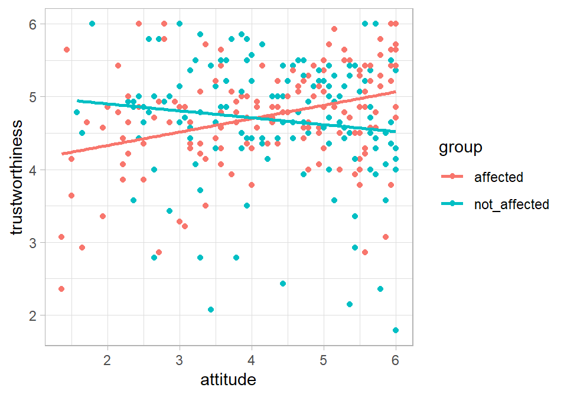

# Multiple regression: one continuous, one categorical {#multiple2}

*Chris Berry*
\
*2023*


<!--
commented text
commented text
--> 

<style>
div.exercise { background-color:#e6f0ff; border-radius: 5px; padding: 20px;}
</style>

<style>
div.tip { background-color:#D5F5E3; border-radius: 5px; padding: 20px;}
</style>


## Overview

* **Slides** from the lecture part of the session: [Download](slides/PSYC753_L4_MultipleRegression2.pptx)
* **Slides** for [Rmd support](slides/PSYC753_Rmd_Support.pptx)

\


So far we have looked at [simple](#simple1) and [multiple regression](#multiple1) with _continuous variables_. (And in the last session, we saw that between-subjects [ANOVA](#anova1) was equivalent to a multiple regression in which all the predictors are categorical.) 

Here, we look at multiple regression with a mixture of continuous and categorical predictors. Specifically, one predictor is _continuous_, and the other is a _dichotomous categorical variable_ (i.e., made up of two levels or groups). 

This type of analysis can be used to see whether the relationship between two variables is the same or different across groups of individuals. For example, adherence to a particular treatment may be associated with attitudes towards the efficacy of the treatment, but the nature of the association may differ according to the type of psychological disorder a person has.

Thus, in this type of analysis, in addition to looking at the ability of individual predictors to explain an outcome variable, we're able to look at their _combined_ effect in explaining the outcome. This is referred to as an **interaction effect**. The interaction can tell us whether the relationship between one of the predictors and the outcome differs as a function of the levels of the other predictor variable.

## Worked example
Scientists often research things that are of personal interest to themselves. Do people end up trusting the researcher more when they have some personal investment in what they are researching? Altenmuller et al. (2021) looked at whether participants' trust in the researcher is related to 1) whether they are told that the researcher is personally affected by the research or not affected by their research, and 2) the participant's attitude towards the research topic. 

The data from Altenmuller et al.'s (2021) study (Experiment 2) are stored at the link below. 

https://raw.githubusercontent.com/chrisjberry/Teaching/master/4_trust_data.csv

The key variables:

* `trustworthiness`: how trustworthy the participant finds the researcher. Higher scores indicate higher levels of trustworthiness.
* `attitude`: the participant's attitude towards the research topic. Higher scores indicate a more positive attitude. 
* `group`: whether participants were told that the researcher is personally `affected` or `not_affected` by their own research.


<div class='webex-solution'><button>More about the data</button>

The data were made publicly available by the researchers and have been pre-processed (using the researcher's open R code). Only a subset of the data is used here for teaching purposes; variable names have been changed for clarity.

</div>


\

:::{.exercise}

Design check.

* What is the outcome variable in this design? <select class='webex-select'><option value='blank'></option><option value=''>attitude</option><option value='answer'>trustworthiness</option><option value=''>group</option></select>

* What is the nature of the outcome variable? <select class='webex-select'><option value='blank'></option><option value=''>categorical</option><option value='answer'>continuous</option></select>

* What is the name of the continuous predictor variable? <select class='webex-select'><option value='blank'></option><option value=''>group</option><option value='answer'>attitude</option><option value=''>trustworthiness</option></select>

* What is the name of the categorical predictor variable? <select class='webex-select'><option value='blank'></option><option value='answer'>group</option><option value=''>attitude</option><option value=''>trustworthiness</option></select>

* How many levels of `group` are there? <select class='webex-select'><option value='blank'></option><option value=''>1</option><option value='answer'>2</option><option value=''>3</option></select>

* When a variable has two levels it is called a <select class='webex-select'><option value='blank'></option><option value=''>continuous</option><option value='answer'>dichotomous</option><option value=''>quantitative</option></select> variable.

:::


\

## Read in the data

Read in the data to `trust_data` 


```r
# ensure tidyverse is loaded
# library(tidyverse)

# read in the data
trust_data <- read_csv('https://raw.githubusercontent.com/chrisjberry/Teaching/master/4_trust_data.csv')

# look at the data
trust_data %>% head()
```

<div class="kable-table">

| ppt|group        | attitude| trustworthiness| credibility| evaluation|
|---:|:------------|--------:|---------------:|-----------:|----------:|
|   1|not_affected | 5.714286|        4.428571|    4.428571|   2.583333|
|   2|affected     | 3.142857|        4.285714|    4.428571|   3.250000|
|   3|not_affected | 5.285714|        4.428571|    4.428571|   2.750000|
|   4|not_affected | 4.428571|        4.642857|    3.857143|   2.416667|
|   5|affected     | 6.000000|        6.000000|    5.285714|   2.333333|
|   6|not_affected | 3.642857|        5.500000|    4.571429|   2.500000|

</div>
\

## Visualise the data

Use a scatterplot to look at the relationship between `trustworthiness`, `attitude` and `group`. Use different colours for each `group` by specifying `colour = group` in `aes()`:


```r
trust_data %>% 
  ggplot(aes(x = attitude, y = trustworthiness, colour = group )) +
  geom_point() +
  geom_smooth(method = "lm", se = FALSE) +
  theme_light() 
```

<div class="figure" style="text-align: center">

<p class="caption">(\#fig:unnamed-chunk-3)Trustworthiness vs. participant attitude to research</p>
</div>


:::{.exercise}

Visual inspection of the scatterplot

Does the relationship between `attitude` and `trustworthiness` appear to be the same within each `group`? <select class='webex-select'><option value='blank'></option><option value=''>yes</option><option value='answer'>no</option></select>

\

Within the group that were told that the researcher was personally `affected` by their research:

* The association between `attitude` and `trustworthiness` appears to be <select class='webex-select'><option value='blank'></option><option value=''>negative</option><option value='answer'>positive</option></select>
* A more positive attitude towards the research topic tends to be associated with <select class='webex-select'><option value='blank'></option><option value=''>lower</option><option value=''>no change</option><option value='answer'>higher</option></select> values of `trustworthiness`.

\

Within the group that were told that the researcher was personally `not_affected` by their research:

* The association between `attitude` and `trustworthiness` appears to be <select class='webex-select'><option value='blank'></option><option value='answer'>negative</option><option value=''>positive</option></select>
* A more positive attitude towards the research topic tends to be associated with <select class='webex-select'><option value='blank'></option><option value='answer'>lower</option><option value=''>no change</option><option value=''>higher</option></select> values of `trustworthiness`.

:::


<div class='webex-solution'><button>Go further with ggplot</button>


The scatterplot can be improved through further customisation.

For example, to change the x- and y- labels, add the code:

  `+ xlab("Participants' attitude to the research")`  
  `+ ylab("Trustworthiness of researcher")`

Feel free to customise the plot further if you feel it can be improved!


</div>


<div class='webex-solution'><button>Further inspection</button>

It is good practice to inspect the distributions of the data prior to analysis, for example, with `geom_histogram()` or `geom_density()`. We can check if the data appear normally distributed, or positively or negatively skewed. We can also check for outliers using `geom_boxplot()`. Get to know your data!


```r
# look at the distribution of trustworthiness
trust_data %>% 
  ggplot(aes(trustworthiness)) +
  geom_histogram() 

# look at the distribution of attitude
trust_data %>% 
  ggplot(aes(attitude)) +
  geom_histogram() 

# obtain n in affected & not_affected groups
trust_data %>% 
  group_by(group) %>% 
  count()
```


</div>


\

## Evidence for the interaction

An interaction between the `attitude` and `group` predictors is suggested by the scatterplot. That is, the association between `trustworthiness` and `attitude` appears to be different in the `affected` and `non_affected` groups. We may therefore want to include the interaction term in our multiple regression model and determine whether we have evidence for the interaction or not using Bayes factors.

We'll do this in three steps:

* 1. Specify the model _without_ the interaction
* 2. Specify the model _with_ the interaction
* 3. Compare the model _with_ and _without_ the interaction

\

### Model without the interaction 

The model without an interaction looks like a typical multiple regression model with two predictors (from Session 2): 

`model <- lm(outcome ~ predictor_1 + predictor_2, data = mydata)`

As we did in the previous session, we need to also convert the categorical variable (`group`) to a `factor()` to ensure it's treated as categorical by R.

Thus, for our data:


```r
# Convert group to a factor
trust_data <- trust_data %>% mutate(group = factor(group))

# Specify the model without the interaction
without_interaction <- lm(trustworthiness ~ attitude + group, 
                          data = trust_data)

# R² for the model
# library(broom)
glance(without_interaction)
```

<div class="kable-table">

| r.squared| adj.r.squared|     sigma| statistic|   p.value| df|    logLik|      AIC|      BIC| deviance| df.residual| nobs|
|---------:|-------------:|---------:|---------:|---------:|--:|---------:|--------:|--------:|--------:|-----------:|----:|
| 0.0130486|     0.0065555| 0.7588684|  2.009602| 0.1358188|  2| -349.3972| 706.7944| 721.7018| 175.0679|         304|  307|

</div>

* How much of the variance in `trustworthiness` is explained by the model with `attitude` and `group`? The adjusted R^2^ (as a proportion, to two decimal places) = <input class='webex-solveme nospaces' size='4' data-answer='["0.01"]'/>.

\

Next use `lmBF()` to obtain the BF for the model with no interaction:


```r
# library(BayesFactor)

# obtain BF for the model
BF_without_interaction <- lmBF(trustworthiness ~ attitude + group,
                               data = data.frame(trust_data))

# look at the BF
BF_without_interaction 
```

```
## Bayes factor analysis
## --------------
## [1] attitude + group : 0.1092231 ±1.1%
## 
## Against denominator:
##   Intercept only 
## ---
## Bayes factor type: BFlinearModel, JZS
```
The BF for the model without the interaction is equal to (to 2 decimal places) <input class='webex-solveme nospaces' data-tol='0.1' size='5' data-answer='["0.105",".105"]'/>.

\
 
### Model with the interaction

:::{.tip}
To specify an interaction between two predictors, use the term `predictor1 * predictor2`. The `*` symbol means multiply, so the interaction term is simply the predictors multiplied together.
:::

To specify the model with the interaction, add the interaction term `predictor1 * predictor2` to the model without the interaction term:


```r
# Specify the model with the interaction
with_interaction <- lm(trustworthiness ~ attitude + group + attitude*group,
                       data = trust_data)

# R² for the model
glance(with_interaction)
```

<div class="kable-table">

| r.squared| adj.r.squared|    sigma| statistic|   p.value| df|    logLik|      AIC|      BIC| deviance| df.residual| nobs|
|---------:|-------------:|--------:|---------:|---------:|--:|---------:|--------:|--------:|--------:|-----------:|----:|
| 0.0623098|     0.0530257| 0.740907|  6.711482| 0.0002128|  3| -341.5378| 693.0756| 711.7098| 166.3298|         303|  307|

</div>


* How much of the variance in `trustworthiness` is explained by the model with `attitude`,`group`, and the `attitude*group` interaction? The adjusted R^2^ (as a proportion, to two decimal places) = <input class='webex-solveme nospaces' size='4' data-answer='["0.05"]'/>.

\

Use `lmBF()` to obtain the BF for the model with the interaction:


```r
# obtain BF for the model
BF_with_interaction <- 
  lmBF(trustworthiness ~ attitude + group + attitude*group,
       data = data.frame(trust_data))

# look at the BF
BF_with_interaction 
```

```
## Bayes factor analysis
## --------------
## [1] attitude + group + attitude * group : 31.78175 ±2.65%
## 
## Against denominator:
##   Intercept only 
## ---
## Bayes factor type: BFlinearModel, JZS
```
The BF for the model with the interaction is equal to <input class='webex-solveme nospaces' data-tol='7.5' size='2' data-answer='["31"]'/>. (Note: yours may come out slightly different to that shown in the worksheet due to random sampling processes used in the BF generation; as long as the BF is around 30, that's okay.)

\

### Compare the model with and without the interaction

To determine whether there's evidence for the interaction, we need to compare the Bayes factor for the model with and without the interaction. 

:::{.exercise}

Bayes factors can be compared with the formula:

$\frac{Bayes \ factor \ more \ complex \ model}{Bayes \ factor \ simpler \ model}$


Dividing the BFs in this way will return another Bayes factor, which is a number that tells us how many times more likely the more complex model compared to the simpler model, given the data.

\

So, if we perform this calculation: 

$\frac{Bayes \ factor \ for \ model \ with \ interaction}{Bayes \ factor \ for \ model \ without \ interaction}$

this will tell us how many times more likely the model _with_ the interaction is than the model _without_ the interaction. In other words, dividing the BF for the model with the interaction by the BF for the model without the interaction will tell us whether there's evidence for an interaction between the predictors.

:::

\


```r
# compare BFs of models
# to determine evidence for the interaction
BF_with_interaction / BF_without_interaction
```

```
## Bayes factor analysis
## --------------
## [1] attitude + group + attitude * group : 290.98 ±2.86%
## 
## Against denominator:
##   trustworthiness ~ attitude + group 
## ---
## Bayes factor type: BFlinearModel, JZS
```
The Bayes factor for the comparison of the model with and without the interaction is approximately 300. (Yours may not be exactly equal to 300 because of the error associated with the generation of the Bayes factor; it should be roughly the same though!)

\

:::{.exercise}

Assessing the interaction

**Adjusted R^2^:**

* The adjusted R^2^ for the model without the interaction (that you noted earlier) was: <input class='webex-solveme nospaces' size='4' data-answer='["0.01"]'/>
* The adjusted R^2^ for the model with the interaction (that you also noted earlier) was: <input class='webex-solveme nospaces' size='4' data-answer='["0.05"]'/>
* What is the _increase_ in adjusted R^2^ as a result of the addition of the interaction term to the model? _Hint. Work out the difference between the two adjusted R^2^ values you noted above_ <input class='webex-solveme nospaces' size='4' data-answer='["0.04"]'/>


\

**Bayes factors**

* According to comparison of BFs for the models, which statement is true?

<div class='webex-radiogroup' id='radio_XPPMTRIKLP'><label><input type="radio" autocomplete="off" name="radio_XPPMTRIKLP" value=""></input> <span>There&apos;s substantial evidence for an absence of an interaction between attitude and group</span></label><label><input type="radio" autocomplete="off" name="radio_XPPMTRIKLP" value=""></input> <span>The model with the interaction is as likely as the model without the interaction, given the data</span></label><label><input type="radio" autocomplete="off" name="radio_XPPMTRIKLP" value="answer"></input> <span>There&apos;s substantial evidence for an interaction between attitude and group</span></label></div>


<div class='webex-solution'><button>Explanation</button>

As a result of adding in the interaction term to the model, the adjusted R^2^ value increases by approximately 0.04 (i.e., from 0.01 to 0.05). The comparison of BFs for the model with and without the interaction term indicates that there's substantial evidence for the interaction between `attitude` and `group` - it's around 300 times more likely that there is an interaction than there isn't one. 

Thus, as indicated in the scatterplot, there's evidence that the association between `trustworthiness` and `attitude` is different in each `group`. Namely, the association is positive in the `affected` group, whereas it appears to be negative in the `not_affected` group. 

</div>


:::

\

## Simple slopes analysis

Given evidence for the interaction, we can conduct follow-up analyses to further characterise it.

:::{.tip}
In a **simple slopes analysis** the relationship between the outcome and first predictor is examined at each level of the second predictor. 
:::

\

Another way of thinking about the interaction is that it implies that the _slopes_ of the lines for the `affected` (red line in the scatterplot) and `not_affected` (blue line) groups are not the same. We'll conduct a simple slopes analysis by conducting two simple regressions. The first will be the regression of `trustworthiness` on the basis of `attitude` in the `affected` group. The second will be the regression of `trustworthiness` on the basis of `attitude` in the `not_affected` group. The simplest way to do this is to store the data for each group separately, then perform a simple regression with each dataset.

\

First, filter `trust_data` for each `group`:


```r
# Filter the dataset for when group is equal to "affected"
# store in affected_data
affected_data <- trust_data %>% filter(group == "affected")

# Filter the dataset for when group is equal to "not_affected"
# store in not_affected_data
not_affected_data <- trust_data %>% filter(group == "not_affected")
```

\

Now run a simple regression of `trustworthiness ~ attitude` in each group. First, do the `affected` group:


```r
# affected group: simple regression coefficients
lm(trustworthiness ~ attitude, data = affected_data)

# affected group: BF
lmBF(trustworthiness ~ attitude, data = data.frame(affected_data))
```

```
## 
## Call:
## lm(formula = trustworthiness ~ attitude, data = affected_data)
## 
## Coefficients:
## (Intercept)     attitude  
##      3.9631       0.1839  
## 
## Bayes factor analysis
## --------------
## [1] attitude : 1483.223 ±0%
## 
## Against denominator:
##   Intercept only 
## ---
## Bayes factor type: BFlinearModel, JZS
```

:::{.exercise}
For the `affected` group (the red line in the scatter plot)

* The intercept of the regression line is = <input class='webex-solveme nospaces' size='4' data-answer='["3.96"]'/>
* The slope of the regression line is = <input class='webex-solveme nospaces' size='4' data-answer='["0.18"]'/>
* The BF for the model is <input class='webex-solveme nospaces' size='7' data-answer='["1483.22"]'/>
* This is <select class='webex-select'><option value='blank'></option><option value=''>inconclusive</option><option value='answer'>substantial</option></select> evidence for <select class='webex-select'><option value='blank'></option><option value=''>a negative</option><option value=''>an absence of an</option><option value='answer'>a positive</option></select> association between `trustworthiness` and `attitude` in the `affected` group.
* In this group, participants with more positive attitudes to the research topic perceived the researcher to <select class='webex-select'><option value='blank'></option><option value=''>be less</option><option value='answer'>be more</option></select> credible.
:::

\

For the `not_affected` group:

```r
# not_affected group: simple regression coefficients
lm(trustworthiness ~ attitude, data = not_affected_data)

# not_affected group BF
lmBF(trustworthiness ~ attitude, data = data.frame(not_affected_data))
```

```
## 
## Call:
## lm(formula = trustworthiness ~ attitude, data = not_affected_data)
## 
## Coefficients:
## (Intercept)     attitude  
##     5.09157     -0.09505  
## 
## Bayes factor analysis
## --------------
## [1] attitude : 0.5874073 ±0%
## 
## Against denominator:
##   Intercept only 
## ---
## Bayes factor type: BFlinearModel, JZS
```

:::{.exercise}

For the `not_affected` group (the blue line in the scatterplot)

* The intercept of the regression line is = <input class='webex-solveme nospaces' size='4' data-answer='["5.09"]'/>
* The slope of the regression line is = <input class='webex-solveme nospaces' size='5' data-answer='["-0.10"]'/>
* The BF for the model is <input class='webex-solveme nospaces' size='4' data-answer='["0.59"]'/>
* Although the scatterplot suggests <select class='webex-select'><option value='blank'></option><option value='answer'>a negative</option><option value=''>an absence of an</option><option value=''>a positive</option></select> association between `trustworthiness` and `attitude` in the `not_affected` group, there was insufficient evidence for this association because the Bayes factor was <select class='webex-select'><option value='blank'></option><option value='answer'>inconclusive</option><option value=''>substantial</option></select>

:::

\

In sum, this analysis has shown that when participants hold a more favourable attitude towards a research topic, they perceived researchers who were personally affected by their own research as being more trustworthy. The association appeared to be reversed for researchers who were not personally affected by their research, but a Bayes factor analysis indicated that there was no association between trustworthiness and attitude in this group.

\


## Exercises

:::{.exercise}

Credibility

In addition to asking about _trustworthiness_, Altenmuller et al. (2021) also asked participants how _credible_ they found the researcher. The scores are stored in `credibility` in the `trust_data`; higher scores indicate greater perceived credibility. As with `trustworthiness`, the authors looked at whether `attitude` and `group` predicted `credibility`. 

\

**Adapt the code in this worksheet to do the following:**

1. **Create a scatterplot with `credibility` on the y-axis, `attitude` on the x-axis, and `group` as separate lines.**


<div class='webex-solution'><button>Hint</button>

Pipe the data to `ggplot()` and use `colour = group` in `aes`

</div>
 


<div class='webex-solution'><button>Solution</button>


```r
trust_data %>% 
  ggplot(aes(x = attitude, y = credibility, colour = group )) +
  geom_point() +
  geom_smooth(method = "lm", se = FALSE) +
  theme_light() 
```

</div>


* The slope for the `affected` group appears to be <select class='webex-select'><option value='blank'></option><option value=''>close to zero</option><option value='answer'>positive</option><option value=''>negative</option></select>
* The slope for the `not_affected` group appears to be <select class='webex-select'><option value='blank'></option><option value='answer'>close to zero</option><option value='answer'>positive</option><option value=''>negative</option></select>

\


**2. Obtain adjusted R^2^ and the BF for the model _without_ an interaction**

* Adjusted R^2^ (as a proportion, to 2 decimal places) for the model without an interaction is: <input class='webex-solveme nospaces' size='4' data-answer='["0.15"]'/>
* The BF for the model without an interaction is <input class='webex-solveme nospaces' data-tol='9e+07' size='9' data-answer='["927611180"]'/>


<div class='webex-solution'><button>Hint</button>

Specify the model with `predictor1 + predictor2` with `lm()`, pass to `glance()`, then use `lmBF()` to get the BF.

</div>
 


<div class='webex-solution'><button>Solution</button>


```r
# Specify the model without an interaction
credibility_no_interaction <- 
  lm(credibility ~ attitude + group, data = trust_data)

# library(broom)
glance(credibility_no_interaction)

# BF model
BF_credibility_no_interaction <-
  lmBF(credibility ~ attitude + group, data = data.frame(trust_data))
```

</div>
 

\

**3. Obtain adjusted R^2^ and the BF for the model _with_ an interaction**

* Adjusted R^2^ (as a _proportion_, to 2 decimal places) for the model without an interaction is: <input class='webex-solveme nospaces' size='4' data-answer='["0.21"]'/>
* The BF for the model without an interaction is <input class='webex-solveme nospaces' data-tol='1.2' size='3' data-answer='["7.5"]'/> x 10^12^


<div class='webex-solution'><button>Hint</button>

Specify the model with `predictor1 + predictor2 + predictor1*predictor2` with `lm()`, pass to `glance()`, then use `lmBF()` to get the BF.

</div>
 


<div class='webex-solution'><button>Solution</button>


```r
# Specify the model with an interaction
credibility_with_interaction <- 
  lm(credibility ~ attitude + group + attitude*group, data = trust_data)

# library(broom)
glance(credibility_with_interaction)

# BF model
BF_credibility_with_interaction <-
  lmBF(credibility ~ attitude + group + attitude*group, data = data.frame(trust_data))
```

</div>
 

\

**4. Compare the models with and without the interaction**

* The increase in adjusted R^2^ as a result of including the interaction term in the model is (as a proportion to 2 decimal places) = <input class='webex-solveme nospaces' size='4' data-answer='["0.06"]'/>
* The Bayes factor for the comparison of the models with and without the interaction  = <input class='webex-solveme nospaces' data-tol='600' size='4' data-answer='["8400"]'/>
* Is there substantial evidence for an interaction between `attitude` and `group` in the prediction of percieved credibility of the researcher? <select class='webex-select'><option value='blank'></option><option value=''>no</option><option value='answer'>yes</option></select>


<div class='webex-solution'><button>Hint</button>


* Work out the difference in adjusted R^2^ in the model with and without the interaction.
* Use `BF_model_with_interaction / BF_model_without_interaction`
* If the BF > 3, then by convention we say there's substantial evidence for the interaction.


</div>


<div class='webex-solution'><button>Solution</button>


```r
# Adj R-square difference
0.21 - 0.15

# Compare BFs
BF_credibility_with_interaction / BF_credibility_no_interaction
```

</div>


\

**5. Simple slopes analysis**

For the `affected` group:

* The intercept of the regression line is = <input class='webex-solveme nospaces' size='4' data-answer='["1.92"]'/>
* The slope of the regression line is = <input class='webex-solveme nospaces' size='4' data-answer='["0.47"]'/>
* The BF for the model is <input class='webex-solveme nospaces' size='4' data-answer='["1.91"]'/> x 10^15^
* This is <select class='webex-select'><option value='blank'></option><option value=''>inconclusive</option><option value='answer'>substantial</option></select> evidence for <select class='webex-select'><option value='blank'></option><option value=''>a negative</option><option value=''>an absence of an</option><option value='answer'>a positive</option></select> association between `credibility` and `attitude` in the `affected` group.
* In this group, participants with more positive attitudes to the research topic perceived the researcher to <select class='webex-select'><option value='blank'></option><option value=''>be less</option><option value='answer'>be more</option></select> credible.

\

For the `not_affected` group:

* The intercept of the regression line is = <input class='webex-solveme nospaces' size='4' data-answer='["3.73"]'/>
* The slope of the regression line is = <input class='webex-solveme nospaces' size='4' data-answer='["0.08"]'/>
* The BF for the model is <input class='webex-solveme nospaces' size='4' data-answer='["0.32"]'/>
* This is <select class='webex-select'><option value='blank'></option><option value=''>inconclusive</option><option value='answer'>substantial</option></select> evidence for <select class='webex-select'><option value='blank'></option><option value=''>a negative</option><option value='answer'>an absence of an</option><option value=''>a positive</option></select> association between `credibility` and `attitude` in the `not_affected` group.


<div class='webex-solution'><button>Hint</button>


Use `filter()` to separate out the groups of each dataset.
Conduct one simple regression for the `affected` group.
Conduct one simple regression for the `not_affected` group.


</div>


<div class='webex-solution'><button>Code</button>


```r
# Filter the dataset for when group is equal to "affected"
affected_data <- trust_data %>% filter(group == "affected")

# Filter the dataset for when group is equal to "not_affected"
not_affected_data <- trust_data %>% filter(group == "not_affected")

# affected group coefficients
lm(credibility ~ attitude, data = affected_data)

# affected group BF
lmBF(credibility ~ attitude, data = data.frame(affected_data))

# not_affected group coefficients
lm(credibility ~ attitude, data = not_affected_data)

# not_affected group BF
lmBF(credibility ~ attitude, data = data.frame(not_affected_data))
```

</div>


:::

\

:::{.exercise}

Critical evaluation of the field

Altenmuller et al. (2021) also asked participants to report how critical they were in their evaluation of the entire research field. The scores are stored in `evaluation` in the `trust_data`; higher scores indicate that the participant evaluated the field _more critically_. As with the other outcome variables we've considered, the authors looked at whether `attitude` and `group` predicted `evaluation`. 

\

**Adapt the code in this worksheet to do the following:**

1. **Create a scatterplot with `evaluation` on the y-axis, `attitude` on the x-axis, and `group` as separate lines.**


<div class='webex-solution'><button>Hint</button>

Pipe the data to `ggplot()` and use `colour = group` in `aes()`

</div>
 


<div class='webex-solution'><button>Solution</button>


```r
trust_data %>% 
  ggplot(aes(x = attitude, y = evaluation, colour = group )) +
  geom_point() +
  geom_smooth(method = "lm", se = FALSE) +
  theme_light() 
```

</div>


* The slope for the `affected` group appears to be <select class='webex-select'><option value='blank'></option><option value=''>close to zero</option><option value=''>positive</option><option value='answer'>negative</option></select>
* The slope for the `not_affected` group appears to be <select class='webex-select'><option value='blank'></option><option value='answer'>close to zero</option><option value=''>positive</option><option value='answer'>negative</option></select>

\


**2. Obtain adjusted R^2^ and the BF for the model without an interaction**

* Adjusted R^2^ (as a proportion, to 2 decimal places) for the model without an interaction is: <input class='webex-solveme nospaces' size='4' data-answer='["0.20"]'/>
* The BF for the model without an interaction is <input class='webex-solveme nospaces' data-tol='0.3' size='3' data-answer='["1.4"]'/> x 10^13^


<div class='webex-solution'><button>Hint</button>

Specify the model with `predictor1 + predictor2` with `lm()`, pass to `glance()`, then use `lmBF()` to get the BF.

</div>
 


<div class='webex-solution'><button>Solution</button>


```r
# Specify the model without an interaction
evaluation_no_interaction <- 
  lm(evaluation ~ attitude + group, data = trust_data)

# library(broom)
glance(evaluation_no_interaction)

# BF model
BF_evaluation_no_interaction <-
  lmBF(evaluation ~ attitude + group, data = data.frame(trust_data))
```

</div>
 

\

**3. Obtain adjusted R^2^ and the BF for the model with an interaction**

* Adjusted R^2^ (as a _proportion_, to 2 decimal places) for the model without an interaction is: <input class='webex-solveme nospaces' size='4' data-answer='["0.27"]'/>
* The BF for the model without an interaction is <input class='webex-solveme nospaces' data-tol='1' size='3' data-answer='["2.9"]'/> x 10^18^


<div class='webex-solution'><button>Hint</button>

Specify the model with `predictor1 + predictor2 + predictor1*predictor2` with `lm()`, pass to `glance()`, then use `lmBF()` to get the BF.

</div>
 


<div class='webex-solution'><button>Solution</button>


```r
# Specify the model with an interaction
evaluation_with_interaction <- 
  lm(evaluation ~ attitude + group + attitude*group, data = trust_data)

# library(broom)
glance(evaluation_with_interaction)

# BF model
BF_evaluation_with_interaction <-
  lmBF(evaluation ~ attitude + group + attitude*group, data = data.frame(trust_data))
```

</div>
 

\

**4. Compare the model with and without the interaction**

* The increase in adjusted R^2^ as a result of including the interaction in the model is (as a proportion to 2 decimal places) = <input class='webex-solveme nospaces' size='4' data-answer='["0.07"]'/>
* The Bayes factor for the model with the interaction vs. without = <input class='webex-solveme nospaces' data-tol='50000' size='6' data-answer='["212284"]'/>
* Is there evidence for an interaction between `attitude` and `group`? <select class='webex-select'><option value='blank'></option><option value=''>no</option><option value='answer'>yes</option></select>


<div class='webex-solution'><button>Hint</button>


* Work out the difference in adjusted R^2^ in the model with and without the interaction.
* Use `BF_more_complex_model / BF_simpler_model`
* If the BF > 3, then there's substantial evidence for the interaction.


</div>


<div class='webex-solution'><button>Solution</button>


```r
# Adj R-square difference
0.27 - 0.20

# Compare BFs
BF_evaluation_with_interaction / BF_evaluation_no_interaction
```

</div>


\

**5. Simple slopes analysis**

For the `affected` group:

* The intercept of the regression line is = <input class='webex-solveme nospaces' size='4' data-answer='["4.80"]'/>
* The slope of the regression line is = <input class='webex-solveme nospaces' size='5' data-answer='["-0.44"]'/>
* The BF for the model is <input class='webex-solveme nospaces' size='4' data-answer='["1.15"]'/> x 10^20^
* This is <select class='webex-select'><option value='blank'></option><option value=''>inconclusive</option><option value='answer'>substantial</option></select> evidence for <select class='webex-select'><option value='blank'></option><option value='answer'>a negative</option><option value=''>an absence of an</option><option value=''>a positive</option></select> association between `evaluation` and `attitude` in the `affected` group.
* In this group, participants with more positive attitudes to the research topic evaluated the research field <select class='webex-select'><option value='blank'></option><option value='answer'>less</option><option value=''>more</option></select> critically

\

For the `not_affected` group:

* The intercept of the regression line is = <input class='webex-solveme nospaces' size='4' data-answer='["3.32"]'/>
* The slope of the regression line is = <input class='webex-solveme nospaces' size='5' data-answer='["-0.09"]'/>
* The BF for the model is <input class='webex-solveme nospaces' size='4' data-answer='["0.65"]'/>
* This is <select class='webex-select'><option value='blank'></option><option value=''>substantial</option><option value='answer'>insufficient</option></select> evidence for an association between `evaluation` and `attitude` in the `not_affected` group.


<div class='webex-solution'><button>Hint</button>


Use `filter()` to separate out the groups of each dataset.
Conduct one simple regression for the `affected` group.
Conduct one simple regression for the `not_affected` group.


</div>


<div class='webex-solution'><button>Code</button>


```r
# Filter the dataset for when group is equal to "affected"
affected_data <- trust_data %>% filter(group == "affected")

# Filter the dataset for when group is equal to "not_affected"
not_affected_data <- trust_data %>% filter(group == "not_affected")

# affected group
lm(evaluation ~ attitude, data = affected_data)

# affected group BF
lmBF(evaluation ~ attitude, data = data.frame(affected_data))

# not_affected group
lm(evaluation ~ attitude, data = not_affected_data)

# not affected group BF
lmBF(evaluation ~ attitude, data = data.frame(not_affected_data))
```

</div>


:::

\

## Further exercise

:::{.exercise}

No interaction

Using the data from Teychenne and Hinkley (2016) that we used in Session 1, determine whether there is evidence for an interaction between `anxiety_score` and level of `education` in the prediction of `screen_time`. `education` is made up of groups 'No uni degree' and 'University degree'.

The data are located at:

https://raw.githubusercontent.com/chrisjberry/Teaching/master/1_mental_health_data.csv

* The increase in Adjusted R^2^ associated with the addition of the interaction to the model is (as a proportion) <input class='webex-solveme nospaces' data-tol='0.01' size='1' data-answer='["0"]'/>
* The Bayes factor comparing the model with and without the interaction is (to two decimal places) <input class='webex-solveme nospaces' data-tol='0.55' size='4' data-answer='["0.17",".17"]'/>
* There's substantial evidence that the relationship between `anxiety_score` and `screen_time` is <select class='webex-select'><option value='blank'></option><option value='answer'>the same</option><option value=''>different</option></select> in those who have a degree and those who don't.

\

Given the lack of evidence for an interaction, in an additive model containing only `anxiety_score` and `education` as predictors of `screen_time`:

* Higher anxiety scores tended to be associated with <select class='webex-select'><option value='blank'></option><option value=''>fewer</option><option value=''>no change in</option><option value='answer'>greater</option></select> hours of screen time, BF = <input class='webex-solveme nospaces' data-tol='0.2' size='3' data-answer='["2.2"]'/>
* Individuals without a university degree tended to spend <select class='webex-select'><option value='blank'></option><option value=''>a similar amount of time</option><option value='answer'>greater amounts of time</option><option value=''>lower amounts of time</option></select> using screens (e.g., devices, TV, computer) each week than those with a university degree, BF = <input class='webex-solveme nospaces' data-tol='1000' size='5' data-answer='["32604"]'/>


<div class='webex-solution'><button>Solution code</button>


```r
# read the data to R using read_csv()
mentalh <- read_csv('https://raw.githubusercontent.com/chrisjberry/Teaching/master/1_mental_health_data.csv')

# scatterplot
mentalh %>% 
  ggplot(aes(x = anxiety_score, y = screen_time, colour = education )) +
  geom_point() +
  geom_smooth(method = "lm", se = FALSE) +
  theme_light() 

# Specify the model without an interaction
screen_time_no_interaction <- 
  lm(screen_time ~ anxiety_score + education, data = mentalh)

# in library(broom)
glance(screen_time_no_interaction) # adj R² = 0.06

# BF model
BF_screen_time_no_interaction <-
  lmBF(screen_time ~ anxiety_score + education, data = data.frame(mentalh))

# Specify the model with an interaction
screen_time_with_interaction <- 
  lm(screen_time ~ anxiety_score + education + anxiety_score*education, data = mentalh)

# library(broom)
glance(screen_time_with_interaction)  # adj R² = 0.06

# BF model
BF_screen_time_with_interaction <-
  lmBF(screen_time ~ anxiety_score + education + anxiety_score*education, data = data.frame(mentalh))

# Adj R-square difference
0.06 - 0.06

# Compare BFs
BF_screen_time_with_interaction / BF_screen_time_no_interaction

# There's no evidence for the interaction, 
# therefore assume additive model
#
# BF of unique contribution of anxiety_score in model with education
BF_screen_time_no_interaction / lmBF(screen_time ~ education, data = data.frame(mentalh))

# BF of unique contribution of education in model with anxiety_score
BF_screen_time_no_interaction / lmBF(screen_time ~ anxiety_score, data = data.frame(mentalh))
```


</div>


:::

\

## Further knowledge

### Moderation


<div class='webex-solution'><button>Moderation</button>


The analysis that we've performed with `attitude` and `group` in this session is sometimes referred to as a test of moderation (Baron & Kenny, 1986).

:::{.tip}
Moderation is when the relationship between two variables changes as a function of a third variable. 
:::

\

Altenmuller et al. (2021) concluded that participants' `attitude` _moderated_ "the effect of a researcher disclosing being personally `affected` (vs. `not affected` ) by their own research on participants' `trustworthiness` ascriptions regarding the research". That is, `attitude` moderates the effect of `group` on `trustworthiness`.

It could also be said that the effect of a researcher saying that they are personally affected by their own research moderates the relationship between `attitude` and `trustworthiness` (or `credibility`). That is, the `group` moderates the relationship between `attitude` and `trustworthiness`. A relationship is present when the researcher says they are affected, but absent when they say they are not affected.

Which variable is said to be the _moderator_ variable appears to be down to the choice of the researcher and the context of the research.

If we don't find evidence for the interaction term, then we don't have evidence that one variable moderates the relationship between the other two. Instead, researchers may  say that there is _an additive effect of both predictors on the outcome variable_. The absence of an interaction indicates that the regression lines for each group do not differ (i.e., the lines for each group in a scatterplot are statistically parallel to one another).


</div>


\

### Coefficients

Only for those wanting a deeper understanding.


<div class='webex-solution'><button>Coefficients</button>


If we obtain the coefficients for the full regression model (with the interaction), we can write out the regression equation:


```r
lm(trustworthiness ~ attitude + group + attitude*group, data = trust_data)
```

\

$Predicted\ outcome = a + b_1X_1 + b_2X_2 + b_3X_1X_2$

So,

$Predicted\ trustworthiness = 3.96 + 0.18(attitude) + 1.13(group) - 0.28(attitude\times group)$

\

From this equation, we can derive the simple regression equations for each group.

\

As we saw in the previous session, behind the scenes, R uses *dummy coding* to code the two levels of the categorical variable (i.e., coding levels of a categorical variable with 0s and 1s). It uses 0s to code the `affected` group and 1s to code the `not_affected` group. It does it this way because it assigns 0s and 1s alphabetically. 

\

Thus, taking the regression equation and substituting `group` = 0 for the `affected` group:

$$ 
\begin{align}
Predicted\ trustworthiness    &= 3.96 + 0.18(attitude) + (1.13\times0) - 0.28(attitude\times0)\\
                              &= 3.96 + 0.18(attitude) + 0 - 0 \\
                              &= 3.96 + 0.18(attitude) 
\end{align}
$$
The intercept (3.96) and slope (0.18) in this simple regression equation match those obtained for the `affected` group  in the earlier simple slopes analysis. 

\

Next, taking the full regression equation and substituting `group` = 1 for the `not_affected` group:

$$ 
\begin{align}
Predicted\ trustworthiness    &= 3.96 + 0.18(attitude) + (1.13\times1) - 0.28(attitude\times1)\\
                              &= 3.96 + 0.18(attitude) + 1.13 - 0.28(attitude) \\
                              &= 5.09 + 0.18(attitude) - 0.28(attitude) \\
                              &= 5.09 -0.10(attitude)
\end{align}
$$

The intercept (5.09) and slope (-0.10) in this simple regression correspond to those we obtained for the `not_affected` group in the earlier simple slopes analysis. 

In sum, when one of the predictors is dichotomous, it is possible to derive the simple regression equation for each level of that predictor from the regression equation for the model with the interaction term included.


</div>


\


### Centering

Again, only for those wanting deeper knowledge.


<div class='webex-solution'><button>Centering</button>


When testing for moderation effects, it is common to _center_ the predictor variables prior to the analysis. (Indeed, Altenmuller et al. (2021) centered `attitude` prior to running their analyses.) Centering is where you subtract the mean of a variable from every score of that variable. For example, to center the `attitude` scores, we'd obtain the mean of `attitude`, and then subtract that value from each of our `attitude` scores. Thus, a participant with a score of 0 on the centered attitude score would therefore have an attitude value that is equal to the mean. 

Centering is usually performed to help increase the interpretability of the coefficients of the predictor variables in a model with an interaction. It can also help to reduce the chances of multicollinearity between the predictor variables and the interaction term. Multicollinearity can occur because the interaction term is derived from the individual predictors themselves (by multiplying them together).

`scale()` can be used to center variables automatically. Set the option `center = TRUE` to center the variable. Setting the option `scale = TRUE` would also standardise the variable (i.e., divide each score by the standard deviation, to create _z_-scores), so `scale = FALSE` means that we won't also standardise the scores:


```r
# center the attitude scores
# use mutate() to create a new variable in trust_data
# called attitude_centered
trust_data <- 
  trust_data %>% 
  mutate( attitude_centered = scale(attitude, center = TRUE, scale = FALSE)[,1] )

# compare the means to check that centered scores have mean of 0
trust_data %>% summarise(mean(attitude), mean(attitude_centered))
```

Before centering, the mean of the `attitude` scores was 4.26. After centering, the mean (of `attitude_centered`) is 0, or close enough to zero, being 4.08 x 10^-16^, more precisely because there's some rounding error along the way.

\

Now re-run the analysis using `attitude_centered` in place of `attitude` and look at adjusted R^2^ and the BF:


```r
# full model with attitude_centered
full_centered <- lm(trustworthiness ~ attitude_centered + group + attitude_centered*group, data = trust_data)

# R-squared
glance(full_centered)

# BF
lmBF(trustworthiness ~ attitude_centered + group + attitude_centered*group, 
     data = data.frame(trust_data))
```

* The adjusted R^2^ for the full model is <input class='webex-solveme nospaces' size='4' data-answer='["0.05"]'/>, which is the same as we found previously when `attitude` was not centered. 
* The BF for the model is approximately 33, which is the same as we found previously with the non-centered version of `attitude`.

Thus, centering predictors does not affect the adjusted R^2^ or evidence for the model. This is because subtracting the mean from a variable is equivalent to a linear transformation and this does not affect the association.

\

\

To go even further, centering affects the values of the coefficients of the individual predictors in the model, but has no effect on the coefficient for the interaction.

\

When `attitude` wasn't centered, the regression equation was:

$Predicted\ trustworthiness = 3.96 + 0.18(attitude) + 1.13(group) - 0.28(attitude\times group)$

\

Using `attitude_centered`, the coefficients for the regression equation are obtained from:


```r
full_centered
```

And so the regression equation is:

$Predicted\ trustworthiness = 4.75 + 0.18(attitude) -0.06(group) - 0.28(attitude\times group)$

Notice that the intercept has changed and so has the coefficient for `group`.

\

As before, to obtain the simple regression equations for each `group` we can once again substitute in the dummy codes for `group`. Thus, for the `affected` group:

$$ 
\begin{align}
Predicted\ trustworthiness    &= 4.75 + 0.18(attitude) - (0.06\times0) - 0.28(attitude\times0)\\
                              &= 4.75 + 0.18(attitude) + 0 - 0 \\
                              &= 4.75 + 0.18(attitude) 
\end{align}
$$


For the `not_affected` group:

$$ 
\begin{align}
Predicted\ trustworthiness    &= 4.75 + 0.18(attitude) - (0.06\times1) - 0.28(attitude\times0)\\
                              &= 4.75 + 0.18(attitude) -0.06 - 0.28(attitude) \\
                              &= 4.69 + 0.18(attitude) - 0.28(attitude) \\
                              &= 4.69 -0.10(attitude)
\end{align}
$$
The values in the simple regression equations come out slightly differently when attitude is centered, but the direction on the sign of the coefficient for `attitude` is the same.

\

In sum, centering of predictor variables is often performed in moderation analyses, but does not affect the variance explained by the model, the evidence (i.e., the BF) for the model, nor the direction (positive/negative) of the associations in the simple slopes analyses (because it doesn't change the slope). Centering can be desirable to aid interpretation of the coefficients of individual predictors and can reduce multicollinearity. 


</div>


\


## Summary

* A multiple regression model can consist of a mixture of continuous and categorical predictors, 
* Predictors may have a combined effect in explaining the outcome variable. Evidence for this _interaction effect_ can be examined by adding the interaction term to the model, i.e., with `lm(outcome ~ predictor1 + predictor2 + predictor1*predictor2)`
* With a dichotomous categorical variable, the interaction implies that the slopes of the simple regressions of `outcome ~ continuous_predictor` are different. This can be examined with a simple slopes analysis.
* The interaction implies that the relationship between the outcome and continuous predictor are different in each group.

\

## References
Altenmuller M.S., Lange L.L., Gollwitzer M. (2021). When research is me-search: How researchers’ motivation to pursue a topic affects laypeople’s trust in science. _PLoS ONE_ _16_(7): e0253911. https://doi.org/10.1371/journal.pone.0253911

Baron, R. M., & Kenny, D. A. (1986). The moderator–mediator variable distinction in social psychological research: Conceptual, strategic, and statistical considerations. _Journal of Personality and Social Psychology_, _51_(6), 1173. https://psycnet.apa.org/doi/10.1037/0022-3514.51.6.1173
