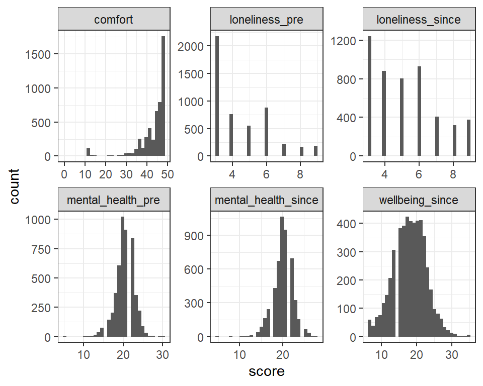

# Multiple regression: hierarchical regression {#multiple3}

*Chris Berry*
\
*2022*


<style>
div.exercise { background-color:#e6f0ff; border-radius: 5px; padding: 20px;}
</style>

<style>
div.tip { background-color:#D5F5E3; border-radius: 5px; padding: 20px;}
</style>

## Overview

* **Slides** from the lecture part of the session: [Download](slides/PSYC753_L5_MultipleRegression3.pptx)

\

**Hierarchical regression** is a form of multiple regression analysis and can be used when we want to add predictor variables to a model in discrete steps or stages. The technique allows the unique contribution of the variables on each step to be separately determined.

We can use it when we want to know whether a predictor variable (e.g., `sense_of_belonging`) predicts an outcome (e.g., `social_interaction`) after controlling for background variables that are categorical (e.g., `gender`, `level of education`) or continuous (e.g., `age`, `score on a cognitive test`) in nature. The variables entered on each step can also be determined by theoretical considerations, to test specific hypotheses.

At each step in the analysis, the increase in the variance explained in the outcome variable (i.e., R^2^) and evidence for the unique contribution of the predictors (with Bayes factors) can be assessed. 

Hierarchical regression is sometimes called _sequential regression_.

\

## Worked example 1: wellbeing
In Session 2, we analysed some of the data from Iani et al. (2019) and found evidence that `brooding` and `worry` predicted `wellbeing` in a multiple regression. 

Iani et al. (2019) were actually primarily interested in whether mindfulness and emotional intelligence predicted psychological wellbeing scores, but _after_ controlling for `brooding` and `worry`. The reason for asking the question in this way is because it's a well-established finding that `brooding` and `worry` explain `wellbeing`, but less is known about `mindfulness` and `emotional intelligence`. 

To control for `brooding` and `worry`, these variables are entered into a regression first. Next, mindfulness and emotional intelligence are added, and the _change_ in R^2^ associated with their addition to the model can be evaluated. Bayes factors can also be used to assess the unique contribution of the predictors added at each step. 


\

### Read in the data

Read the data to R, and store in `pwb_data` (to stand for Psychological WellBeing data). The data we'll use are located at:

https://raw.githubusercontent.com/chrisjberry/Teaching/master/2_wellbeing_data.csv


```r
# First ensure tidyverse is loaded, i.e., 'library(tidyverse)'

# read in the data using read_csv(), store in pwb_data
pwb_data <- read_csv('https://raw.githubusercontent.com/chrisjberry/Teaching/master/2_wellbeing_data.csv')
```

(_Note._ The data are publicly available, but I've changed the variable names for clarity. As in Iani et al., missing values were replaced with the mean of the relevant variable.)

Preview the data with `head()`:


```r
pwb_data %>% head()
```

<div class="kable-table">

| describing| observing| acting| nonreactivity| nonjudging| attention| clarity| repair| brooding| worry| wellbeing| gad|
|----------:|---------:|------:|-------------:|----------:|---------:|-------:|------:|--------:|-----:|---------:|---:|
|         13|        14|     19|             6|         15|        23|      20|     21|       18|    19|        64|  13|
|         15|         6|     15|            13|         12|        24|      20|     15|       14|    30|        72|   7|
|         14|        14|     16|            17|         11|        31|      27|     26|       15|    30|        59|  11|
|         10|        10|     18|            18|         18|        27|      18|     20|       16|    29|        62|  13|
|         10|        14|     15|            14|         16|        21|      24|     14|        8|    27|        78|   5|
|         21|        15|     18|            14|         14|        30|      26|     23|       10|    23|        78|   4|

</div>

**About the data:**

Mindfulness variables: 

* `describing`: Higher scores indicate greater ability to describe one's inner experiences. 
* `observing`: Higher scores indicate greater levels of observing.
* `acting`: Higher scores indicate greater levels of acting with awareness. 
* `nonreactivity`: Higher scores indicate greater levels of nonreactivity. 
* `nonjudging`: Higher scores indicate greater levels of nonjudging. 

Emotional intelligence variables: 

* `attention`: Higher scores indicate greater skill in attending to their feelings and moods.
* `clarity`: Higher scores indicate greater skill in experiencing their feelings clearly.
* `repair`: Higher scores indicate greater skill in regulating unpleasant moods or prolonging pleasant ones. 

Negative functioning variables:

* `brooding`: Higher scores indicate greater levels of brooding.
* `worry`: Higher scores indicate greater levels of worry.

Outcome variables:

* `wellbeing`: Higher scores indicate higher levels of psychological wellbeing in terms of self-acceptance, positive relations with others, autonomy, environmental mastery, purpose in life, and personal growth.
* `gad`: higher scores indicate greater severity of Generalised Anxiety Disorder.

\

### Visualisation

There are a number of continuous variables in the dataset that we can visualise with density plots or histograms. We've done this individually, variable by variable in past worksheets. Here I'd like to show you a more advanced way of plotting. The code below uses will create a density plot of every variable in a dataset that is numeric (continuous) in nature, using different facets:


```r
# Plot density plots of all the numeric (continuous) variables
# The code below:
# -Keeps only the numeric columns in a data frame
# -Uses pivot_longer() to code each set of scores by its variable name
# -Specifies the 'score' to plot in aes()
# -Uses facet_wrap() to plot each variable in a separate panel
# -Uses scales = "free" to allow the range on the x- and y-axis to be different across panels

pwb_data %>%
  keep(is.numeric) %>%                     
  pivot_longer(everything(), names_to = "variable", values_to = "score") %>%  
  ggplot(aes(score)) +                     
  facet_wrap(~ variable, scales = "free") +     
  geom_density()        
```

<div class="figure" style="text-align: center">

<p class="caption">(\#fig:unnamed-chunk-4)Density plots for each continous predictor in pwb_data</p>
</div>
\

### Correlations
With many variables being used in a multiple regression, it is good practice to inspect the correlations between all continuous variables to get an idea of the inter-relations and to check for multicollinearity between predictors. 

Obtain a correlation matrix of all of the numeric variables. Ensure the `corrr` package is loaded, then use `correlate()`:


```r
# library(corrr) # ensure this is loaded

# correlations of all numeric variables
# use mutate() with round() to round to 2 D.P.
pwb_data %>%
  keep(is.numeric) %>%
  correlate(method = "pearson") %>% 
  mutate(across(where(is.numeric), round, digits = 2))
```

:::{.exercise}
Before conducting the hierarchical regression, Iani et al. (2019) reported the Pearson correlations between `wellbeing` and `gad` and the mindfulness and emotional intelligence variables. We'll report a subset of those here. Report the correlations below to two decimal places:

* `describing` and `clarity`, _r_ = <input class='webex-solveme nospaces' size='4' data-answer='["0.64",".64"]'/>
* `describing` and `wellbeing`, _r_ = <input class='webex-solveme nospaces' size='4' data-answer='["0.54",".54"]'/>
* `repair` and `wellbeing`, _r_ = <input class='webex-solveme nospaces' size='4' data-answer='["0.50",".50"]'/>
* `nonreactivity` and `brooding`, _r_ = <input class='webex-solveme nospaces' size='5' data-answer='["-0.25","-.25"]'/>
* `nonreactivity` and `gad`, _r_ = <input class='webex-solveme nospaces' size='5' data-answer='["-0.22","-.22"]'/> 

\

* Does multicollinearity seem an issue (check the correlations between the predictors for _r_ < -0.8 or _r_ > 0.8)? <select class='webex-select'><option value='blank'></option><option value=''>yes</option><option value='answer'>no</option></select>
:::


\

### Hierarchical regression
To conduct the hierarchical regression, variables will be entered to the multiple regression in progressive steps, and the change in R^2^ associated with the predictors added to the model at each step obtained. Likewise, Bayes factors can be used to determine whether there is evidence that the predictors added at each step make a unique contribution to the prediction of the outcome variable.

Iani et al. (2019) wanted to explain variance in `wellbeing` (the outcome variable). They reported the non-adjusted R^2^, so that's what we'll do too. Due to theoretical considerations, the variables in each step were entered as follows:

* Step 1: `brooding`
* Step 2: `brooding`, `worry`
* Step 3: `brooding`, `worry` and mindfulness variables (`describing`, `observing`, `acting`, `nonreactivity`, `nonjudging`)
* Step 4: `brooding`, `worry`, mindfulness variables (`describing`, `observing`, `acting`, `nonreactivity`, `nonjudging`), and emotional intelligence variables (`attention`, `clarity`, `repair`).

\

#### Step 1: brooding
First, use `brooding` to predict `wellbeing`. Use `lm()` and `glance()` to obtain the R^2^ for the model, then use `lmBF()` to obtain the BF for the model. 


```r
# specify the model in the step
step1 <- lm(wellbeing ~ brooding, data = pwb_data)

# R^2^
# ensure broom package loaded, i.e., 'library(broom)'
glance(step1)

# store the BF
# library(BayesFactor)
BF_step1 <- lmBF(wellbeing ~ brooding, data = data.frame(pwb_data))

# look at BF
BF_step1
```

<div class="kable-table">

| r.squared| adj.r.squared|   sigma| statistic|   p.value| df|    logLik|      AIC|      BIC| deviance| df.residual| nobs|
|---------:|-------------:|-------:|---------:|---------:|--:|---------:|--------:|--------:|--------:|-----------:|----:|
|  0.189052|     0.1763809| 11.4776|  14.91998| 0.0002642|  1| -253.7007| 513.4014| 519.9704| 8431.064|          64|   66|

</div>

```
## Bayes factor analysis
## --------------
## [1] brooding : 95.76111 ±0%
## 
## Against denominator:
##   Intercept only 
## ---
## Bayes factor type: BFlinearModel, JZS
```

* The R^2^ (non-adjusted, to 2 decimal places) for the model in Step 1 = <input class='webex-solveme nospaces' size='4' data-answer='["0.19"]'/>.
* The BF for the model in Step 1 = <input class='webex-solveme nospaces' size='5' data-answer='["95.76"]'/>

\

#### Step 2: brooding + worry

Next, add `worry` to the model in Step 1, using `+ worry` and look at R^2^ again and obtain the BF. We'll look at: 

* whether the model in Step 2 explains more variance in `wellbeing` by looking at whether R^2^ increases. 
* whether there's evidence for a contribution of `worry` after controlling for `brooding`, by dividing the Bayes factor for the model in Step 2 by the BF for the model in Step 1


```r
# specify the model in the step
step2 <- lm(wellbeing ~ brooding + worry, data = pwb_data)

# R-sq
glance(step2)

# store the BF
BF_step2 <- lmBF(wellbeing ~ brooding + worry, data = data.frame(pwb_data))

# compare the BFs for the models in Step 2 and Step 1
BF_step2 / BF_step1
```

<div class="kable-table">

| r.squared| adj.r.squared|    sigma| statistic| p.value| df|    logLik|      AIC|      BIC| deviance| df.residual| nobs|
|---------:|-------------:|--------:|---------:|-------:|--:|---------:|--------:|--------:|--------:|-----------:|----:|
| 0.3288693|     0.3075636| 10.52393|  15.43572| 3.5e-06|  2| -247.4558| 502.9116| 511.6702| 6977.446|          63|   66|

</div>

```
## Bayes factor analysis
## --------------
## [1] brooding + worry : 56.11175 ±0%
## 
## Against denominator:
##   wellbeing ~ brooding 
## ---
## Bayes factor type: BFlinearModel, JZS
```

* The R^2^ for the model in Step 2 is <input class='webex-solveme nospaces' size='4' data-answer='["0.33"]'/>
* The _increase_ in R^2^ associated with the addition of `worry` to the model is <input class='webex-solveme nospaces' size='4' data-answer='["0.14"]'/> _Hint. To calculate this, take the R^2^ for the model in step 2 and subtract the R^2^ for the model in Step 1_.
* The BF for the contribution of `worry` to the model is <input class='webex-solveme nospaces' size='5' data-answer='["56.11"]'/>. _Hint. This is the BF produced by dividing the BF for the model in Step 2, by the BF for the model in Step 1._


<div class='webex-solution'><button>calculatoR</button>


Did you know that R can function like a calculator too? Simply type the formula next to `>` in the console window and hit enter, e.g., `> 2 + 2`

Or use code in your script:

```r
0.33 - 0.19
```

</div>


<div class='webex-solution'><button>Change in R-squared symbol</button>


In reports and articles, you will often see the change in R^2^ written as $\Delta R^2$. The $\Delta$ symbol means "change". For example $\Delta R^2 = 0.33$.

</div>


\

#### Step 3: brooding + worry + mindfulness variables

Next, add the variables associated with mindfulness to the model. The mindfulness measures are `observing`, `describing`, `acting`, `nonjudging`, and `nonreactivity`. Add these five variables to the model all in the same step. As before, note R^2^ for the model and the BF. To determine whether there's evidence for the addition of the mindfulness variables, compare the BF for the model in Step 3 and the BF of the model in Step 2.


```r
# specify the model in the step
step3 <- lm(wellbeing ~ brooding + worry + 
             observing + describing + acting + nonjudging + nonreactivity, 
            data = pwb_data)

# R-sq
glance(step3)

# store the BF
BF_step3 <- lmBF(wellbeing ~ brooding + worry + 
                   observing + describing + acting + nonjudging + nonreactivity, 
                 data = data.frame(pwb_data))

# compare the BFs for the models in step 3 and step 2
BF_step3 / BF_step2
```

<div class="kable-table">

| r.squared| adj.r.squared|    sigma| statistic| p.value| df|    logLik|      AIC|      BIC| deviance| df.residual| nobs|
|---------:|-------------:|--------:|---------:|-------:|--:|---------:|--------:|--------:|--------:|-----------:|----:|
| 0.5330601|     0.4767053| 9.148738|  9.458999|   1e-07|  7| -235.4846| 488.9692| 508.6761| 4854.566|          58|   66|

</div>

```
## Bayes factor analysis
## --------------
## [1] brooding + worry + observing + describing + acting + nonjudging + nonreactivity : 35.49308 ±0%
## 
## Against denominator:
##   wellbeing ~ brooding + worry 
## ---
## Bayes factor type: BFlinearModel, JZS
```

* The R^2^ for the model in Step 3 is <input class='webex-solveme nospaces' size='4' data-answer='["0.53"]'/>
* The increase in R^2^ associated with the addition of the mindfulness variables is <input class='webex-solveme nospaces' size='4' data-answer='["0.20"]'/> _Hint. Take the R^2^ for the model in Step 3 and subtract the R^2^ for the model in Step 2._
* The BF for the contribution of the mindfulness variables to the model is <input class='webex-solveme nospaces' size='5' data-answer='["35.49"]'/> _Hint. This is the BF produced by dividing `BF_step3` by `BF_step2`._
* After controlling for `brooding` and `worry`, is there sufficient evidence for the contribution of mindfulness to the prediction of `wellbeing`? <select class='webex-select'><option value='blank'></option><option value='answer'>yes, BF>3</option><option value=''>no</option></select>


<div class='webex-solution'><button>Explain</button>

The BF comparing the models in Steps 3 and 2 was BF = 34.59, indicating that the model in Step 3 is more than thirty five times more likely than the model in Step 2, given the data. Thus, there's substantial evidence that the mindfulness variables contribute to the prediction of `wellbeing` after controlling for `brooding` and `worry`. The mindfulness variables explain an additional R^2^ = 0.20, or 20%. of the variance in `wellbeing`, over and above `brooding` and `worry`. 

</div>


\

#### Step 4: brooding + worry + mindfulness + emotional intelligence variables

Next, add the variables associated with emotional intelligence to the model. The emotional intelligence variables are `attention`, `clarity`, and `repair`. These three variables are added to the model all in the same step. Once again, note R^2^ for the model and the BF. To determine whether there's evidence for the addition of the emotional intelligence variables, compare the BF for the model in Step 4 and the BF of the model in Step 3. 


```r
# specify the model in step 4
step4 <- lm(wellbeing ~ brooding + worry + 
              observing + describing + acting + nonjudging + nonreactivity + 
              attention + clarity + repair, 
            data = pwb_data)

# R-sq
glance(step4)

# store the BF
BF_step4 <- lmBF(wellbeing ~ brooding + worry + 
                   observing + describing + acting + nonjudging + nonreactivity + 
                   attention + clarity + repair, 
                 data = data.frame(pwb_data))

# compare the BFs for the models in step 4 and step 3
BF_step4 / BF_step3
```

<div class="kable-table">

| r.squared| adj.r.squared|    sigma| statistic| p.value| df|    logLik|      AIC|      BIC| deviance| df.residual| nobs|
|---------:|-------------:|--------:|---------:|-------:|--:|---------:|--------:|--------:|--------:|-----------:|----:|
| 0.6045859|     0.5326924| 8.645487|  8.409467|       0| 10| -229.9978| 483.9956| 510.2715| 4110.944|          55|   66|

</div>

```
## Bayes factor analysis
## --------------
## [1] brooding + worry + observing + describing + acting + nonjudging + nonreactivity + attention + clarity + repair : 2.150042 ±0%
## 
## Against denominator:
##   wellbeing ~ brooding + worry + observing + describing + acting + nonjudging + nonreactivity 
## ---
## Bayes factor type: BFlinearModel, JZS
```

* The R^2^ for the model in Step 4 is <input class='webex-solveme nospaces' data-tol='0.01' size='3' data-answer='["0.6",".6"]'/>
* The increase in R^2^ associated with the addition of the emotional intelligence variables is <input class='webex-solveme nospaces' data-tol='0.01' size='4' data-answer='["0.07",".07"]'/> _Hint. Take the R^2^ for the model in Step 4 and subtract the R^2^ for the model in Step 3._
* The BF representing the evidence for the unique contribution of the emotional intelligence variables to the model is <input class='webex-solveme nospaces' size='4' data-answer='["2.15"]'/>
* After controlling for `brooding`,  `worry`, and mindfulness, is there sufficient evidence for the contribution of emotional intelligence to the prediction of `wellbeing`? <select class='webex-select'><option value='blank'></option><option value=''>yes, BF > 3</option><option value='answer'>no, BF < 3</option></select>


<div class='webex-solution'><button>Explain</button>

The BF comparing the models in steps 4 and 3 was BF = 2.15. Although this indicates that the model in Step 4 is more than twice as likely than the model in Step 3, given the data, the BF is less than 3, and therefore falls short of the conventional level for declaring that there's substantial evidence for the addition of emotional intelligence. Thus, according to this Bayes factor analysis, there's insufficient evidence that the additional R^2^ = 0.07, or 7%, of the variance in `wellbeing` explained by emotional intelligence is meaningful. 

</div>


\

\

## Exercise 1

:::{.exercise}

Hierarchical regression

Iani et al. (2019) were also interested in whether whether mindfulness and emotional intelligence predicted `gad` (anxiety symptoms) after controlling for `brooding` and `worry`. 

Repeat the analysis conducted above, but now with `gad` as the outcome variable.

* Step 1: `brooding`
* Step 2: `brooding`, `worry`
* Step 3: `brooding`, `worry` and mindfulness variables (`describing`, `observing`, `acting`, `nonreactivity`, `nonjudging`)
* Step 4: `brooding`, `worry`, mindfulness variables (`describing`, `observing`, `acting`, `nonreactivity`, `nonjudging`), and emotional intelligence variables (`attention`, `clarity`, `repair`).


**Step 1: brooding**

* The R^2^ (non-adjusted, to two decimal places) for the model in Step 1 = <input class='webex-solveme nospaces' data-tol='0.01' size='4' data-answer='["0.36",".36"]'/>
* The BF for the model in Step 1 = <input class='webex-solveme nospaces' data-tol='0.5' size='8' data-answer='["138455.1"]'/>


<div class='webex-solution'><button>Solution - code</button>


```r
# specify the model in step 1, store in gad1
gad1 <- lm(gad ~ brooding, data = pwb_data)

# R-sq
glance(gad1)

# store BF
BF_gad1 <- lmBF(gad ~ brooding, data = data.frame(pwb_data))

# show BF
BF_gad1
```

</div>


\

**Step 2: brooding + worry**

* The R^2^ for the model in Step 2 is <input class='webex-solveme nospaces' size='4' data-answer='["0.45"]'/>
* The increase in R^2^ associated with the addition of `worry` is <input class='webex-solveme nospaces' data-tol='0.01' size='4' data-answer='["0.08",".08"]'/> 
* The BF for the contribution of `worry` to the model is <input class='webex-solveme nospaces' data-tol='0.03' size='5' data-answer='["12.66"]'/>


<div class='webex-solution'><button>Hint</button>

Next, add `worry` to the model, using `+ worry`. Look at R^2^ again and obtain the BF. 

* To determine the R^2^ change for the model, take the R^2^ for the model in Step 2 and subtract the R^2^ value for the model in Step 1. 
* To determine whether there's evidence for a contribution of `worry` after controlling for `brooding`, divide the Bayes factor for the model by the BF for the model in Step 1.


</div>


<div class='webex-solution'><button>Solution - code</button>


```r
# specify the model in Step 2
gad2 <- lm(gad ~ brooding + worry, data = pwb_data)

# R sq
glance(gad2)

# store the BF
BF_gad2 <- lmBF(gad ~ brooding + worry, data = data.frame(pwb_data))

# compare the BFs for the models in Step 2 and Step 1
BF_gad2 / BF_gad1
```

</div>


\

**Step 3: brooding + worry + mindfulness variables**

* The R^2^ for the model in Step 3 is <input class='webex-solveme nospaces' size='4' data-answer='["0.48"]'/>
* The increase in R^2^ associated with the addition of the mindfulness variables is <input class='webex-solveme nospaces' size='4' data-answer='["0.03"]'/> 
* The BF for the contribution of the mindfulness variables to the model is <input class='webex-solveme nospaces' size='5' data-answer='["0.006"]'/>
* After controlling for `brooding` and `worry`, is there sufficient evidence for the contribution of mindfulness to the prediction of `gad`? <select class='webex-select'><option value='blank'></option><option value=''>yes</option><option value='answer'>no</option></select>
* There's <select class='webex-select'><option value='blank'></option><option value='answer'>substantial</option><option value=''>inconclusive</option></select> evidence for the model in Step 2, compared to Step 3, because the Bayes factor for the model in Step 3 divided by that of the model in Step 2 is <select class='webex-select'><option value='blank'></option><option value='answer'>less than 0.33</option><option value=''>equal to 1</option><option value=''>greater than 3</option></select>.


<div class='webex-solution'><button>Hint</button>

Add the variables associated with mindfulness to the model. The mindfulness measures are `observing`, `describing`, `acting`, `nonjudging`, and `nonreactivity`. These five variables are added to the model all in the same step. 

* To calculate the increase in R^2^, take the R^2^ for the model in Step 3 and subtract the R^2^ for the model in Step 2.
* To obtain the BF for the contribution of the mindfulness variables, take the BF for the model in Step 3 and divide it by the BF for the model in Step 2. 
* If the BF is greater than 3, there's substantial evidence for the model in Step 3. If the BF < 0.33, then there's substantial evidence for the model in Step 2. Intermediate BFs are inconclusive.


</div>


<div class='webex-solution'><button>Solution - code</button>


```r
# specify the model in Step 3
gad3 <- lm(gad ~ brooding + worry + 
              observing + describing + acting + 
              nonjudging + nonreactivity, 
            data = pwb_data)

# R-sq
glance(gad3)

# store the BF
BF_gad3 <- lmBF(gad ~ brooding + worry + 
                   observing + describing + acting + 
                   nonjudging + nonreactivity, 
                 data = data.frame(pwb_data))

# compare the BFs for the models in Step 3 and Step 2
BF_gad3 / BF_gad2
```

</div>

\

**Step 4: brooding + worry + mindfulness + emotional intelligence variables**

* The R^2^ for the model in Step 4 is <input class='webex-solveme nospaces' size='4' data-answer='["0.55"]'/>
* The increase in R^2^ associated with the addition of the emotional intelligence variables to the model is <input class='webex-solveme nospaces' size='4' data-answer='["0.07"]'/>.
* The BF associated with the contribution of the emotional intelligence variables to the model is <input class='webex-solveme nospaces' size='4' data-answer='["1.33"]'/>
* After controlling for `brooding`, `worry`, and mindfulness, is there sufficient evidence for the contribution of emotional intelligence to the prediction of `gad`? <select class='webex-select'><option value='blank'></option><option value=''>yes</option><option value='answer'>no</option></select>


<div class='webex-solution'><button>Hint</button>

Add the variables associated with emotional intelligence to the model. The emotional intelligence measures are `attention`, `clarity`, and `repair`. These three variables are added to the model all in the same step.

* To calculate the increase in R^2^, take the R^2^ for the model in Step 4 and subtract the R^2^ for the model in Step 3.
* To obtain the BF for the contribution of the emotional intelligence variables, take the BF for the model in Step 4 and divide it by the BF for the model in Step 3.
* If the BF is greater than 3, there's substantial evidence for the model in Step 4. If the BF < 0.33, then there's substantial evidence for the model in Step 3. Intermediate BFs are inconclusive.


</div>


<div class='webex-solution'><button>Solution - code</button>


```r
# specify the model in Step 4
gad4 <- lm(gad ~ brooding + worry + 
                  observing + describing + acting + nonjudging + nonreactivity + 
                  attention + clarity + repair, 
                  data = pwb_data)

# R-sq
glance(gad4)

# store the BF
BF_gad4 <- lmBF(gad ~ brooding + worry + 
                       observing + describing + acting + nonjudging + nonreactivity +
                       attention + clarity + repair, 
                       data = data.frame(pwb_data))

# compare the BFs for the models in Step 3 and Step 2
BF_gad4 / BF_gad3
```


</div>


\

**In summary, regarding the hypothesis of Iani et al. (2019):**

* After controlling for `brooding` and `worry`, there's evidence for the contribution of mindfulness and emotional intelligence to the prediction of `gad`. <select class='webex-select'><option value='blank'></option><option value='answer'>no</option><option value=''>yes</option></select>


:::

\

## Worked Exercise 2: Controlling for categorical variables

All of the variables considered in the previous exercise were continuous (or at were least assumed to be). It is also possible to use hierarchical regression to control for the influence of variables that are _categorical_ in nature. 

How do human-animal relationships affect mental health? Ratschen et al. (2020) looked at the impact of relationships with animals (e.g., pets) on mental health and loneliness in individuals during the Covid-19 pandemic.

Data from their study are located at the link below.

https://raw.githubusercontent.com/chrisjberry/Teaching/master/5_animal_data.csv


<div class='webex-solution'><button>More on the data</button>

The data are publicly available and variable names have been changed here for clarity. Missing data have been dealt with differently to the way the researchers dealt with them, so the data you are analysing (and therefore the results) are not identical to theirs.

</div>


\

About the data:

* `comfort`: Comfort from companion animals. Higher scores indicate greater comfort from the companion animal.
* `mental_health_pre`: Mental health before lockdown. Higher scores indicate better mental health.
* `mental_health_since`: Mental health during lockdown. Higher scores indicate better mental health.
* `wellbeing_since`: Higher scores indicate better wellbeing.
* `gender`: Male, female, another option, or prefer not to say
* `age`: Age group. 
* `partner`: Whether the participant lives with their partner or not.
* `species`: The type of animal companion.
* `loneliness_pre`: Loneliness before lockdown. Higher scores indicate greater loneliness.
* `loneliness_since`: Loneliness during lockdown. Higher scores indicate greater loneliness. 

\

### Visualisation

Inspect the distributions of the continuous variables:


```r
# Read in the data
animal_data <- 
  read_csv('https://raw.githubusercontent.com/chrisjberry/Teaching/master/5_animal_data.csv')


# Plot density plots of all the numeric (continuous) variables
# The code below:
# -Keeps only the numeric columns in a data frame
# -Uses pivot_longer() to code each set of scores by its variable name
# -Specifies the 'score' to plot in aes()
# -Uses facet_wrap() to plot each variable in a separate panel
# -Uses scales = "free" to allow the range on the x- and y-axis to be different across panels

animal_data %>%
  keep(is.numeric) %>%                     
  pivot_longer(everything(), names_to = "variable", values_to = "score") %>%   
  ggplot(aes(score)) +     
  facet_wrap(~ variable, scales = "free") +     
  geom_histogram()            
```

<div class="figure" style="text-align: center">

<p class="caption">(\#fig:unnamed-chunk-15)Histogram plots for each continous predictor</p>
</div>
\

The code can be modified to obtain histograms of all of the categorical variables:


```r
# Plot histograms of all the categorical vars (i.e., count data)
# The code:
# -Keeps only the character columns in the dataset
# -Uses pivot_longer() to code each set of scores by variable
# -Specifies the 'score' to plot in aes()
# -Uses facet_wrap() to plot in separate panels
# -Tells geom_histogram() to plot count data 

animal_data %>% 
  keep(is.character)  %>% 
  pivot_longer(everything(), names_to = "variable", values_to = "score") %>%   
  ggplot(aes(score)) +     
  facet_wrap(~ variable, scales = "free") +     
  geom_histogram(stat = "count")        
```

<div class="figure" style="text-align: center">

<p class="caption">(\#fig:unnamed-chunk-16)Histograms for each categorical predictor</p>
</div>

By looking at the histograms of the categorical variables, answer the following:

* Age: The majority of people were in age group <select class='webex-select'><option value='blank'></option><option value=''>18_24</option><option value=''>25_34</option><option value=''>35_44</option><option value='answer'>45_54</option><option value=''>55_64</option><option value=''>65_70</option><option value=''>70_over</option></select>
* Gender: The majority of people were <select class='webex-select'><option value='blank'></option><option value=''>in another way</option><option value='answer'>female</option><option value=''>male</option><option value=''>prefer not to say</option></select>
* Partner: The majority of people were <select class='webex-select'><option value='blank'></option><option value='answer'>living with partner</option><option value=''>not_living_with_partner</option></select>
* Species: The most common animal companion was <select class='webex-select'><option value='blank'></option><option value=''>bird</option><option value=''>cat</option><option value='answer'>dog</option><option value=''>fish</option><option value=''>horse</option><option value=''>other</option><option value=''>reptile</option><option value=''>small</option></select>

\

The scores on the `loneliness_pre` variable range from 3 to 9, so there are only 7 possible scores. When there are many data points, this can create issues when visualising the variable in a scatterplot because there are only so many combinations of scores for the variable, so they overlap.  

The code below uses the `gridExtra` package to display two plots created with `ggplot()`. Each plot is stored in a separate variable `panel1` and `panel2`, then placed side-by-side using `grid.arrange()` from the `gridExtra` package:


```r
# load library(gridExtra)
# for displaying different plots on multiple panels
library(gridExtra)

# create a scatterplot of loneliness scores
# without random jittering of points
# store in panel1
panel1 <- 
  animal_data %>% 
    ggplot(aes(x=loneliness_pre, y = loneliness_since)) +
    geom_point() +
    geom_smooth(method="lm", se = F) +
    ggtitle("Without geom_jitter()")

# create a scatterplot of loneliness scores
# with random jittering of points using geom_jitter()
# store in panel2
panel2 <- 
  animal_data %>% 
    ggplot(aes(x=loneliness_pre, y = loneliness_since)) +
    geom_jitter() +
    geom_smooth(method="lm", se = F)+
    ggtitle("With geom_jitter()")

grid.arrange(panel1, panel2, nrow = 1)
```

<div class="figure" style="text-align: center">

<p class="caption">(\#fig:unnamed-chunk-17)Using geom_jitter(): loneliness_since vs. londliness_pre</p>
</div>

Using `geom_jitter()` instead of `geom_point()` means that the scores will be randomly jittered by a tiny amount. This reduces overlap, making it much easier to see how the scores are distributed. It's useful to use `geom_jitter()` when the response variable is on an ordinal scale, but the responses are discrete (e.g., 1, 2, 3, 4, 5), as is often the case with survey data and likert scales. Thus, if you ever create a scatterplot of survey data and it ends up looking like the plot on the left, try using `geom_jitter()` instead of `geom_point()`.

\

The next step isn't strictly necessary because the categorical variables are stored as character variables (i.e., `<chr>`), but it is good practice to convert the categorical variables to `factors` before the analysis.


```r
# Convert categorical variables to factors
# (remember, age is grouped, so is categorical here)
animal_data <- 
  animal_data %>% 
  mutate(gender = factor(gender),
         age = factor(age),
         partner = factor(age),
         species = factor(species))
```


## Exercise 2

:::{.exercise}
Hierarchical regression

Using the `animal_data`, we'll look at whether `comfort` scores predict `mental_health_pre` after controlling for `gender`, `age`, `partner`, `species` and `loneliness_pre`.

* How many steps do you think there'll be in the hierarchical regression analyses? <select class='webex-select'><option value='blank'></option><option value=''>1</option><option value='answer'>2</option><option value=''>3</option><option value=''>4</option><option value=''>5</option><option value=''>6</option><option value=''>7</option></select>


<div class='webex-solution'><button>Explain</button>


The variables we want to control for can go into the model in the Step 1. Then we can add `comfort` to the model in Step 2, to see whether it explains `mental_health_pre` over and above all the variables in Step 1.


</div>


\

The variables that are controlled for in a multiple regression are sometimes called **covariates**

\

**Step 1: Covariates only**

* R^2^ for the model containing the covariates only is <input class='webex-solveme nospaces' size='5' data-answer='["0.119"]'/> (to **three** decimal places; this level of precision is required for this answer)
* The BF for the model containing the covariates only is <select class='webex-select'><option value='blank'></option><option value=''>< 0.33</option><option value=''>between 0.33 and 3</option><option value='answer'>> 10000</option></select>


<div class='webex-solution'><button>Hint</button>

Run a regression to predict `mental_health_pre` from the covariates only. The covariates are the things we want to control for, and are `gender`, `age`, `partner`, `species` and `loneliness_pre`.

* Obtain R^2^ for the model using `glance()` in the `broom` package.
* Obtain the BF for the model using `lmBF()` in the `BayesFactor` package.

</div>


<div class='webex-solution'><button>Solution</button>


```r
# store model with covariates only
step1_covariates <- 
  lm(mental_health_pre ~ gender + age + partner + species + loneliness_pre,
     data = animal_data)

# R-sq
glance(step1_covariates)

# Store the BF
BF_step1_covariates <- 
  lmBF(mental_health_pre ~ gender + age + partner + species + loneliness_pre, 
       data = data.frame(animal_data))

# View the BF for step 1
BF_step1_covariates
```


</div>


\

**Step 2: Covariates plus comfort**

* The R^2^ for the model with the covariates and the `comfort` predictor is <input class='webex-solveme nospaces' size='5' data-answer='["0.121"]'/> (report to **three** decimal places)
* The _increase_ in R^2^ as a result of the addition of `comfort` to the model with the covariates is <input class='webex-solveme nospaces' size='5' data-answer='["0.002"]'/> _Hint: subtract the R^2^ for Step 1 from that of Step 2. It's necessary to use the R^2^ values to three decimal places because the increase is so small!_
* The Bayes factor for the comparison of the model in Step 2 and Step 1 is <select class='webex-select'><option value='blank'></option><option value=''>< 0.33</option><option value=''>between 0.33 and 3</option><option value='answer'>> 3</option></select>
* Is there sufficient evidence that comfort from animal companions explains mental health levels before lockdown, after controlling for `gender`, `age`, `partner`, `species` of animal, and `loneliness_pre`? <select class='webex-select'><option value='blank'></option><option value=''>no, BF < 0.33</option><option value=''>no, BF between 0.33 and 3</option><option value='answer'>yes, BF > 3</option></select>
* Individuals who reported deriving greater comfort from animals also tended to have <select class='webex-select'><option value='blank'></option><option value=''>higher</option><option value='answer'>lower</option></select> levels of mental health, as measured  before lockdown.


<div class='webex-solution'><button>Hint</button>

Run a regression to predict `mental_health_pre` from the covariates and `comfort`. The covariates are the things we want to control for, and are `gender`, `age`, `partner`, `species` and `loneliness_pre`.

* Obtain R^2^ for the model using `glance()` in the `broom` package.
* Obtain the BF for the model using `lmBF()` in the `BayesFactor` package.
* Calculate the difference in R^2^ for the model in Step 2 and the model in Step 1
* Divide the BF for the model in Step 2 by the BF for the model in Step 1 to obtain the BF representing the evidence for the contribution of `comfort` to the model, after controlling for the covariates.
* To determine whether the association between `comfort` and `mental_health_pre` is positive or negative, look at the sign on the coefficient for `comfort` by using `step2_full`.

</div>


<div class='webex-solution'><button>Solution - code</button>


```r
# covariates + comfort
step2_full <- 
  lm(mental_health_pre ~ comfort + gender + age + partner + species + loneliness_pre, 
     data = animal_data)

# R-sq
glance(step2_full) 

# store BF
BF_step2_full <- 
  lmBF(mental_health_pre ~ comfort + gender + age + partner + species + loneliness_pre, 
       data = data.frame(animal_data))

# evidence for comfort, controlling for covariates
BF_step2_full / BF_step1_covariates

# look at the sign on the coefficient for comfort
step2_full
```

</div>


:::

\

## Further knowledge and exercises

### Standardised Coefficients


<div class='webex-solution'><button>Standardised coefficients</button>

Iani et al. (2019) also reported the values of the coefficients for the predictors at each step (see their Table 2). 

When a multiple regression has been performed using the raw data, the coefficients given by `lm()` are **unstandardised**. This means that they are in the same units as the predictor variable they correspond to. For example, if the coefficient for `brooding` is -1.57, this means that a 1 unit increase in `brooding` score is associated with a 1.57 _decrease_ in `wellbeing` score.

We'd like to be able to compare the coefficients of predictors to get some idea of their relative strength of the contribution to the model. The trouble is that predictors are often measured on different scales, with different ranges. For example, scores of `brooding` range from 5 to 20, and those of `clarity` range from 10 to 40. Use `summary(pwb_data)` to see this. Because the scales are so different, it doesn't make sense to directly compare the coefficients of the predictors.

:::{.tip}
To compare the coefficients of predictor variables in a model, we need to compare the **standardised regression coefficients**. These are the coefficients derived from the data after the scores of each predictor have been standardised. To standardise the scores of a variable, subtract the mean value from each score, and then divide each score by the standard deviation of the scores. The `scale()` function does this automatically for us. 
:::

\

To standardise all the numeric variables in the `pwb_data`:


```r
# Store the result in std_pwb_data
# Take pwb_data, pipe it to
# mutate_if().
# Tell mutate_if() to standardise a column
# using 'scale' if the variable type 'is.numeric'
# (note, it's not possible to standardise non-numeric variables)

std_pwb_data <-
  pwb_data %>% 
  mutate_if(is.numeric, scale)
```

Now re-run Step 4 (i.e., the final model) of the hierarchical regression in Iani et al. (2019), but with `std_pwb_data` instead of `pwb_data`:


```r
# run the regression using standardised data
std_step4 <- lm(wellbeing ~ brooding + worry + 
              observing + describing + acting + nonjudging + nonreactivity + 
              attention + clarity + repair, 
            data = std_pwb_data)

# look at standardised coefficients
std_step4
```

The standardised coefficients are called the **beta** coefficients, and have the symbol $\beta$. Beta coefficients range from -1 to +1, so the zero is usually omitted when reporting, e.g., $\beta(brooding) = -.12$

Make a note of the standardised (beta) coefficients for the model in Iani et al. (2019):

* `brooding` = <input class='webex-solveme nospaces' size='5' data-answer='["-.12","-0.12"]'/>
* `worry` = <input class='webex-solveme nospaces' size='5' data-answer='["-.28","-0.28"]'/>
* `observing` = <input class='webex-solveme nospaces' size='5' data-answer='["-.07","-0.07"]'/>
* `describing` = <input class='webex-solveme nospaces' size='4' data-answer='[".38","0.38"]'/>
* `acting` = <input class='webex-solveme nospaces' size='4' data-answer='[".10","0.10"]'/>
* `nonjudging` = <input class='webex-solveme nospaces' size='5' data-answer='["-.24","-0.24"]'/>
* `nonreactivity` = <input class='webex-solveme nospaces' size='5' data-answer='["-.11","-0.11"]'/>
* `attention` = <input class='webex-solveme nospaces' size='5' data-answer='["-.29","-0.29"]'/>
* `clarity` = <input class='webex-solveme nospaces' size='4' data-answer='[".02","0.02"]'/>
* `repair` = <input class='webex-solveme nospaces' size='4' data-answer='[".20","0.20"]'/>

\

As with the unstandardised coefficients, the sign on the beta coefficient indicates the direction of the association with the outcome variable (i.e., positive or negative).

Because the beta coefficients are now on the same scale, their magnitudes (i.e., their absolute size, ignoring the sign) can be compared to determine the relative "importance" of each predictor. For example, `describing` has the largest beta coeffcient (.38); it therefore makes the greatest contribution to the prediction of `wellbeing` in the full model. `clarity` makes the smallest contribution (beta = .02).

Note, some of the beta coefficients differ slightly from those reported by Iani et al. (2019). This is most likely due to differences in rounding  introduced during standardisation by different software packages. The values are very close though and the ordinal pattern in the beta coefficients is the same.

\

### Prediction


<div class='webex-solution'><button>Prediction</button>

The final model can be used to predict new data points (as in earlier sessions). For the model with continuous predictors:


```r
# specify data for new ppt
new_pwb <- tibble(  brooding = 6,
                    worry = 12,
                    observing = 12,
                    describing = 18,
                    acting = 17,
                    nonjudging = 20,
                    nonreactivity = 19,
                    attention = 30,
                    clarity = 27,
                    repair = 27 )

# use augment() in broom package. 
# .fitted = predicted wellbeing value
augment(step4, newdata = new_pwb)
```

The predicted value of wellbeing for the new participant in `new_pwb` is <input class='webex-solveme nospaces' size='5' data-answer='["73.29"]'/>.

\

For the model with categorical predictors:


```r
# specify data for new ppt
new_animal_dat <- tibble( comfort = 45,
                    gender = 'female',
                    age = '18_24',
                    partner = 'living_partner',
                    species = 'cat',
                    loneliness_pre = 7)

# use augment() in broom package. 
# .fitted = predicted value
augment(step2_full, newdata = new_animal_dat)
```

The predicted value of `mental_health_pre` for the new participant in `new_animal_dat` is <input class='webex-solveme nospaces' size='5' data-answer='["18.03"]'/>.


</div>


\

### Residuals


<div class='webex-solution'><button>Residuals</button>

As in earlier sessions, the residuals can be inspected in a plot of the predicted values vs. the residuals:


```r
# scatterplot of the predicted outcome values vs. residuals
augment(step4) %>% 
  ggplot(aes(x=.fitted, y=.resid)) + 
  geom_point()+
  geom_hline(yintercept=0)
```
We can also inspect the histogram of the residuals for normality:


```r
# histogram of the residuals
augment(step4) %>% 
  ggplot(aes(x=.resid)) + 
  geom_histogram() 
```

</div>


\

## Summary

**Hierarchical regression**

* In hierarchical regression, predictors are added to a regression model in successive steps.
* It can be used to test particular theories or hypotheses.
* It can also be used to control the influence of particular variables before analysing whether a predictor variable (or set of variables) of interest explains the outcome variable.
* As before, `lm()` and `glance()` can be used to obtain R^2^ for the model at each step. 
* The change in R^2^ associated with each step can be obtained to determine the unique contribution of the predictors in each step.
* `lmBF()` can be used to obtain the Bayes factor for the model in each step. Bayes factors of models from successive steps can be compared to determine the evidence for the unique contribution of predictors in a step.

\

**Plotting tips:**

* Use `geom_jitter()` to make scatterplots with overlapping points easier to interpret. Useful for survey data. 
* Use `keep()` with `pivot_longer()`, `ggplot()` and `facet_wrap()` to plot lots of variables of a certain type (e.g., numeric or character) on separate panels.
* Use `grid.arrange()` in the `gridExtra` package to display figures on separate panels.


\

## References
Iani, L., Quinto, R. M., Lauriola, M., Crosta, M. L., & Pozzi, G. (2019). Psychological well-being and distress in patients with generalized anxiety disorder: The roles of positive and negative functioning. _PloS ONE_, _14_(11), e0225646. https://doi.org/10.1371/journal.pone.0225646

Ratschen E., Shoesmith E., Shahab L., Silva K., Kale D., Toner P., et al. (2020) Human-animal relationships and interactions during the Covid-19 lockdown phase in the UK: Investigating links with mental health and loneliness. _PLoS ONE_, _15_(9):e0239397. https://doi.org/10.1371/journal.pone.0239397

