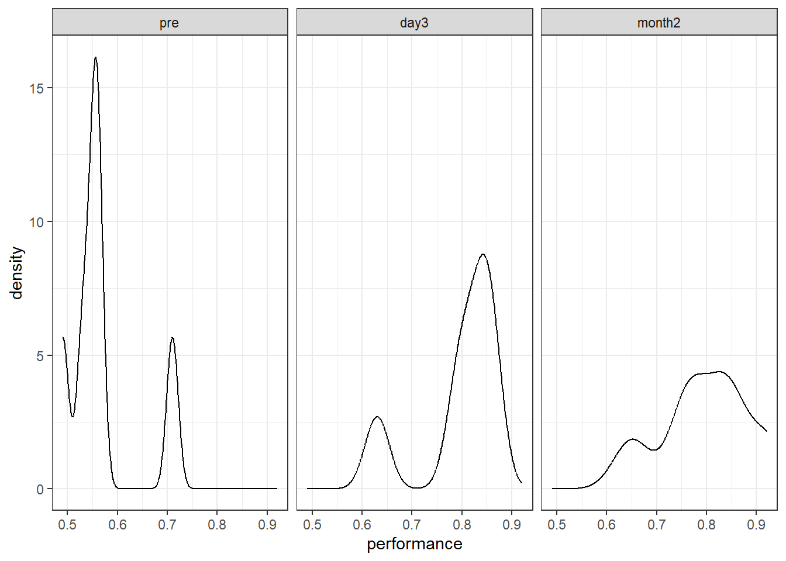
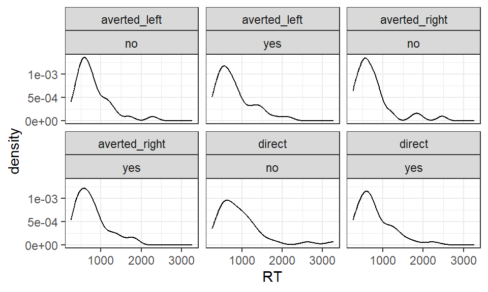
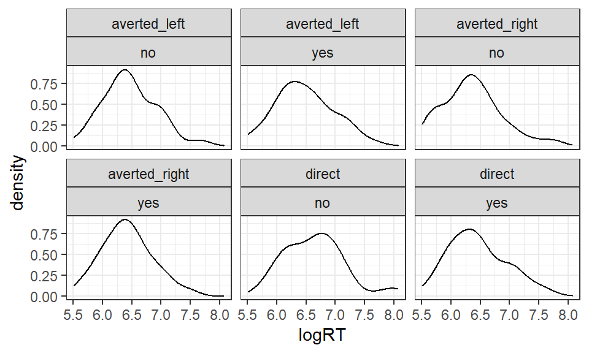

# ANOVA: Repeated measures {#anova2}

*Chris Berry*
\
*2022*


<!--
commented text
commented text
--> 

<style>
div.exercise { background-color:#e6f0ff; border-radius: 5px; padding: 20px;}
</style>

<style>
div.tip { background-color:#D5F5E3; border-radius: 5px; padding: 20px;}
</style>

## Overview

* **Slides** from the lecture part of the session: [Download](slides/PSYC753_L6_ANOVA_2.pptx)

\


Previously, we saw that when all of the predictor variables in a multiple regression are categorical then the analysis has the name ANOVA (in Session 3). 

Here we will analyse _repeated measures_ (or _within-subjects_) designs with ANOVA. In a repeated measures design, the scores for the different levels of an independent variable come from the same participants, rather than separate groups of participants.

We consider two types of ANOVA for within-subjects designs: one-way ANOVA and two-way factorial ANOVA. 

The methods are similar to those in Session 3, where we analysed between-subjects designs with ANOVA. 

The exercise at the end is for a mixed factorial design, where one of the factors is manipulated between-subjects, and the other is manipulated within-subjects. 


\

## One-way repeated measures ANOVA

:::{.tip}
**A one-way repeated measures ANOVA** is used to compare the scores from a dependent variable for the same individuals across different time points. For example, do depression scores differ in a group of individuals across three time points: before CBT therapy, during therapy, and 1 year after therapy?

**One-way within-subjects ANOVA** refers to the same analysis. The scores for each level of the independent variable manipulated within-subjects come from the same group of participants. For example, we can say that the independent variable of _time_ is manipulated _within-subjects_.  
:::

\

  * **One-way** means that there is one independent variable, for example, _time_. 
  * Independent variables are also called **factors** in ANOVA. 
  * A factor is made up of different **levels**. _Time_ could have three levels: before, during and after therapy.
  * In repeated measures/within-subjects designs, these levels are often referred to as **conditions**.
  * **Repeated measures** means that the same dependent variable (depression score) is measured multiple times on the same participant. Here, it's measured at different time points. Each participant provides multiple measurements.

\


## Long format data
To conduct a repeated measures ANOVA in R, the data must be in **long format**. This is crucial.

:::{.exercise}

Wide vs. long format

* When the data are in _wide_ format, all of the data for a single participant is stored:

<div class='webex-radiogroup' id='radio_QQMJRZWYPQ'><label><input type="radio" autocomplete="off" name="radio_QQMJRZWYPQ" value="answer"></input> <span>on one row, across multiple columns</span></label><label><input type="radio" autocomplete="off" name="radio_QQMJRZWYPQ" value=""></input> <span>on multiple rows, with each row representing a separate observation</span></label></div>


\

* When the data are in _long_ format, all of the data for a single participant is stored:

<div class='webex-radiogroup' id='radio_HTXXSQXTWR'><label><input type="radio" autocomplete="off" name="radio_HTXXSQXTWR" value=""></input> <span>on one row, across multiple columns</span></label><label><input type="radio" autocomplete="off" name="radio_HTXXSQXTWR" value="answer"></input> <span>on multiple rows, with each row representing a separate observation</span></label></div>


:::

\


## Worked Example

In an investigation of language learning, Chang et al., (2021) provided neuro-feedback training to 6 individuals attempting to discriminate particular sounds in a foreign language. Performance was measured as the proportion of correct responses in the discrimination task, and was measured at three time points relative to when the training was administered: before training was given (`pre`), after 3 days (`day3`), and after two months (`month2`).

\

The data are at the link below:

https://raw.githubusercontent.com/chrisjberry/Teaching/master/6a_discrimination_test.csv


:::{.exercise}

Design check.

* What is the independent variable (or _factor_) in this design? <select class='webex-select'><option value='blank'></option><option value=''>proportion correct</option><option value='answer'>time since training</option></select>

* How many levels does the factor have? <select class='webex-select'><option value='blank'></option><option value=''>1</option><option value=''>2</option><option value='answer'>3</option><option value=''>4</option></select>

* What is the dependent variable? <select class='webex-select'><option value='blank'></option><option value='answer'>proportion correct</option><option value=''>time</option></select>

* What is the nature of the independent variable? <select class='webex-select'><option value='blank'></option><option value='answer'>categorical</option><option value=''>continuous</option></select>

* Is the independent variable manipulated within- or between-subjects?
<select class='webex-select'><option value='blank'></option><option value=''>between-subjects</option><option value='answer'>within-subjects</option></select>

:::

\

### Read in the data 


```r
# library(tidyverse)

# read in the data
discriminate_wide <- read_csv('https://raw.githubusercontent.com/chrisjberry/Teaching/master/6a_discrimination_test.csv')

# look at the data
discriminate_wide
```

<div class="kable-table">

| ppt|  pre| day3| month2|
|---:|----:|----:|------:|
|   1| 0.56| 0.63|   0.65|
|   2| 0.71| 0.79|   0.76|
|   3| 0.53| 0.86|   0.92|
|   4| 0.56| 0.81|   0.77|
|   5| 0.49| 0.85|   0.84|
|   6| 0.55| 0.84|   0.84|

</div>

Columns:

* `ppt`: the participant number
* `pre`: proportion correct before training
* `day3`: proportion correct 3 days after training
* `month2`: proportion correct 2 months after training

:::{.exercise}
Data check

* How many participants are there in this dataset? <select class='webex-select'><option value='blank'></option><option value=''>3</option><option value=''>4</option><option value='answer'>6</option><option value=''>18</option></select>

* Are the data in long format or wide format? <select class='webex-select'><option value='blank'></option><option value=''>long</option><option value='answer'>wide</option></select>


<div class='webex-solution'><button>Explain</button>

The data for each of the 6 participants is on a different row in `discriminate_wide`, with the scores for each level of the independent variable _time_ in different columns. The data are therefore in **wide format**.

</div>

:::


\

### Convert the data to long format

Data must be in _long format_ in order to be analysed using a repeated measures ANOVA.

Use `pivot_longer()` to convert the data to long format:


```r
# The code below:
# - stores the result in discriminate_long
# - takes discriminate_wide and pipes it to
# - pivot_longer()
# - specifies which of the existing columns to make into a new single column
# - specifies the name of the new column labeling the conditions
# - specifies the name of the column containing the dependent variable
discriminate_long <-
  discriminate_wide %>% 
  pivot_longer(cols = c("pre", "day3", "month2"),
               names_to = "time",
               values_to = "performance")

# look at the first 6 rows
discriminate_long %>% head()
```

<div class="kable-table">

| ppt|time   | performance|
|---:|:------|-----------:|
|   1|pre    |        0.56|
|   1|day3   |        0.63|
|   1|month2 |        0.65|
|   2|pre    |        0.71|
|   2|day3   |        0.79|
|   2|month2 |        0.76|

</div>

:::{.exercise}
Data check - long

* How many participants are there in `discriminate_long`? <select class='webex-select'><option value='blank'></option><option value=''>2</option><option value=''>4</option><option value='answer'>6</option><option value=''>18</option></select>

* Are the data in `discriminate_long` in long format or wide format? <select class='webex-select'><option value='blank'></option><option value='answer'>long</option><option value=''>wide</option></select>

* How many rows or observations are there in `discriminate_long`? <select class='webex-select'><option value='blank'></option><option value=''>3</option><option value=''>4</option><option value=''>6</option><option value='answer'>18</option></select>


<div class='webex-solution'><button>Explain</button>

Each score is now on a separate row. There is a column to code the participant and condition. The data are therefore in **long format**. Each participant contributes 3 scores (one for `pre`, `day3` and `month2`). 

</div>


* In `discriminate_long`, what type of variable is `ppt` currently? <select class='webex-select'><option value='blank'></option><option value=''><fct> factor</option><option value=''><chr> character</option><option value='answer'><dbl> double (numeric)</option></select> _Hint. Look at the label at the top of each column, e.g., `<dbl>`_

* In `discriminate_long`, what type of variable is `time` currently? <select class='webex-select'><option value='blank'></option><option value=''><fct> factor</option><option value='answer'><chr> character</option><option value=''><dbl> double (numeric)</option></select> 
:::

\


### Convert the participant and the categorical variable to factors

As with the analysis of categorical variables in regression and ANOVA, each categorical variable must be converted to a factor before the analysis. 

Importantly, in repeated measures designs, **the column of participant labels `ppt` must also be converted to a factor**. 

Because the levels of `time` are ordered, we can additionally specify the way the levels should be ordered by using `levels = c("level_1_name", "level_2_name", "level_3_name")` when using `factor()`.


```r
# use mutate() to transform 
# both ppt and time to factor
# and overwrite existing variables
discriminate_long <-
  discriminate_long %>% 
  mutate(ppt  = factor(ppt),
         time = factor(time, levels = c("pre", "day3", "month2") ) )

# check
discriminate_long %>% head()
```

<div class="kable-table">

|ppt |time   | performance|
|:---|:------|-----------:|
|1   |pre    |        0.56|
|1   |day3   |        0.63|
|1   |month2 |        0.65|
|2   |pre    |        0.71|
|2   |day3   |        0.79|
|2   |month2 |        0.76|

</div>

:::{.exercise}
Data check - factors

After using `mutate()` and `factor()` above:

* In `discriminate_long`, what type of variable is `ppt`? <select class='webex-select'><option value='blank'></option><option value='answer'><fct> factor</option><option value=''><chr> character</option><option value=''><dbl> double (numeric)</option></select> 

* In `discriminate_long`, what type of variable is `time`? <select class='webex-select'><option value='blank'></option><option value='answer'><fct> factor</option><option value=''><chr> character</option><option value=''><dbl> double (numeric)</option></select> 


</div>

:::

\

### Visualise the data

Look at the distribution of the dependent variable in each condition.


```r
discriminate_long %>% 
  ggplot(aes(x = performance)) +
  facet_wrap(~ time) + 
  geom_density()
```

<div class="figure" style="text-align: center">

<p class="caption">(\#fig:unnamed-chunk-5)Density plots of performance at each time point</p>
</div>
The density plots look a little 'lumpy'. Remember that in our sample, there are only six data points per condition, so the plots are unlikely to be representative of the true (population) distribution of scores! 

\

### Plot the means


```r
# load the ggpubr package
library(ggpubr)

# use ggline() to plot the means
discriminate_long %>% 
  ggline(x = "time" , y = "performance", add = "mean") +
  ylab("Performance") + 
  ylim(c(0,1))
```

<div class="figure" style="text-align: center">

<p class="caption">(\#fig:unnamed-chunk-6)Mean proportion correct at each time point</p>
</div>

<div class='webex-solution'><button>Error bars</button>

Previously, we used `desc_stat = "mean_se"` to add errorbars to the plot. Doing so here would add error bars representing the standard error of the mean to each of the points in the plot. These are appropriate for between-subjects designs, but for within-subjects designs, these are not as appropriate. Refer to the Further Knowledge section at the end of the worksheet to see how to add within-subject error bars (and see Morey, 2008, for more detail).

</div>


:::{.exercise}
Describe the trend shown in the line plot:

* Between `pre` and `day3`, performance appeared to <select class='webex-select'><option value='blank'></option><option value='answer'>improve</option><option value=''>show no change</option><option value=''>decline</option></select>
* Between `pre` and `month2`, performance appeared to <select class='webex-select'><option value='blank'></option><option value='answer'>improve</option><option value=''>show no change</option><option value=''>decline</option></select>
* Between `day3` and `month2`, performance appeared to <select class='webex-select'><option value='blank'></option><option value=''>improve</option><option value='answer'>show no change</option><option value=''>decline</option></select>
:::

\

### Descriptives: Mean of each condition

Obtain the mean proportion correct at each time point using `summarise()`:


```r
discriminate_long %>% 
  group_by(time) %>% 
  summarise(M = mean(performance))
```

<div class="kable-table">

|time   |         M|
|:------|---------:|
|pre    | 0.5666667|
|day3   | 0.7966667|
|month2 | 0.7966667|

</div>

\

### Bayes factor

The crucial difference in repeated measures designs compared to between-subjects ones concerns the column labeling the participant, `ppt`.

* `ppt` is entered into the model as another predictor variable, i.e., using `...+ ppt`. 
* `ppt` is specified as a _random factor_ using `whichRandom = `. This means that the model comprising the other predictors in the model will be evaluated relative to the null model containing `ppt` alone. `ppt` is not individually evaluated. 

The Bayes factors can be obtained with `anovaBF()` but can also be obtained (less conveniently) using `lmBF()`. 

\

Using `anovaBF()`:


```r
# library(BayesFactor)

anovaBF(performance ~ time + ppt, whichRandom = "ppt", data = data.frame(discriminate_long))
```

```
## Bayes factor analysis
## --------------
## [1] time + ppt : 331.4158 ±0.66%
## 
## Against denominator:
##   performance ~ ppt 
## ---
## Bayes factor type: BFlinearModel, JZS
```

In the output, the Bayes factor provided is for the model of `performance ~ time + ppt` vs. the model of `performance ~ ppt`. The latter is the null model containing only `ppt` as a predictor variable. The Bayes factor therefore represents evidence for the (unique) effect of `time` on performance, over and above a model containing `ppt` only. This differs to between-subject designs, where the null model (in the denominator) is the intercept-only model (representing the grand mean). 

:::{.exercise}

The Bayes factor for the effect of time on performance is <input class='webex-solveme nospaces' data-tol='15' size='3' data-answer='["331"]'/>

\

This indicates that (select one):

<div class='webex-radiogroup' id='radio_VKHHPSSEMF'><label><input type="radio" autocomplete="off" name="radio_VKHHPSSEMF" value="answer"></input> <span>it is approximately 300 times more likely that there is difference between the means of the three time conditions, compared to there being no difference.</span></label><label><input type="radio" autocomplete="off" name="radio_VKHHPSSEMF" value=""></input> <span>it is approximately 300 times more likely that there is no difference between the means of the three time conditions, compared to there being a difference.</span></label></div>


\

On the basis of the Bayes factor analysis, does neuro-feedback training affect performance in the language learning task? <select class='webex-select'><option value='blank'></option><option value='answer'>yes</option><option value=''>no</option></select>
:::


<div class='webex-solution'><button>Equivalent BFs using lmBF()</button>


It is possible to obtain the same result as `anovaBF()` using `lmBF()`. Doing so can help us to understand what `anovaBF()` is doing. Again, we must tell `lmBF()` that `ppt` is a random factor, using `whichRandom = `.


```r
# Equivalent results with lmBF()

# model with time and ppt only
BF_time_ppt <- lmBF(performance ~ time + ppt, whichRandom = "ppt", data = data.frame(discriminate_long))

# model with ppt only
BF_ppt_only <- lmBF(performance ~ ppt, whichRandom = "ppt", data = data.frame(discriminate_long))

# compare model with vs. without time
BF_time_ppt / BF_ppt_only
```

```
## Bayes factor analysis
## --------------
## [1] time + ppt : 332.6118 ±0.51%
## 
## Against denominator:
##   performance ~ ppt 
## ---
## Bayes factor type: BFlinearModel, JZS
```
This produces a Bayes factor of approximately 330. This is equivalent to the BF obtained with `anovaBF()`, though note that because of the random data sampling methods used to generate the Bayes factors, the value may differ by a small amount.


</div>


\

### Follow-up tests

The Bayes factor obtained with `anovaBF()` above tells us that there's a difference between the means of the conditions, but not which conditions differ from which.

To determine which conditions differ from which, filter the data for the conditions of interest, then use `anovaBF()` in exactly the same way as before, but this time with relevant filtered data.

\

#### Pre vs. day3 conditions


```r
# pre vs. day3 
# filter the data for the relevant conditions
pre_v_day3 <- discriminate_long %>% filter(time == "pre" | time == "day3")
#
# compare the means of the conditions, using anovaBF()
anovaBF(performance ~ time + ppt, whichRandom = "ppt", data = data.frame(pre_v_day3))
```

```
## Bayes factor analysis
## --------------
## [1] time + ppt : 79.75876 ±0.59%
## 
## Against denominator:
##   performance ~ ppt 
## ---
## Bayes factor type: BFlinearModel, JZS
```

* The Bayes factor for the comparison of mean performance in the `pre` and `day3` conditions is <input class='webex-solveme nospaces' data-tol='6' size='5' data-answer='["79.15"]'/>. _Note. Your BF may differ slightly from the one above due to the random sampling methods anovaBF() uses._
* This indicates that there is <select class='webex-select'><option value='blank'></option><option value='answer'>substantial</option><option value=''>inconclusive</option></select> evidence for <select class='webex-select'><option value='blank'></option><option value=''>no difference</option><option value='answer'>a difference</option></select> between the performance in the `pre` and `day3` conditions. 
* Performance at `day3` was <select class='webex-select'><option value='blank'></option><option value='answer'>higher</option><option value=''>lower</option></select> than performance `pre` training.

\

#### Pre vs. month2 conditions

```r
# pre vs. month2
# filter the data for these conditions
pre_v_month2 <- discriminate_long %>% filter(time == "pre" | time == "month2") 
#
# compare the means of the conditions, using anovaBF() 
anovaBF(performance ~ time + ppt, whichRandom = "ppt", data = data.frame(pre_v_month2))
```

```
## Bayes factor analysis
## --------------
## [1] time + ppt : 55.06891 ±1.89%
## 
## Against denominator:
##   performance ~ ppt 
## ---
## Bayes factor type: BFlinearModel, JZS
```

* The Bayes factor for the comparison of mean performance in the `pre` and `month2` conditions is <input class='webex-solveme nospaces' data-tol='6' size='5' data-answer='["54.14"]'/>
* This indicates that there is <select class='webex-select'><option value='blank'></option><option value='answer'>substantial</option><option value=''>inconclusive</option></select> evidence for <select class='webex-select'><option value='blank'></option><option value=''>no difference</option><option value='answer'>a difference</option></select> between the mean performance in the `pre` and `month2` conditions. 
* Performance at `month2` was <select class='webex-select'><option value='blank'></option><option value='answer'>higher</option><option value=''>lower</option></select> than performance `pre` training.

\

#### day3 vs. month2 conditions


```r
# day3 vs. month2
# filter the data for these conditions
day3_v_month2 <- discriminate_long %>% filter(time == "day3" | time == "month2") 
#
# compare the means of the conditions, using anovaBF()
anovaBF(performance ~ time + ppt, whichRandom = "ppt", data = data.frame(day3_v_month2))
```

```
## Bayes factor analysis
## --------------
## [1] time + ppt : 0.4776541 ±1.94%
## 
## Against denominator:
##   performance ~ ppt 
## ---
## Bayes factor type: BFlinearModel, JZS
```

* The Bayes factor for the comparison of mean performance in the `day3` and `month2` conditions is <input class='webex-solveme nospaces' data-tol='0.1' size='4' data-answer='["0.46",".46"]'/>
* This indicates that there is <select class='webex-select'><option value='blank'></option><option value=''>substantial</option><option value='answer'>inconclusive</option></select> evidence for <select class='webex-select'><option value='blank'></option><option value='answer'>an absence of a difference</option><option value=''>a difference</option></select> between the mean performance in the `day3` and `month2` conditions. 
* Thus, there's no evidence of a difference in performance between the `day3` and `month2` conditions.


<div class='webex-solution'><button>Equivalent results with lmBF()</button>


As before, it's possible to conduct the same comparisons and obtain the same BFs using `lmBF()`:


```r
# pre vs. day3
lmBF(performance ~ time + ppt, whichRandom = "ppt", data = data.frame(pre_v_day3)) /
lmBF(performance ~ ppt, whichRandom = "ppt", data = data.frame(pre_v_day3))

# pre vs. month2
lmBF(performance ~ time + ppt, whichRandom = "ppt", data = data.frame(pre_v_month2)) /
lmBF(performance ~ ppt, whichRandom = "ppt", data = data.frame(pre_v_month2))

# day3 vs. month2
lmBF(performance ~ time + ppt, whichRandom = "ppt", data = data.frame(day3_v_month2)) /
lmBF(performance ~ ppt, whichRandom = "ppt", data = data.frame(day3_v_month2))
```

```
## Bayes factor analysis
## --------------
## [1] time + ppt : 79.62382 ±0.67%
## 
## Against denominator:
##   performance ~ ppt 
## ---
## Bayes factor type: BFlinearModel, JZS
## 
## Bayes factor analysis
## --------------
## [1] time + ppt : 54.85038 ±0.96%
## 
## Against denominator:
##   performance ~ ppt 
## ---
## Bayes factor type: BFlinearModel, JZS
## 
## Bayes factor analysis
## --------------
## [1] time + ppt : 0.4636084 ±1.2%
## 
## Against denominator:
##   performance ~ ppt 
## ---
## Bayes factor type: BFlinearModel, JZS
```

</div>


\

## Two-way within subjects ANOVA


:::{.tip}
In a **two-way repeated measures or within-subjects ANOVA**, there are _two_ categorical independent variables or factors.  

When there are multiple factors, the ANOVA is referred to as _factorial_ ANOVA. 

For example, if the design has two factors, and each factor has two levels, then we refer to the design as a 2 x 2 factorial design. The first number (2) denotes the number of levels of the first factor. The second number (2) denotes the number of levels of the second factor. If, instead, the second factor had three levels, we'd say we have a 2 x 3 factorial design. 

The **cells** of the design are produced by crossing the levels of one factor with each level of the other factor. If both factors are manipulated within-subjects, then the scores from each cell of the design come from the same group of participants.

:::

\

### Worked Example

Kreysa et al. (2016) analysed RTs to statements made by faces that had different gaze directions - the eyes of the face were either averted to the left, averted to the right, or were looking directly at the participant when the statement was made. RTs were further broken down according to whether the participant had agreed with the statement or not (they responded 'yes' or 'no').

:::{.exercise}

Design check.

* What is the first independent variable (or _factor_) that is mentioned in this design? <select class='webex-select'><option value='blank'></option><option value=''>RT</option><option value='answer'>gaze direction</option><option value=''>agreement with statement</option></select>

* How many levels does the first factor have? <select class='webex-select'><option value='blank'></option><option value=''>1</option><option value=''>2</option><option value='answer'>3</option><option value=''>4</option></select>

* What is the second independent variable (or _factor_) that was mentioned? <select class='webex-select'><option value='blank'></option><option value=''>RT</option><option value=''>gaze direction</option><option value='answer'>agreement with statement</option></select>

* How many levels does the second factor have? <select class='webex-select'><option value='blank'></option><option value=''>1</option><option value='answer'>2</option><option value=''>3</option><option value=''>4</option></select>

* What is the dependent variable? <select class='webex-select'><option value='blank'></option><option value='answer'>RT</option><option value=''>gaze direction</option><option value=''>agreement with statement</option></select>

* What is the nature of the independent variables? <select class='webex-select'><option value='blank'></option><option value='answer'>categorical</option><option value=''>continuous</option></select>

* What type of design is this? <select class='webex-select'><option value='blank'></option><option value=''>2 x 2 x 2 repeated measures factorial design</option><option value='answer'>3 x 2 repeated measures factorial design</option><option value=''>2 x 2 repeated measures design</option></select>

:::

\

### Read in the data

Read in the data from the link below: 

https://raw.githubusercontent.com/chrisjberry/Teaching/master/6_gaze_data.csv


```r
gaze <- read_csv('https://raw.githubusercontent.com/chrisjberry/Teaching/master/6_gaze_data.csv')

gaze %>% head()
```

<div class="kable-table">

| ppt|gaze_direction |agreement |        RT|    logRT|
|---:|:--------------|:---------|---------:|--------:|
|   1|averted_left   |no        |  725.6667| 6.553344|
|   1|averted_left   |yes       |  787.6667| 6.615148|
|   1|averted_right  |no        |  621.6667| 6.389811|
|   1|averted_right  |yes       |  752.6667| 6.568404|
|   1|direct         |no        | 1001.3333| 6.829217|
|   1|direct         |yes       |  688.8333| 6.477116|

</div>

Columns:

* `ppt`: the participant number
* `gaze_direction`: the gaze-direction of the face. 
* `agreement`: whether the responses made to the statements were 'yes' or 'no'
* `RT`: mean response times
* `logRT`: the log transform of the RT column, i.e., `log(RT)`

* Are the data in long format or wide format? <select class='webex-select'><option value='blank'></option><option value=''>wide format</option><option value='answer'>long format</option></select>


<div class='webex-solution'><button>Explain</button>

You can tell this is a repeated measures design and that the data are in long format because a given participant's scores are on multiple rows, and there are multiple scores on the dependent variable (RT) for each participant.

</div>


\

### Visualise the data

Reaction time data tend to be positively skewed. As result, Kreysa et al. (2016) analysed the RT data after it had been log transformed.

The log transformed data are in the column `logRT`.

\

To see the positive skew, inspect the (untransformed) RTs in `RT`:


```r
gaze %>% 
  ggplot(aes(x=RT)) +
  facet_wrap(~ gaze_direction * agreement) + 
  geom_density()
```

<div class="figure" style="text-align: center">

<p class="caption">(\#fig:unnamed-chunk-15)Mean RT according to gaze direction and agreement</p>
</div>

\

Now inspect the log transformed RTs in `logRT`:

```r
gaze %>% 
  ggplot(aes(x = logRT)) +
  facet_wrap(~ gaze_direction * agreement) + 
  geom_density()
```

<div class="figure" style="text-align: center">

<p class="caption">(\#fig:unnamed-chunk-16)Mean logRT according to gaze direction and agreement</p>
</div>

* Does the positive skew in the distributions appear to be reduced by the log transformation? <select class='webex-select'><option value='blank'></option><option value=''>no</option><option value='answer'>yes</option></select>

\


### Plot the means

`ggline()` in the `ggpubr` package can be used to plot the mean of each condition. 


```r
# load the ggpubr package
#library(ggpubr)

# use ggline to plot the means
gaze %>% 
  ggline(x = "gaze_direction" , y = "logRT", add = "mean", color= "agreement") +
  ylab("Mean log RT") 
```

<div class="figure" style="text-align: center">

<p class="caption">(\#fig:unnamed-chunk-17)Mean logRT according to gaze direction and agreement</p>
</div>

It appears as if people took longer to respond when the gaze was direct and they said 'no' to the statement that was made.

\

### Descriptive statistics - mean

To obtain the mean of each condition, use `group_by()` to group the results of `summarise()` by the two factors in the design:


```r
# take the data in gaze
# pipe to group_by()
# group by the gaze_direction and agreement factors
# create a table of the mean of each condition
# and label the column 'M'
gaze %>% 
  group_by(gaze_direction, agreement) %>% 
  summarise(M = mean(RT))
```

<div class="kable-table">

|gaze_direction |agreement |        M|
|:--------------|:---------|--------:|
|averted_left   |no        | 793.5092|
|averted_left   |yes       | 818.7174|
|averted_right  |no        | 756.4577|
|averted_right  |yes       | 774.9986|
|direct         |no        | 970.6278|
|direct         |yes       | 800.4069|

</div>
\

### Convert participant and categorical variables to factors 

Convert the `ppt`, `gaze_direction`, and `agreement` variables to factors so that R will treat them as such in the ANOVA.
 

```r
# use mutate() to transform 
# ppt, gaze_direction and agreement to factors
# and overwrite existing variables
gaze <- 
  gaze %>% 
  mutate(ppt = factor(ppt),
         gaze_direction = factor(gaze_direction),
         agreement = factor(agreement))

# check changes
gaze %>% head()
```

<div class="kable-table">

|ppt |gaze_direction |agreement |        RT|    logRT|
|:---|:--------------|:---------|---------:|--------:|
|1   |averted_left   |no        |  725.6667| 6.553344|
|1   |averted_left   |yes       |  787.6667| 6.615148|
|1   |averted_right  |no        |  621.6667| 6.389811|
|1   |averted_right  |yes       |  752.6667| 6.568404|
|1   |direct         |no        | 1001.3333| 6.829217|
|1   |direct         |yes       |  688.8333| 6.477116|

</div>

As before, you could double check that the relevant variable labels in `gaze` have changed to `<fct>`. 

\

### Bayes factor

As with between-subjects two-way designs, researchers are interested in three things in a two-way repeated measures design:

* the main effect of `factor1`
* the main effect of `factor2`
* the interaction between `factor1` and `factor2`, i.e., the `factor1*factor2` interaction term.

Obtain the Bayes factors for each of the above using `anovaBF()`. To specify the full model with the interaction, use `factor1 * factor2`. This will automatically specify a model with the main effects of `factor1` and `factor2`, in addition to the interaction term:

As before, add `ppt` to the model using `...+ ppt`, and tell R it is a random factor using `whichRandom = ppt`.


```r
# obtain BFs for the anova
BFs_gaze <- 
  anovaBF(logRT ~ gaze_direction*agreement + ppt, 
          whichRandom = "ppt", 
          data = data.frame(gaze) )

# look at BFs
BFs_gaze
```

```
## Bayes factor analysis
## --------------
## [1] gaze_direction + ppt                                        : 26.22868 ±0.87%
## [2] agreement + ppt                                             : 0.26817  ±2.12%
## [3] gaze_direction + agreement + ppt                            : 7.382171 ±1.57%
## [4] gaze_direction + agreement + gaze_direction:agreement + ppt : 101.4481 ±54.32%
## 
## Against denominator:
##   logRT ~ ppt 
## ---
## Bayes factor type: BFlinearModel, JZS
```

Interpretation of the output is similar as with two-way between-subjects ANOVA (Session 3). Notice, however, that `ppt` is included in each of models, and the comparison of each model is not against the intercept-only model as it was with between-subjects factorial ANOVA. Because this is a repeated measures design, each model is compared against a null model containing only `ppt` as a predictor. 

\

#### Main effect of gaze_direction

The main effect of gaze direction:


```r
BFs_gaze[1]
```

```
## Bayes factor analysis
## --------------
## [1] gaze_direction + ppt : 26.22868 ±0.87%
## 
## Against denominator:
##   logRT ~ ppt 
## ---
## Bayes factor type: BFlinearModel, JZS
```

* RTs tended <select class='webex-select'><option value='blank'></option><option value=''>not to differ</option><option value='answer'>to differ</option></select> between `gaze_direction` conditions, BF = <input class='webex-solveme nospaces' data-tol='3' size='5' data-answer='["25.97"]'/>.

\

#### The main effect of agreement


```r
BFs_gaze[2]
```

```
## Bayes factor analysis
## --------------
## [1] agreement + ppt : 0.26817 ±2.12%
## 
## Against denominator:
##   logRT ~ ppt 
## ---
## Bayes factor type: BFlinearModel, JZS
```

* RTs tended <select class='webex-select'><option value='blank'></option><option value='answer'>not to differ</option><option value=''>to differ</option></select> between `agreement` conditions, BF = <input class='webex-solveme nospaces' data-tol='0.2' size='4' data-answer='["0.27",".27"]'/>.


\

#### The gaze_direction x agreement interaction


```r
BFs_gaze[4] / BFs_gaze[3]
```

```
## Bayes factor analysis
## --------------
## [1] gaze_direction + agreement + gaze_direction:agreement + ppt : 13.74232 ±54.34%
## 
## Against denominator:
##   logRT ~ gaze_direction + agreement + ppt 
## ---
## Bayes factor type: BFlinearModel, JZS
```
* There <select class='webex-select'><option value='blank'></option><option value='answer'>was substantial evidence for</option><option value=''>was insufficient evidence for</option><option value=''>was evidence of an absence of</option></select> an interaction between `gaze_direction` and `agreement`, BF = <input class='webex-solveme nospaces' data-tol='15' size='4' data-answer='["6.37"]'/>.

\


### Follow up comparisons

Given the evidence for an interaction, Kreysa et al. (2016) conducted pairwise comparisons to compare "yes" and "no" responses in each gaze direction condition.

This can be achieved by filtering the data for each gaze direction condition, and then using `anovaBF()` to compare scores in each `agreement` condition.

If there were no evidence for the interaction, we wouldn't conduct further comparisons.

\

#### averted_left


```r
# filter data for averted_left condition
averted_left <- 
  gaze %>% 
  filter(gaze_direction == "averted_left")

# use anovaBF() to compare the agreement conditions
anovaBF(logRT ~ agreement + ppt, whichRandom = "ppt", data = data.frame(averted_left))
```

```
## Bayes factor analysis
## --------------
## [1] agreement + ppt : 0.2466716 ±0.85%
## 
## Against denominator:
##   logRT ~ ppt 
## ---
## Bayes factor type: BFlinearModel, JZS
```
There was substantial evidence for <select class='webex-select'><option value='blank'></option><option value=''>a difference</option><option value='answer'>an absence of a difference</option></select> between the mean log RTs made to "yes" and "no" responses in the `averted_left` condition, BF = <input class='webex-solveme nospaces' data-tol='0.3' size='4' data-answer='["0.25",".25"]'/>.

\

#### averted_right


```r
# filter data for averted right condition
averted_right <- 
  gaze %>% 
  filter(gaze_direction == "averted_right")

# use anovaBF() to compare the agreement conditions
anovaBF(logRT ~ agreement + ppt, whichRandom = "ppt", data = data.frame(averted_right))
```

```
## Bayes factor analysis
## --------------
## [1] agreement + ppt : 0.3535601 ±1%
## 
## Against denominator:
##   logRT ~ ppt 
## ---
## Bayes factor type: BFlinearModel, JZS
```

The Bayes factor comparing the mean log RTs to "yes" and "no" responses in the `averted_right` condition was inconclusive, BF = <input class='webex-solveme nospaces' data-tol='0.3' size='4' data-answer='["0.36",".36"]'/>, although there was more evidence for the null hypothesis of there being no difference between conditions. 

\

#### direct


```r
# filter data for direct condition
direct <- 
  gaze %>% 
  filter(gaze_direction == "direct")

# use anovaBF() to compare the agreement conditions
anovaBF(logRT ~ agreement + ppt, whichRandom = "ppt", data = data.frame(direct))
```

```
## Bayes factor analysis
## --------------
## [1] agreement + ppt : 33.84858 ±0.81%
## 
## Against denominator:
##   logRT ~ ppt 
## ---
## Bayes factor type: BFlinearModel, JZS
```

* There was substantial evidence for <select class='webex-select'><option value='blank'></option><option value='answer'>a difference</option><option value=''>an absence of a difference</option></select> between the mean log RTs made to "yes" and "no" responses in the `direct` condition, BF = <input class='webex-solveme nospaces' data-tol='5' size='5' data-answer='["33.68"]'/>.
* RTs tended to be longer in the direct condition when participants made a <select class='webex-select'><option value='blank'></option><option value='answer'>no</option><option value=''>yes</option></select> response.

\


## Exercise: two-way mixed ANOVA

:::{.exercise}

Mixed ANOVA

When one of the factors is manipulated within-subjects and the other is manipulated between-subjects, the design is said to be a **mixed design**. It is also sometimes called a _split-plot_ design. 

Hammel and Chan (2016) looked at the `duration` (in seconds) that participants were able to balance on a balance-board on three successive occasions (`trials`). There were three `groups` of participants: one group (`counterfactual`) engaged in counterfactual thinking, another group (`prefactual`) engaged in prefactual thinking, and another group (`control`) engaged in an unrelated thinking task. 

The data (already in long format) are located at the link below:

https://raw.githubusercontent.com/chrisjberry/Teaching/master/6_improve_long.csv

\

**1. Create a line plot of `trial` vs. `duration`. Represent each group as a separate line.**

* Balance duration seems highest in the <select class='webex-select'><option value='blank'></option><option value='answer'>counterfactual</option><option value=''>prefactual</option><option value=''>control</option></select> group.
* Balance duration seems lowest in the <select class='webex-select'><option value='blank'></option><option value=''>counterfactual</option><option value=''>prefactual</option><option value='answer'>control</option></select> group.
* Balance duration generally appears to <select class='webex-select'><option value='blank'></option><option value='answer'>become shorter</option><option value=''>remain constant</option><option value='answer'>become longer</option></select> across trials.


<div class='webex-solution'><button>Hints</button>


* convert `ppt` and the columns labeling the levels of the independent variables to factors.
* use `ggline()` in the `ggpubr` package to create the line plot.


</div>


<div class='webex-solution'><button>Solution - code</button>


```r
# read in the data
balance <- read_csv('https://raw.githubusercontent.com/chrisjberry/Teaching/master/6_improve_long.csv')


# plot
#
# library(ggpubr)
balance %>% 
  ggline(x = "trial", y = "duration", color = "group", add = "mean")
```


</div>


\

**2. Bayes factors**

* The main effect of group: BF = <input class='webex-solveme nospaces' data-tol='0.2' size='4' data-answer='["0.57",".57"]'/>
* The main effect of trial: BF = <input class='webex-solveme nospaces' data-tol='20000' size='7' data-answer='["2019789"]'/>
* The `group` x `trial` interaction: <input class='webex-solveme nospaces' data-tol='0.5' size='3' data-answer='["0.6",".6"]'/>

Note. It may take a short while for `anovaBF()` to determine the BFs. The processing time increases for more complex designs, especially those with repeated measures.


<div class='webex-solution'><button>Solution - code</button>


```r
# convert ppt and independent variables to factors
balance <- 
  balance %>% 
  mutate(ppt = factor(ppt),
         group = factor(group),
         trial = factor(trial))

# anovaBF
#library(BayesFactor)
bfs <- anovaBF(duration ~ ppt + group + trial, whichRandom = "ppt", data = data.frame(balance))

# main effect of group
bfs[1]

# main effect of trial
bfs[2]

# group*trial interaction
bfs[4] / bfs[3]

# You'll notice there is a large amount of error on the interaction term
# If you have time to wait, then we can recompute the BF with a larger number of iterations,
# which should reduce the error. The BFs come out very similarly, but with smaller error.
# Try this:
# bfs2 <- recompute(bfs, iterations = 100000)
# bfs2[1]
# bfs2[2]
# bfs2[4]/bfs2[3]
```

</div>

\

**4. Follow up comparisons.**

Conduct follow-up comparisons to investigate the interaction further. Note, we wouldn't usually do this because there was evidence _against_ there being an interaction between `trial` and `group`. In statistical terms, this means that the effect of `trial` is the same in each `group`, so there's no need to dig deeper into the data. Instead, the following is a pedagogical exercise only. 

Assuming there were an interaction, one approach to investigating it is, for each group, to conduct a one-way ANOVA to determine the effect of `trial` on `duration`. This is called a **simple effects** analysis. This is where we assess the effect of `trial` at each level of the second factor, in this case `group`.

\

Conduct three one-way repeated measures ANOVAs, comparing `duration` across the three types of `trial` in each `group`.

* Prefactual group: There's substantial evidence for the effect of `trial` on `duration`, BF = <input class='webex-solveme nospaces' data-tol='10' size='6' data-answer='["126.77"]'/>.

* Counterfactual group:  There's substantial evidence for the effect of `trial` on `duration`, BF = <input class='webex-solveme nospaces' data-tol='10' size='6' data-answer='["139.76"]'/>.

* Control group:  There's insufficient evidence for the effect of `trial` on `duration`, BF = <input class='webex-solveme nospaces' data-tol='0.3' size='4' data-answer='["1.43"]'/>.


<div class='webex-solution'><button>Hint</button>


* Use `filter()` to subset the data for each group. 
* Use `anovaBF()` to conduct a one-way repeated measures ANOVA for each group.


</div>


<div class='webex-solution'><button>Solution - code</button>


```r
# filter rows corresponding to prefactual group
prefactual <- balance %>% filter(group == "prefactual")
#
# one-way ANOVA, comparing trial_1, trial_2, trial_3
anovaBF(duration ~ trial + ppt, whichRandom = "ppt", data = data.frame(prefactual))


# filter rows corresponding to counterfactual group
counterfactual <- balance %>% filter(group == "counterfactual")
#
# one-way ANOVA, comparing trial_1, trial_2, trial_3
anovaBF(duration ~ trial + ppt, whichRandom = "ppt", data = data.frame(counterfactual))


# filter rows corresponding to control group
control <- balance %>% filter(group == "control")
#
# one-way ANOVA, comparing trial_1, trial_2, trial_3
anovaBF(duration ~ trial + ppt, whichRandom = "ppt", data = data.frame(control))
```

</div>


:::

\

## Further knowledge - within-subject errorbars


<div class='webex-solution'><button>Within-subject errorbars</button>

Here I show you how to plot the means with within-subject error bars (following Morey, 2008) for the first dataset in the worksheet `discriminate_long`. 

I use `summarySEwithin()` from the `Rmisc` package for this. The functions from this package have similar names to other `tidyverse` functions, which can lead to problems/conflicts later. For that reason, I unload `Rmisc` after using the functions from it, then reload the `tidyverse.`  


```r
# within-subjects error bars

# load Rmisc package for the summarySEwithin() function
library(Rmisc)
  
# get within-subject intervals
# can also specify between-subjects vars with 'betweenvars = '
intervals_RM <- 
  summarySEwithin(discriminate_long, 
                  measurevar = "performance", 
                  withinvars = "time", 
                  idvar = "ppt")

# look at what's produced
# intervals_RM

# select time, performance and se columns
# rename 'performance' to M
intervals_RM <- 
  intervals_RM %>% 
  select(time, performance, se) %>% 
  dplyr::rename(M = performance,
                SE = se) 

# compare with between subject intervals (they should be larger)
# summarySE(discriminate_long, measurevar = "performance", groupvars = "time")

# unload the Rmisc package due to conflicts with other packages
detach("package:Rmisc", unload = TRUE)

# now use the M and within-subjects SE to create a plot of means
intervals_RM %>% 
  ggplot(aes(x = time, y = M)) + 
  geom_point() +
  geom_errorbar(aes(ymin = M - SE, ymax = M + SE), width=.2,
                 position = position_dodge(.9)) +
  theme_classic()
```

<div class="figure" style="text-align: center">

<p class="caption">(\#fig:unnamed-chunk-30)Mean proportion correct at each time point. Error bars represent within-subjects standard error of the mean</p>
</div>

</div>


\

## Further knowledge - R-squared


<div class='webex-solution'><button>One-way within-subjects ANOVA</button>


It's possible to obtain R^2^ for the ANOVA model as we have done previously, by specifying the model with `lm()`, and then using `glance()`:

For the one-way repeated measures ANOVA:


```r
# specify full model with ppt and time using lm()
ppt_and_time <- lm(performance ~ ppt + time, data = discriminate_long)

# look at R-squared
glance(ppt_and_time)
```

* This produces an R^2^ value, which is relatively high, R^2^ = <input class='webex-solveme nospaces' size='4' data-answer='["0.81"]'/> (non-corrected, as a proportion, to two decimal places).  

\

This value of R^2^ is, however, for the _full_ ANOVA model, which includes the random factor `ppt` too. Given that we are interested in the R^2^ associated with `time` only, we need to work out the _change_ in R^2^ as a result of adding `time` to the model containing `ppt`.  

To do this, obtain R^2^ for the model with `ppt` alone:


```r
# specify model with ppt only using lm()
ppt_alone <- lm(performance ~ ppt, data = discriminate_long)

# look at R-squared
glance(ppt)
```

* R^2^ for the model with `ppt` alone = <input class='webex-solveme nospaces' size='4' data-answer='["0.15"]'/>

\

The R^2^ associated with the `time` factor can be calculated as the difference in R^2^ values for the models:


```r
glance(ppt_and_time)$r.squared - glance(ppt)$r.squared
```

* Thus, R^2^ for the `time` factor = <input class='webex-solveme nospaces' size='4' data-answer='["0.66"]'/>

\

The value of R^2^ that we have calculated for `time` is the one that we would provide in a journal article, and could be reported as a measure of effect size. 

In the literature, this R^2^ value actually goes by the name _generalised eta-squared_, and is the recommended measure of effect size for repeated measures designs (see Bakeman, 2005, for more details).


</div>


<div class='webex-solution'><button>Two-way repeated measures ANOVA</button>


To calculate generalised eta-squared for each factor and the interaction term in a repeated measures ANOVA, each model in the design must be separately specified with `lm()`. The change in R^2^ value for each factor and the interaction must then be separately determined, by subtracting the relevant R^2^ value:


```r
# specify each model in the design
gaze_ppt_only <- lm(logRT ~ ppt, data = gaze)
gaze_ppt_agreement <- lm(logRT ~ ppt + agreement, data = gaze)
gaze_ppt_gaze <- lm(logRT ~ ppt + gaze_direction, data = gaze)
gaze_ppt_agreement_gaze <- lm(logRT ~ ppt + agreement + gaze_direction, data = gaze)
gaze_ppt_agreement_gaze_interaction <- lm(logRT ~ ppt + agreement + gaze_direction + agreement*gaze_direction, data = gaze)

# work out change in R-squared (equivalent to Generalised Eta Squared or ges)
glance(gaze_ppt_agreement)$r.squared - glance(gaze_ppt_only)$r.squared # ges for agreement
glance(gaze_ppt_gaze)$r.squared - glance(gaze_ppt_only)$r.squared # ges for gaze_direction
glance(gaze_ppt_agreement_gaze_interaction)$r.squared - glance(gaze_ppt_agreement_gaze)$r.squared # ges for interaction
```

This is clearly quite cumbersome, and potentially error prone. For this reason, you may wish to use a package that will determine generalised eta-squared automatically, such as the `afex` package, which stands for Analysis of Factorial EXperiments. The package performs an ANOVA using frequentist methods, but provides generalised eta squared by default in the output.


```r
library(afex)

anova2way <- afex::aov_ez(id = c("ppt"),
                          dv = c("logRT"),
                          within = c("agreement","gaze_direction"), # two factors
                          data = gaze)
```

The `ges` column provides the generalised eta squared values for each effect.

</div>


\


## Summary

* To analyse repeated measures data with ANOVA, the data must be in long format.
* Convert from wide to long format using `pivot_longer()`. 
* Convert the columns containing the participant identifier (e.g., `ppt`) and independent variables to factors using `factor()`.
* Add `ppt` as a predictor in `anovaBF()`, and specify as a random factor using `whichRandom = "ppt"`.
* Bayes factors given by `anovaBF()` compare each model against a null model with `ppt` only (as a random factor), rather than the intercept-only model (as was the case in between-subjects designs).
* Conduct follow-up tests using `anovaBF()` if there's evidence for an interaction.

\

## References

Bakeman, R. (2005). Recommended effect size statistics for repeated measures designs. _Behavior Research Methods_, _37_(3), 379-384. https://doi.org/10.3758/BF03192707

Chang, M., Ando, H., Maeda, T., Naruse, Y. (2021). Behavioral effect of mismatch negativity neurofeedback on foreign language learning. _PLoS ONE_, _16_(7): e0254771. https://doi.org/10.1371/journal.pone.0254771

Hammell, C., Chan, A.Y.C. (2016). Improving physical task performance with counterfactual
and prefactual thinking. _PLoS ONE_, _11_(12): e0168181. doi:10.1371/journal.pone.0168181

Kreysa, H., Kessler, L., Schweinberger, S.R. (2016). Direct Speaker Gaze Promotes Trust in
Truth-Ambiguous Statements. _PLoS ONE_, _11_(9): e0162291. doi:10.1371/journal.pone.0162291

Morey, R. D. (2008). Confidence intervals from normalized data: A correction to Cousineau (2005). _Reason_, _4_(2), 61-64.

Rouder, J. N., Morey, R. D., Speckman, P. L., & Province, J. M. (2012). Default Bayes factors for ANOVA designs. _Journal of Mathematical Psychology_, _56_(5), 356-374.

