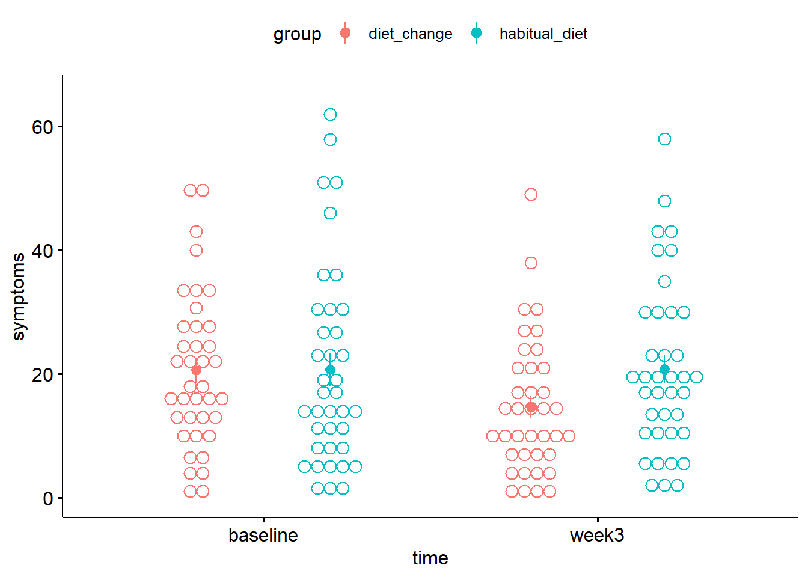
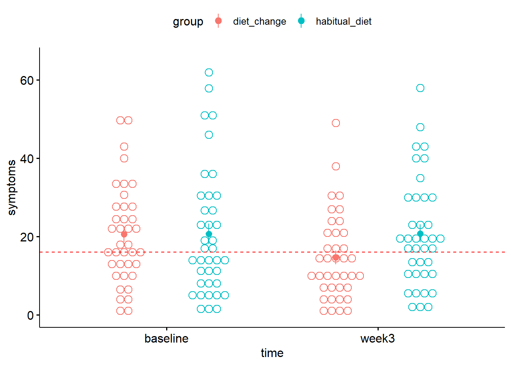
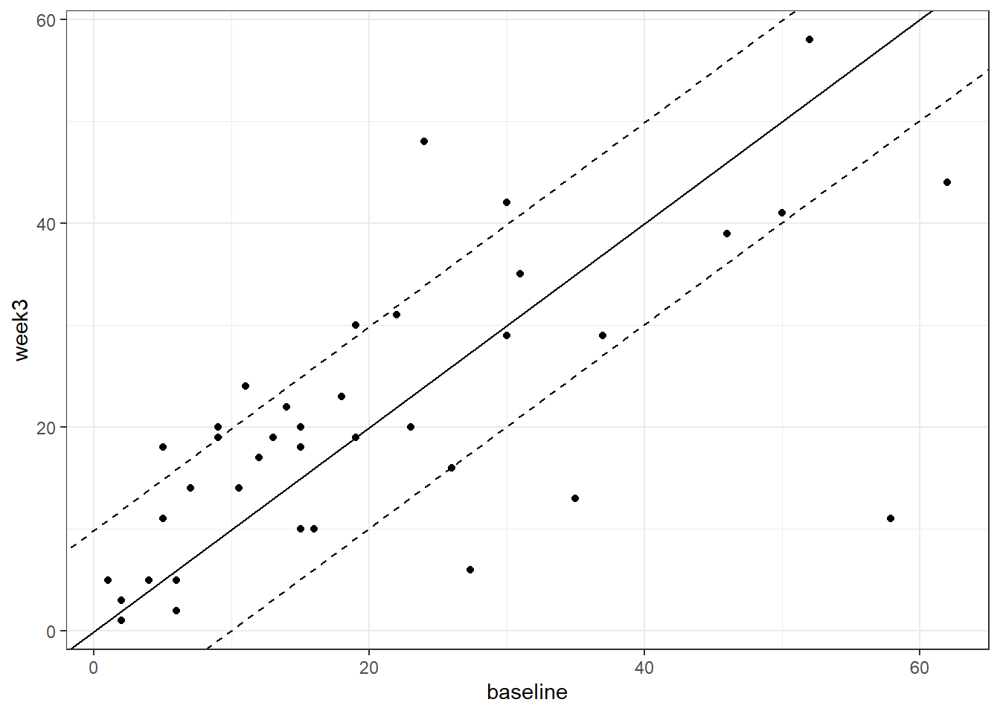

# Pre-post data, clinically significant change {#prepost}

*Chris Berry*
\
*2024*


<!--
commented text
commented text
--> 

<style>
div.exercise { background-color:#e6f0ff; border-radius: 5px; padding: 20px;}
</style>

<style>
div.tip { background-color:#D5F5E3; border-radius: 5px; padding: 20px;}
</style>


## Overview

* **Slides** from the lecture part of the session: [Download](slides/PSYC761_L7_PrePostData.pptx)

\

:::{.tip}
To investigate the effect of an intervention, researchers may measure a dependent variable before and after the intervention. For example, a researcher might look at the impact of a particular treatment (or therapy) on the severity of depression symptoms. The data produced is sometimes referred to as _pre-post_ data. 

Pre-post data in the treatment group is often compared with that of a control group. 
:::

\

There are numerous ways to analyse the data from such designs. Three approaches are presented here, alongside an introduction to methods for calculating clinically significant change.

\

### Worked example

Francis et al. (2019) investigated whether a shift to a healthy diet impacted on depression in a group of individuals that had diets that fell short of the criteria for healthy eating, as defined by the Australian Guide to Healthy Eating. There were 76 participants. All had moderate to severe symptoms of depression.

Half of the participants received instruction on guidance regarding their diet. Severity of depression symptoms were measured at two time points: before the intervention, and again three weeks later. 


:::{.exercise}
Design Check

* What is the name of the first independent variable mentioned? <select class='webex-select'><option value='blank'></option><option value=''>severity of depression symptoms</option><option value='answer'>dietary intervention</option></select>

* Is the first independent variable manipulated between- or within-subjects? <select class='webex-select'><option value='blank'></option><option value='answer'>between-subjects</option><option value=''>within-subjects</option></select>

* How many levels does the first independent variable have? <select class='webex-select'><option value='blank'></option><option value=''>1</option><option value='answer'>2</option><option value=''>4</option></select>

* What is the name of the second independent variable mentioned in the study? <select class='webex-select'><option value='blank'></option><option value='answer'>time</option><option value=''>severity of depression symptoms</option></select>

* Is the second independent variable manipulated between- or within-subjects? <select class='webex-select'><option value='blank'></option><option value=''>between-subjects</option><option value='answer'>within-subjects</option></select>

* How many levels does the second independent variable have? <select class='webex-select'><option value='blank'></option><option value=''>1</option><option value='answer'>2</option><option value=''>4</option></select>

* What is the dependent variable?  <select class='webex-select'><option value='blank'></option><option value='answer'>severity of depression symptoms</option><option value=''>dietary intervention</option></select>

:::

\

### Read in the data


```r
# read in
diet <- read_csv('https://raw.githubusercontent.com/chrisjberry/Teaching/master/7_diet_depression.csv')

# preview
diet %>% head()
```

<div class="kable-table">

| ppt|group       | baseline|    week3|
|---:|:-----------|--------:|--------:|
|   1|diet_change | 18.00000| 11.00000|
|   2|diet_change | 34.00000| 11.00000|
|   3|diet_change | 28.42105|  3.00000|
|   4|diet_change | 25.00000| 14.00000|
|   5|diet_change | 40.00000| 49.00000|
|   6|diet_change | 15.00000| 14.73684|

</div>
\

:::{.exercise}
Data Check

* How many participants are there in `diet`? <select class='webex-select'><option value='blank'></option><option value=''>6</option><option value=''>38</option><option value=''>66</option><option value='answer'>76</option></select>

* Are the data in `diet` in long format or wide format? <select class='webex-select'><option value='blank'></option><option value=''>long</option><option value='answer'>wide</option></select>


<div class='webex-solution'><button>Explain</button>

Each participant's data is on a separate row. There is a column to code the `group` membership. The scores for each time condition, `baseline` and `week3`, are in separate columns. Therefore the data are in wide format. You can inspect all the data in a separate data viewer with the code `View(diet)`. (Note that although there are 76 participants on 76 rows, the `ppt` identifiers go up to 77; this is because the data for participant 50 were incomplete and were therefore excluded.)

</div>


* What do the scores in the `baseline` and `week3` columns represent? <select class='webex-select'><option value='blank'></option><option value='answer'>severity of depression symptoms</option><option value=''>time</option><option value=''>dietary change</option></select>

:::

\

### Plot the means

To plot the means, we need the data to be in **long format**:


```r
# The code below:
# - stores the result in diet_long
# - takes diet and pipes it to
# - pivot_longer()
# - specifies which of the existing columns to make into a single new column ('cols')
# - specifies the name of the new column labeling the conditions ('names_to')
# - specifies the name of the column containing the dependent variable ('values_to')
diet_long <- 
  diet %>% 
  pivot_longer(cols = c(baseline, week3), 
               names_to = "time", 
               values_to = "symptoms")

# preview
diet_long %>% head()
```

<div class="kable-table">

| ppt|group       |time     | symptoms|
|---:|:-----------|:--------|--------:|
|   1|diet_change |baseline | 18.00000|
|   1|diet_change |week3    | 11.00000|
|   2|diet_change |baseline | 34.00000|
|   2|diet_change |week3    | 11.00000|
|   3|diet_change |baseline | 28.42105|
|   3|diet_change |week3    |  3.00000|

</div>

\

Now use `diet_long` with `ggdotplot()` in the `ggpubr` package. 


```r
library(ggpubr)

diet_long %>% 
  ggdotplot(x = "time", 
            y = "symptoms", 
            color = "group", 
            add = "mean_se", 
            ylim = c(0,65),
            position_dodge = 0.1) 
```

<div class="figure" style="text-align: center">

<p class="caption">(\#fig:unnamed-chunk-4)Mean depression symptoms score. Solid circles denote the mean, error bars the SE.</p>
</div>
Each dot represents one participant's data. The solid circles indicate the mean severity of depression symptoms in each condition (with between-subject error bars added by using `add = mean_se`). (See Session 6 for further details on producing _within-subject_ error bars, which may be more appropriate here.) Higher scores indicate greater severity.

* In the `diet_change` group, from baseline to week 3, the mean severity of symptoms appeared to <select class='webex-select'><option value='blank'></option><option value='answer'>lessen</option><option value=''>worsen</option><option value=''>stay about the same</option></select>.
* In the `habitual_diet` group, from baseline to week 3, the mean severity of symptoms appeared to <select class='webex-select'><option value='blank'></option><option value=''>lessen</option><option value=''>worsen</option><option value='answer'>stay about the same</option></select>.

\

## Approach 1 - Difference scores

One approach to analysing pre-post data is to compare the _change_ in symptom scores from `baseline` to `week3` across groups. This is achieved by 1) calculating the difference in scores between `baseline` and `week3`, and then 2) comparing the difference scores between the two groups using a between-subjects ANOVA (or, equivalently, a _t_-test).  

To calculate the change in severity score for each participant, it's simplest to use the wide format data since we can easily subtract scores in one column (`week3`) from another (`baseline`).


```r
# using the wide format data
# calculate the difference in baseline and week3 scores
# store in a new column called 'change'
diet <- 
  diet %>% 
  mutate(change = week3 - baseline)

# look at new column
diet %>% head()
```

<div class="kable-table">

| ppt|group       | baseline|    week3|      change|
|---:|:-----------|--------:|--------:|-----------:|
|   1|diet_change | 18.00000| 11.00000|  -7.0000000|
|   2|diet_change | 34.00000| 11.00000| -23.0000000|
|   3|diet_change | 28.42105|  3.00000| -25.4210526|
|   4|diet_change | 25.00000| 14.00000| -11.0000000|
|   5|diet_change | 40.00000| 49.00000|   9.0000000|
|   6|diet_change | 15.00000| 14.73684|  -0.2631579|

</div>

The column `change` now contains the change in symptom severity score from `baseline` to `week3`. A negative difference indicates an improvement in symptoms (i.e., the score at `week3` was lower).

To compare the `change` scores between the two groups, use `anovaBF()`. The functions `lmBF()` or `ttestBF()` could also be used. They all give equivalent results because there are only two groups being compared.


```r
# Convert the grouping variable 'group' to a factor
diet <- 
  diet %>% 
  mutate(group = factor(group))

# anovaBF(): between-subjects ANOVA
anovaBF(change ~ group, data = data.frame(diet))
```

```
## Bayes factor analysis
## --------------
## [1] group : 2.262527 ±0.01%
## 
## Against denominator:
##   Intercept only 
## ---
## Bayes factor type: BFlinearModel, JZS
```


<div class='webex-solution'><button>Alternatively with lmBF and ttest</button>


```r
# lmBF(): between-subjects ANOVA
lmBF(change ~ group, data = data.frame(diet)) 

# ttestBF: between-subjects
ttestBF(x = diet$change[ diet$group == "habitual_diet" ], 
        y = diet$change[ diet$group == "diet_change" ]) 
```

```
## Bayes factor analysis
## --------------
## [1] group : 2.262527 ±0.01%
## 
## Against denominator:
##   Intercept only 
## ---
## Bayes factor type: BFlinearModel, JZS
## 
## Bayes factor analysis
## --------------
## [1] Alt., r=0.707 : 2.262527 ±0.01%
## 
## Against denominator:
##   Null, mu1-mu2 = 0 
## ---
## Bayes factor type: BFindepSample, JZS
```

</div>


* The Bayes factor comparing the change in severity of depression symptoms between baseline and week 3 is (to two decimal places) <input class='webex-solveme nospaces' data-tol='0.02' size='4' data-answer='["2.26"]'/>.
* Although there is <select class='webex-select'><option value='blank'></option><option value=''>no</option><option value='answer'>weak</option><option value=''>substantial</option></select> evidence for a difference in the change score between groups, the Bayes factor was <select class='webex-select'><option value='blank'></option><option value='answer'>inconclusive</option><option value=''>substantial</option></select>.
* Thus, by the method of comparing change scores between groups, can we conclude that the dietary intervention led to a reduction in depression symptom severity? <select class='webex-select'><option value='blank'></option><option value=''>yes</option><option value='answer'>no</option></select>


\

## Approach 2 - Mixed ANOVA

Given that we have two independent variables, each with two levels, and where one is manipulated between-subjects and the other within-subjects, it is also possible to treat the design as a **2 x 2 mixed factorial design** and analyse the data using `anovaBF()`.

Because one of the factors is manipulated within-subjects, we need to add `ppt` to the model  and specify it as a random factor using `whichRandom = "ppt"` (see Session [6](#anova2)). We also need to convert `ppt` to a factor, along with the other independent variables, `group` and `time`.

As with repeated measures ANOVA in Session 6, the long format data needs to be used for the analysis.


```r
# convert ppt and IVs to factors
diet_long <- 
  diet_long %>% 
  mutate(ppt   = factor(ppt),
         group = factor(group),
         time  = factor(time))

# anova model
bfs <- anovaBF(symptoms ~ group + time + ppt, whichRandom = "ppt", data = data.frame(diet_long))

# look at the bfs
bfs
```
In this analysis, we are less interested in the main effects of `group` and `time` and are more interested in the interaction between the factors. The interaction will tell us whether the change in symptom severity differs between groups. As with previous two-way ANOVAs, the BF for the interaction can be obtained by dividing the BF in [4] by the BF in [3] (see Sessions [3](#anova1) and [6](#anova2)).


```r
# bf for the interaction
bfs[4] / bfs[3]  
```

* The Bayes factor representing evidence for the interaction term is <input class='webex-solveme nospaces' data-tol='5' size='4' data-answer='["2.25"]'/>.

The Bayes factor for the interaction should come out at around 2.25, but because `anovaBF()` calculates the BF using random sampling methods, your value may not match this exactly (note the large error associated with the BF in the output). For greater precision, it's possible to `recompute()` the Bayes factor with a greater number of random samples, e.g., 1,000,000 (note, this could take a short while):


```r
# recompute bfs, but with a million iterations
bfs_more <- recompute(bfs, 1000000)

# re-obtain the BF for the interaction, using bf_more
bfs_more[4] / bfs_more[3]
```
* The Bayes factor for the interaction, using `bf_more` is <input class='webex-solveme nospaces' data-tol='5' size='4' data-answer='["2.25"]'/>.
* Although there is <select class='webex-select'><option value='blank'></option><option value=''>no</option><option value='answer'>weak</option><option value=''>substantial</option></select> evidence for a difference in the change score between groups, the Bayes factor was <select class='webex-select'><option value='blank'></option><option value='answer'>inconclusive</option><option value=''>substantial</option></select>.
* As a result of using a mixed ANOVA, can we conclude that the dietary intervention led to a reduction in depression symptom severity? <select class='webex-select'><option value='blank'></option><option value=''>yes</option><option value='answer'>no</option></select>


\

## Approach 3 - ANCOVA

A third approach to analysing pre-post data is to use ANCOVA, which stands for Analysis of COvariance. This approach is particularly appropriate if our focus were solely on comparing the scores at the second time point between groups, but controlling for baseline symptom severity.

A **covariate** is a background variable that may be associated with the outcome variable, but is not of primary interest. In ANCOVA, the variance explained by a covariate is first accounted for, before examining whether the dependent variable differs between groups or conditions. Because some of the error variance is explained by the covariate, ANCOVAs can have the advantage of being more powerful tests of the predictor of interest.

The ANCOVA is essentially a one-way between subjects ANOVA, with symptom severity at `week3` as the dependent variable, `group` as the independent variable, and symptoms at `baseline` as the covariate. 

Equivalently, the analysis can be conceptualised is a multiple regression of `week3` scores on the basis of `group` and `baseline`. Assessing the unique contribution of `group` will tell us whether there's a difference in symptom severity at `week3`, after accounting for the variance explained by `baseline` scores (see Sessions [2](#multiple1) and [4](#multiple2))).

Note that because effects of `time` are not analysed in this approach, there is no repeated measures factor, and `ppt` does not need to be included as a random factor.


```r
# The model with both group and baseline scores
full <- lmBF(week3 ~ group + baseline, data = data.frame(diet))

# The model with baseline scores only (for comparison)
baseline <- lmBF(week3 ~ baseline, data = data.frame(diet))

# The BF representing evidence for the unique contribution of group
full / baseline 
```

```
## Bayes factor analysis
## --------------
## [1] group + baseline : 6.124479 ±0.83%
## 
## Against denominator:
##   week3 ~ baseline 
## ---
## Bayes factor type: BFlinearModel, JZS
```

* The Bayes factor for the unique contribution of `group` is <input class='webex-solveme nospaces' data-tol='2' size='4' data-answer='["6.08"]'/>.
* There is <select class='webex-select'><option value='blank'></option><option value=''>no</option><option value=''>weak</option><option value='answer'>substantial</option></select> evidence for a difference in the `week3` scores between groups, after controlling for `baseline` scores.
* As a result of using the ANCOVA approach, can we conclude that the dietary intervention led to a reduction in depression symptom severity? <select class='webex-select'><option value='blank'></option><option value='answer'>yes</option><option value=''>no</option></select>


<div class='webex-solution'><button>R-squared</button>

In Approach 3 R^2^ for the effect of `group` can be determined using methods from earlier sessions. The method is equivalent to obtaining R^2^ for the unique contribution of a predictor.


```r
# ensure broom is loaded
# library(broom) 

# specify the full model with lm()
full_model    <- lm(week3 ~ group + baseline, data = diet)

# specify the model with baseline only
baseline_only <- lm(week3 ~ baseline, data = diet)

# R-squared full model
glance(full_model)$r.squared

# R-squared baseline only
glance(baseline_only)$r.squared

# Unique contribution of group 
# (effect size associated with difference in groups)
glance(full_model)$r.squared - glance(baseline_only)$r.squared # R-sq = 0.05817
```


</div>


\


## Which approach should you use?

Which method you use depends on the _research question_ you are asking. 

If your question is whether the _change_ in the dependent variable across timepoints differs between the two groups, then Methods 1 or 2 are appropriate.  

If your question is whether one group has a higher mean at the second timepoint, then Method 3 seems most appropriate. Indeed, ANCOVA is often recommended for pre-post designs (see e.g., O'Connel et al., 2017). An advantage of the ANCOVA method is that is has greater statistical power. It is the approach that Francis et al. (2019) used.

\

## Clinical Significance

The measure of depressive symptoms used by Francis et al. (2019) was the Centre for Epidemiological Studies Depression scale-Revised (CESD-R; Radloff, 1977). The scale ranges from 0-60, and the criterion for being the elevated range of depressive symptoms is a score equal to **16** or above.  

Re-plot the data, but with a horizontal line to indicate this criterion. 


```r
diet_long %>% 
  ggdotplot(x = "time", 
            y = "symptoms", 
            color = "group", 
            add = "mean_se", 
            ylim = c(0,65),
            position_dodge = 0.1) +
  geom_hline(yintercept = 16, colour = "red", lty = 2)
```

<div class="figure" style="text-align: center">

<p class="caption">(\#fig:unnamed-chunk-14)Mean depression symptom severity score in each condition. The dotted line indicates the criterion for the elevated range of depressive symptoms</p>
</div>

* At baseline, was the mean of the `diet_change` group above or below the criterion for clinical significance in the severity of depression symptoms? <select class='webex-select'><option value='blank'></option><option value='answer'>above</option><option value=''>below</option></select>
* After 3 weeks, was the mean of the `diet_change` above or below the criterion for clinical significance in the severity of depression symptoms? <select class='webex-select'><option value='blank'></option><option value=''>above</option><option value='answer'>below</option></select>

Note that these statements apply to the conditions as a whole, rather than the _individuals_ in each condition. For instance, there may be individuals whose symptoms did not improve. To learn more about whether a given _individual_ can be said to have improved or not, see the Further Knowledge section below.

\


## Exercises

:::{.exercise}

Pre-post self-efficacy scores

Francis et al. (2019) also measured **self-efficacy** before and after the dietary intervention. Self-efficacy refers to a person's belief in their ability to exert control over their behaviours and circumstances they find themselves in. Higher scores indicate greater levels of self-efficacy.

Read in the data at the link below to `self_efficacy` and answer the questions.

https://raw.githubusercontent.com/chrisjberry/Teaching/master/7_diet_self_efficacy.csv

\

**1. Create a plot of the mean self-efficacy before and after the intervention in each group**


<div class='webex-solution'><button>Hint</button>


* Read the data using `read_csv()`
* Convert to long format
* Use a suitable package to plot the data. For example, `ggdotplot()` in the `ggpubr` package.


</div>


<div class='webex-solution'><button>Solution</button>


```r
# read in
self_efficacy <- read_csv('https://raw.githubusercontent.com/chrisjberry/Teaching/master/7_diet_self_efficacy.csv')

# convert to long format
self_efficacy_long <- 
  self_efficacy %>% 
  pivot_longer(cols = c("baseline", "week3"),
               names_to = "time",
               values_to = "score")

# plot
self_efficacy_long %>% 
  ggdotplot(x = "time", y = "score", color = "group", add = "mean_se",
            ylab = "Self-efficacy score")
```


</div>


\

**2. Evidence for the dietary intervention on self-efficacy**

* Using Approach 1, determine the Bayes factor representing the evidence for a difference in the change in self-efficacy score between the `diet_change` and `habitual_diet` groups. BF = <input class='webex-solveme nospaces' data-tol='0.05' size='4' data-answer='["0.45",".45"]'/>
* Using Approach 2, determine the Bayes factor, representing the evidence for a difference in the change in self-efficacy score score between groups. BF = <input class='webex-solveme nospaces' data-tol='1.5' size='4' data-answer='["0.45",".45"]'/>
* Using Approach 3, determine the Bayes factor, representing the evidence for a difference in self-efficacy scores between groups at week 3, after controlling for self-efficacy scores at baseline. BF = <input class='webex-solveme nospaces' data-tol='0.2' size='1' data-answer='["1"]'/>

\

Is there substantial evidence for an effect of the dietary intervention on self-efficacy scores according to any of the approaches?

* Approach 1: ANOVA of difference scores. <select class='webex-select'><option value='blank'></option><option value=''>yes</option><option value='answer'>no</option></select>
* Approach 2: Mixed ANOVA. <select class='webex-select'><option value='blank'></option><option value=''>yes</option><option value='answer'>no</option></select>
* Approach 3: ANCOVA. <select class='webex-select'><option value='blank'></option><option value=''>yes</option><option value='answer'>no</option></select>


<div class='webex-solution'><button>Hint - Approach 1</button>

* Use the data in wide format.
* Create a column of difference scores using `mutate()`
* Compare the difference scores between groups using `anovaBF()` (or `lmBF()` or `ttestBF()`).

</div>


<div class='webex-solution'><button>Hint - Approach 2</button>

* Convert the data to long format using `pivot_longer()`.
* Convert the columns labelling the participant and independent variables to factors using `factor()`.
* Use `anovaBF()` to run the 2 x 2 ANOVA, with the participant column as a random factor.
* Obtain the Bayes factor for the interaction.

</div>


<div class='webex-solution'><button>Hint - Approach 3</button>

* Use the data in wide format.
* Use `lmBF()` with the scores at `week3` as the outcome variable and `group` and `baseline` as predictors.
* Use `lmBF()` with the scores at `week3` as the outcome variable and `baseline` as the predictor.
* Divide the BF for the model with both `group` and `baseline` by the BF for the model with `baseline` alone in order to determine the evidence that the scores at `week3` differ between `group` after controlling for `baseline`.

</div>


\


<div class='webex-solution'><button>Solution - Approach 1</button>


```r
# Approach 1 - difference
self_efficacy <- 
  self_efficacy %>% 
  mutate(change = week3 - baseline,
         group = factor(group))

# using anovaBF
anovaBF(change ~ group, data = data.frame(self_efficacy))

# or lmBF
lmBF(change ~ group, data = data.frame(self_efficacy)) 

# or ttest
ttestBF(self_efficacy$change[self_efficacy$group=="habitual_diet"],
        self_efficacy$change[self_efficacy$group=="diet_change"]) 
```

</div>


<div class='webex-solution'><button>Solution - Approach 2</button>


```r
# Approach 2 - Mixed ANOVA

# set factors
self_efficacy_long <- 
  self_efficacy_long %>% 
  mutate(time  = factor(time),
         ppt   = factor(ppt), 
         group = factor(group))

# get bfs
BFs <- anovaBF(score ~ group + time + ppt, whichRandom = "ppt", data = data.frame(self_efficacy_long))

BFs[4] / BFs[3]  

# recompute
BFs2 <- recompute(BFs, 1000000)
 
BFs2[4] / BFs2[3]  
```

</div>


<div class='webex-solution'><button>Solution - Approach 3</button>


```r
# Approach 3 - ANCOVA

# wide format
# convert to factors
self_efficacy <- 
  self_efficacy %>% 
  mutate(group = factor(group))

# specify group + baseline
BF_group_baseline <- lmBF(week3 ~ group + baseline, data = data.frame(self_efficacy))

# specify baseline only
BF_baseline <- lmBF(week3 ~ baseline, data = data.frame(self_efficacy))

# unique contribution group
BF_group_baseline / BF_baseline 
```

</div>


:::

\

## Further Knowledge


<div class='webex-solution'><button>Reliable Change RC index</button>


### Reliable Change (RC) index

In the main part of the worksheet, the mean symptom severity in the dietary intervention group moved from being above the criterion for the elevated range before the intervention to being below the criterion afterwards.

One way to determine whether a particular **individual** shows a clinically significant change involves calculating a Reliable Change (RC) index (Christensen & Mendoza, 1986; Jacobson & Trurax, 1991). The RC index can be calculated for each individual as follows:

\

$RC = \frac{X_1 - X_2}{SE_D}$

\


where $X_1$ is an individual's pretest score, $X_2$ is the posttest score, and $SE_D$ is the standard error of the difference scores.

$SE_D$ is calculated with the equation:

\

$\sqrt{2(SD_{Pre}\sqrt{(1-\alpha)})^2}$

\

where $SD_{pre}$ is the standard deviation of the pre-test scores and $\alpha$ is the reliability of the measure (e.g., Cronbach's alpha). 

$\alpha$ is necessary for the calculation of $SE_D$, but was not reported by Francis et al. (2019). The CESD-R scale is widely used though, and Busch et al. (2011) derived an estimate of $SE_D$ to be 5.05, using an $\alpha$ of .914 and $SD_{Pre}$ score of 12.187. For the purposes of illustration, we'll assume the value of $SE_D$ is the same as in Busch et al. (2011) (i.e., 5.05).

If RC > 1.96 (or RC < -1.96, depending on the way the difference is calculated), then the individual can be said to show a _reliable change_.

Thus, to calculate RC for each individual in the `diet_change` group:


```r
# filter the data for the diet_change group only
diet_change <-
  diet %>% filter(group == "diet_change")

# SE of differences
se_diff <- 5.05 # from Busch et al. (2011)

# Reliable Change index calculation
diet_change <-
  diet_change %>%
  mutate(RC = change / se_diff)

# preview
diet_change %>% head()
```

<div class="kable-table">

| ppt|group       | baseline|    week3|      change|         RC|
|---:|:-----------|--------:|--------:|-----------:|----------:|
|   1|diet_change | 18.00000| 11.00000|  -7.0000000| -1.3861386|
|   2|diet_change | 34.00000| 11.00000| -23.0000000| -4.5544554|
|   3|diet_change | 28.42105|  3.00000| -25.4210526| -5.0338718|
|   4|diet_change | 25.00000| 14.00000| -11.0000000| -2.1782178|
|   5|diet_change | 40.00000| 49.00000|   9.0000000|  1.7821782|
|   6|diet_change | 15.00000| 14.73684|  -0.2631579| -0.0521105|

</div>

`RC` scores less than -1.96 indicate that the individual's score showed a reliable improvement in depressive symptoms (i.e., reliably lower scores on the CESD-R).  

\

To see all the individuals who showed such a reduction:


```r
improved_ppts <- diet_change %>% filter(RC < -1.96) 
improved_ppts
```

<div class="kable-table">

| ppt|group       | baseline| week3|    change|        RC|
|---:|:-----------|--------:|-----:|---------:|---------:|
|   2|diet_change | 34.00000|    11| -23.00000| -4.554455|
|   3|diet_change | 28.42105|     3| -25.42105| -5.033872|
|   4|diet_change | 25.00000|    14| -11.00000| -2.178218|
|   8|diet_change | 33.00000|     9| -24.00000| -4.752475|
|  23|diet_change | 43.00000|    30| -13.00000| -2.574257|
|  28|diet_change | 22.00000|     8| -14.00000| -2.772277|
|  33|diet_change | 50.52632|    23| -27.52632| -5.450756|
|  34|diet_change | 28.00000|    17| -11.00000| -2.178218|
|  36|diet_change | 49.00000|    14| -35.00000| -6.930693|
|  37|diet_change | 23.00000|    10| -13.00000| -2.574257|

</div>

\

#### Scatterplot with RC bounds

All the data can be represented on a plot with bounds for reliable change as follows:


```r
diet_change %>% 
  ggplot(aes(x = baseline, y = week3)) + 
  geom_point() +
  geom_abline() +
  geom_abline(slope = 1, intercept = -1.96*se_diff, lty = 2) +
  geom_abline(slope = 1, intercept = 1.96*se_diff, lty = 2) 
```

<div class="figure" style="text-align: center">

<p class="caption">(\#fig:unnamed-chunk-21)Baseline vs. week 3 depressive symptom severity in the diet change group. Dotted lines denoted Reliable Change index bounds</p>
</div>

The black dashed lines are those plotted with `geom_abline()` and are created by multiplying `se_diff` by +1.96 and -1.96. 

The points falling above the upper black dashed line indicate participants showing reliable worsening of depressive symptoms at the posttest compared to the the pretest. 

The points falling below the lower black dashed line are individuals showing a reliable improvement (i.e., fewer depressive symptoms) at the posttest. 

Francis et al. (2019) reported that 10 individuals showed a reliable improvement in the diet change group, as indicated by their RC scores. Only 4 individuals in the habitual diet group were reported to show a reliable improvement.

Count how many individuals fall below the lower black dashed line on the scatterplot, and can therefore be considered to meet the criteria for showing reliable improvement, as defined by the RC index? <select class='webex-select'><option value='blank'></option><option value=''>8</option><option value=''>9</option><option value='answer'>10</option><option value=''>11</option><option value=''>12</option></select>

The same process could be followed for the `habitual_diet` group to compare the number of individuals showing reliable change according to the RC index between groups. The code for this group is below. With the value of `se_diff` we've used here, a fifth person in this group has an RC index (just) exceeding -1.96. There's still half as many participants showing a reliable change, compared to the `diet_change` group.

The results obtained with RC index converge with those of the ANCOVA, and support the notion that a healthy diet can lead to improvement in the severity of depression symptoms. 


<div class='webex-solution'><button>Habitual diet group</button>


```r
# filter the data for the habitual_diet group only
habitual_diet <-
  diet %>% filter(group == "habitual_diet")

# SE of differences
se_diff <- 5.05 # from Busch et al. (2011)

# Reliable Change index calculation
habitual_diet <-
  habitual_diet %>%
  mutate(RC = change / se_diff)

# RC plot
habitual_diet %>% 
  ggplot(aes(x = baseline, y = week3)) + 
  geom_point() +
  geom_abline() +
  geom_abline(slope = 1, intercept = -1.96*se_diff, lty = 2) +
  geom_abline(slope = 1, intercept =  1.96*se_diff, lty = 2) 
```

<div class="figure" style="text-align: center">

<p class="caption">(\#fig:unnamed-chunk-22)Baseline vs. week 3 depressive symptom severity in the habitual diet group. Dotted lines denoted Reliable Change index bounds</p>
</div>


</div>


</div>


\

## Summary

There are three main approaches for measuring pre-post data when there is a treatment and control group:

* Analysis of the difference scores in a between-subjects ANOVA.
* A 2 x 2 mixed ANOVA, with time (pre, post) as the within-subjects factor, and group (treatment, control) as the between-subjects factor.
* An ANCOVA comparing posttest scores between groups, after accounting for pretest scores as a covariate. This is equivalent to a multiple regression of posttest scores on the basis of pretest scores and group (i.e., one continuous and one categorical predictor).
* A result can be statistically significant, but not necessarily clinically significant. Various methods exist for establishing clinical significance, including using established scale cutoffs and using the Reliable Change Index.

\

## References
Busch, A. M., Wagener, T. L., Gregor, K. L., Ring, K. T., & Borrelli, B. (2011). Utilizing reliable and clinically significant change criteria to assess for the development of depression during smoking cessation treatment: The importance of tracking idiographic change. _Addictive Behaviors_, _36_(12), 1228-1232.

Christensen, L. & Mendoza, J. L. (1986). A method of assessing change in a single subject: an alteration of the RC index. _Behavior Therapy_. _17_, 305-308.

Francis H.M., Stevenson R.J., Chambers J.R., Gupta D., Newey B., Lim C.K. (2019) A brief diet intervention can reduce symptoms of depression in young adults – A randomised controlled trial. _PLoS ONE_, _14_(10): e0222768. https://doi.org/10.1371/journal.pone.0222768

Jacobson, N. S., & Truax, P. (1991). Clinical significance: A statistical approach to defining meaningful change in psychotherapy research. _Journal of Consulting and Clinical Psychology_, _59_(1), 12–19. https://doi.org/10.1037/0022-006X.59.1.12

O'Connell, N. S., Dai, L., Jiang, Y., Speiser, J. L., Ward, R., Wei, W., ... & Gebregziabher, M. (2017). Methods for analysis of pre-post data in clinical research: a comparison of five common methods. _Journal of Biometrics & Biostatistics_, _8_(1), 1. https://doi.org/10.4172/2155-6180.1000334

Radloff, L. S. (1977). The CES-D scale: A self-report depression scale for research in the general population. _Applied Psychological Measurement_, _1_(3), 385-401.
